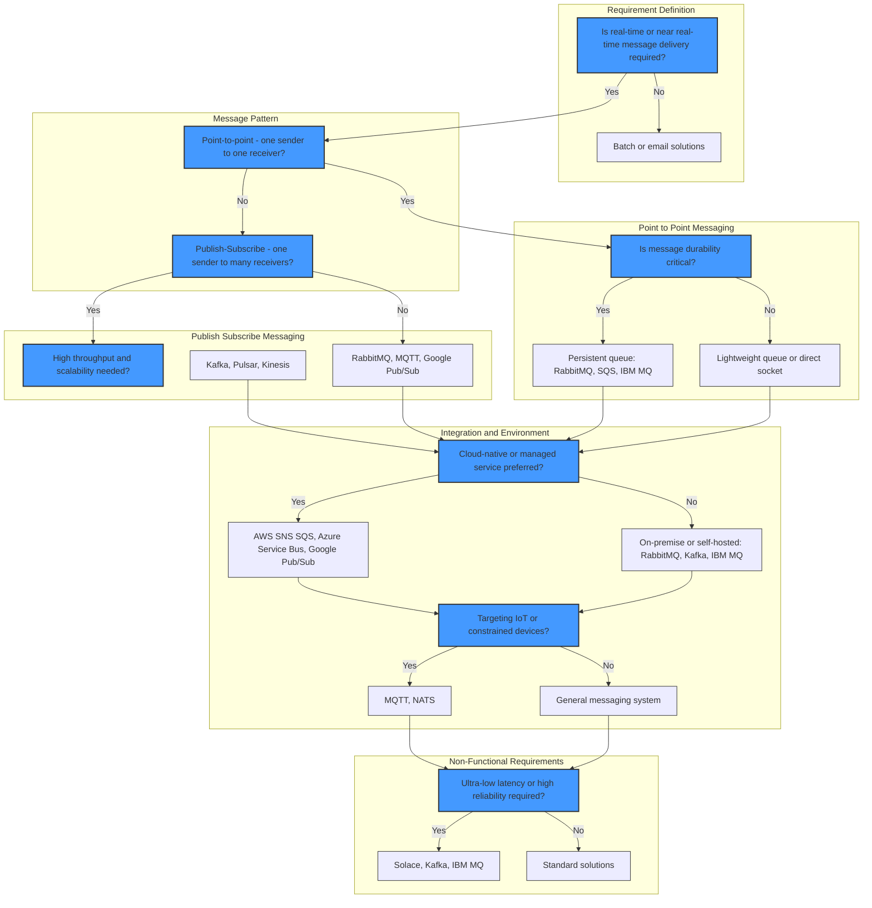

# Decision Tree for Selecting the Right Messaging Solution

A decision tree can help you systematically select the most appropriate messaging system based on your requirements. Below is the detailed decision tree:

## Comprehensive Decision Tree

## How to Use

1. **Start at the Top**: Determine if real-time delivery is needed.
2. **Message Pattern**: Decide between point-to-point or pub-sub.
3. **Point-to-Point Messaging**: Assess the durability requirements.
4. **Pub-Sub Messaging**: Evaluate throughput and scalability needs.
5. **Integration  Environment**: Choose between cloud-native or on-premises.
6. **Specialized Needs**: Consider IoT or specialized message handling.
7. **Non-Functional Requirements**: Focus on low latency or reliability needs.

This revised structure offers a detailed decision-making path to ensure alignment with both technical and business needs.
