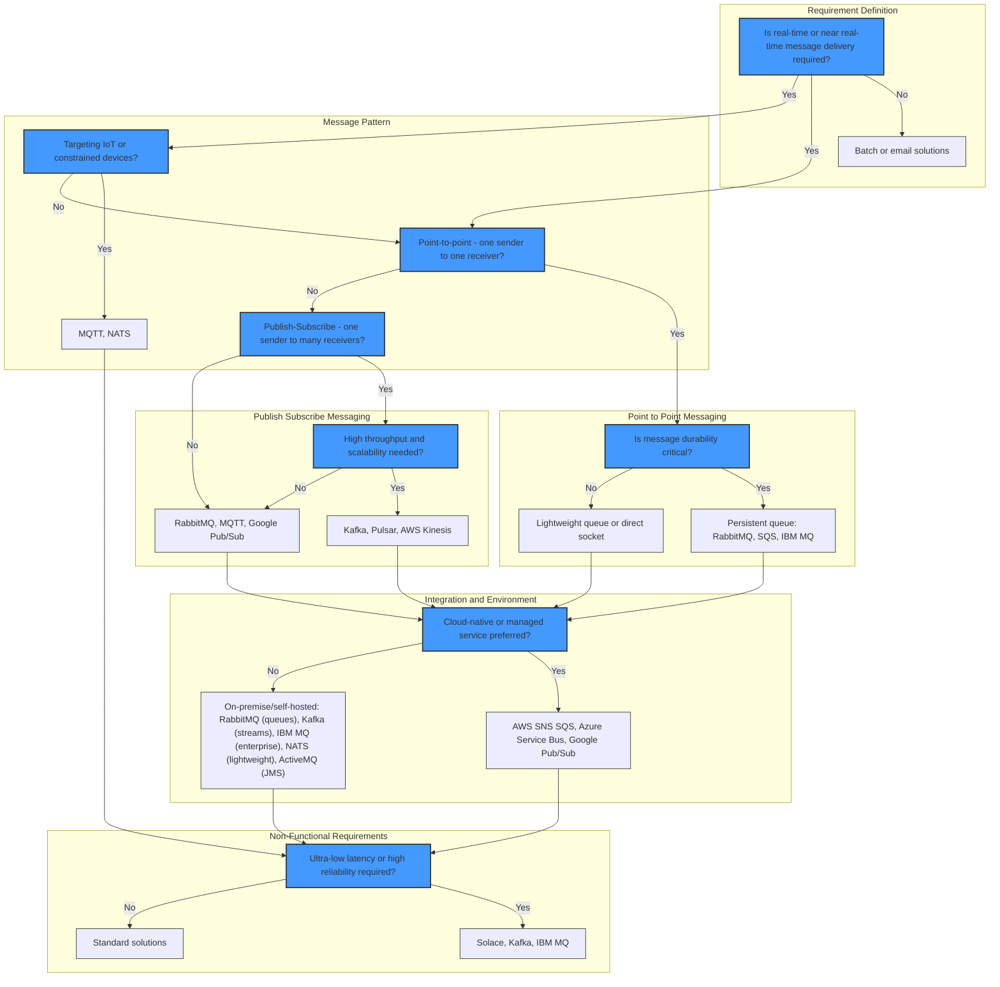

# Decision Tree for Selecting the Right Messaging Solution

A decision tree can help you systematically select the most appropriate messaging system based on your requirements. This guide provides comprehensive decision paths tailored to different personas within an organization.

## User Personas and their Decision Paths

### Overview

**Decision Maker (Business Focus)**
- Fast setup, proven ROI, vendor support

**Technical Architect (Tech Focus)**
- System complexity, scalability, integration

**DevOps Engineer (Ops Focus)**
- Operational overhead, incident management, automation

**Data Engineer (Data Focus)**
- Data processing, schema management, system throughput

## Comprehensive Decision Tree

## Persona-Based Guidance

### 👨‍💼 For Business Decision Makers
- **Key Question**: What are the cost, ROI, and business value?
- **Path**: Start with cost analysis and strategic alignment. Solutions preferred: AWS SQS/SNS for minimal ops; Apache Kafka for robust integration.

### 👩‍💻 For Technical Architects
- **Key Question**: How does the system integrate and scale?
- **Path**: Focus on messaging patterns and technical fit. Solutions preferred: Apache Kafka for scale, RabbitMQ for ease of setup.

### 🔧 For DevOps Engineers
- **Key Question**: What are the deployment and monitoring needs?
- **Path**: Assess operational complexity and incident response. Solutions preferred: Managed services for easy scaling; Kafka for powerful tooling.

### 👨‍🔬 For Data Engineers
- **Key Question**: How does it handle data consistency and throughput?
- **Path**: Consider schema management and processing needs. Solutions preferred: Apache Kafka for strong stream processing; NATS for lightweight messaging.

## How to Use

1. **Start at the Top**: Determine if real-time delivery is needed.
2. **IoT/Constrained Devices**: Early check for IoT-specific requirements.
3. **Message Pattern**: Decide between point-to-point or pub-sub.
4. **Point-to-Point Messaging**: Assess the durability requirements.
5. **Pub-Sub Messaging**: Evaluate throughput and scalability needs.
6. **Integration & Environment**: Choose between cloud-native or on-premises.
7. **Non-Functional Requirements**: Focus on low latency or reliability needs.

This revised structure offers a detailed decision-making path to ensure alignment with both technical and business needs.

## Detailed Decision Path Examples

### Example 1: E-commerce Platform (Business Decision Maker)

**Starting Point**: Need to handle order processing, inventory updates, and notifications

**Decision Path**:
1. **Real-time required?** → Yes (order processing)
2. **Message pattern?** → Pub-Sub (multiple services need order updates)
3. **High throughput?** → Yes (peak shopping periods)
4. **Recommended**: Apache Kafka + Confluent Schema Registry

**Business Justification**:
- **Strategic Alignment**: Fits the overall business strategy for growth and innovation.
- **Return on Investment (ROI)**: Demonstrated financial benefits and efficiency improvements.
- **Vendor Support**: Access to professional support and training, reducing risks.
- **Scalability**: Grows with business needs, supporting peak loads without additional investment.
- **TCO (Total Cost of Ownership)**: Efficient cost structure balancing initial outlay and ongoing expenses.

### Example 2: IoT Sensor Network (Technical Architect)

**Starting Point**: Thousands of sensors sending telemetry data

**Decision Path**:
1. **Real-time required?** → Yes (monitoring alerts)
2. **Message pattern?** → Pub-Sub (multiple consumers)
3. **IoT/constrained devices?** → Yes
4. **Recommended**: MQTT + Apache Kafka backend

**Technical Justification**:
- MQTT optimized for IoT devices
- Kafka handles backend processing
- Hierarchical architecture for scalability

### Example 3: Microservices Communication (DevOps Engineer)

**Starting Point**: 20+ microservices needing async communication

**Decision Path**:
1. **Real-time required?** → Yes (user-facing features)
2. **Message pattern?** → Mixed (point-to-point + pub-sub)
3. **Cloud-native preferred?** → Yes (easier ops)
4. **Recommended**: AWS SQS/SNS + EventBridge

**Operational Justification**:
- Minimal operational overhead
- Native cloud integration
- Built-in monitoring and alerting

### Example 4: Financial Trading System (Data Engineer)

**Starting Point**: High-frequency trading with strict latency requirements

**Decision Path**:
1. **Real-time required?** → Yes (trading decisions)
2. **Message pattern?** → Pub-Sub (market data distribution)
3. **Ultra-low latency?** → Yes (microsecond requirements)
4. **Recommended**: Solace PubSub+ Event Broker

**Data Engineering Justification**:
- Guaranteed delivery semantics
- Ultra-low latency capabilities
- Strong schema management

## Quick Reference Guide

### Decision Shortcuts by Use Case

| Use Case | Primary Concern | Recommended Solution | Key Benefits |
|----------|----------------|---------------------|-------------|
| **E-commerce** | Scalability + Reliability | Apache Kafka | Event sourcing, high throughput |
| **IoT/Sensors** | Efficiency + Scale | MQTT + Kafka | Lightweight protocol, powerful backend |
| **Microservices** | Simplicity + Integration | RabbitMQ or AWS SQS | Easy setup, flexible routing |
| **Financial Trading** | Latency + Compliance | Solace | Ultra-low latency, enterprise features |
| **Analytics Pipeline** | Throughput + Processing | Apache Kafka + Kafka Streams | Stream processing, exactly-once semantics |
| **Notification System** | Cost + Simplicity | AWS SNS/SQS | Serverless, pay-per-use |

### Red Flags - When NOT to Use

**Don't Use Apache Kafka if**:
- You have < 1000 messages/day
- You need ultra-simple setup
- You lack Kafka expertise

**Don't Use RabbitMQ if**:
- You need > 100K messages/second
- You require built-in stream processing
- You need multi-datacenter replication

**Don't Use Cloud Services if**:
- You have strict data sovereignty requirements
- You need custom protocol support
- You have unpredictable cost tolerance

**Don't Use MQTT if**:
- You need complex routing logic
- You require guaranteed message ordering
- You need built-in authentication/authorization

## Summary

This decision framework provides comprehensive guidance for selecting messaging systems based on different personas and use cases. The combination of visual decision trees, detailed examples, and practical guidance ensures that stakeholders can make informed decisions that align with their specific needs and constraints.
