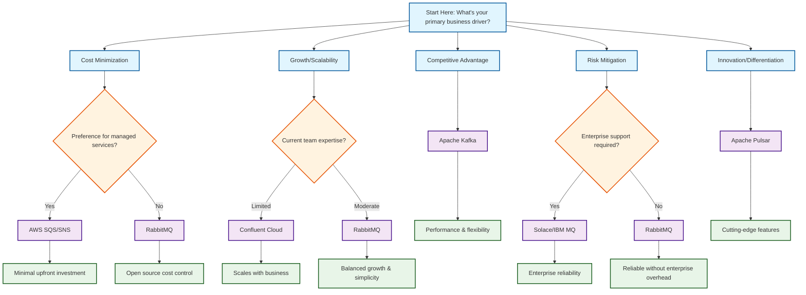

# Selection Criteria for Messaging Systems

This document provides comprehensive guidance for selecting the right messaging system based on your role, use case, and organizational needs. Each criterion includes specific considerations for different personas and scenarios.

## Target Personas

### 👨‍💼 **Business Decision Makers**
- Focus on: Cost, vendor support, compliance, time-to-market
- Key concerns: ROI, risk mitigation, strategic alignment

### 👩‍💻 **Technical Architects**
- Focus on: Scalability, integration, performance, reliability
- Key concerns: Technical debt, future-proofing, system complexity

### 🔧 **DevOps Engineers**
- Focus on: Deployment, monitoring, maintenance, automation
- Key concerns: Operational overhead, observability, incident response

### 👨‍🔬 **Data Engineers**
- Focus on: Throughput, data integrity, schema management, streaming
- Key concerns: Data pipeline reliability, processing guarantees

## Comprehensive Selection Criteria

### 1. **Architecture Fit**
**Importance**: Critical for technical success

**Evaluation Questions**:
- Does the system support your required messaging patterns?
- Can it handle your data flow architecture?
- Does it integrate with your existing tech stack?

**Messaging Pattern Support**:
- **Point-to-Point**: RabbitMQ, AWS SQS, IBM MQ
- **Publish-Subscribe**: Apache Kafka, Apache Pulsar, Redis
- **Request-Reply**: RabbitMQ, NATS, Solace
- **Streaming**: Apache Kafka, Apache Pulsar, AWS Kinesis

### 2. **Scalability Requirements**
**Importance**: Critical for long-term success

**Evaluation Matrix**:

| Scale Level | Messages/sec | Recommended Systems | Considerations |
|-------------|--------------|-------------------|----------------|
| Small (< 1K/sec) | < 1,000 | RabbitMQ, NATS, Redis | Simple setup, lower cost |
| Medium (1K-100K/sec) | 1,000-100,000 | Apache Kafka, Apache Pulsar | Moderate complexity |
| Large (> 100K/sec) | > 100,000 | Apache Kafka, Apache Pulsar, Solace | High complexity, specialized skills |

### 3. **Latency and Throughput**
**Importance**: Critical for real-time applications

**Performance Tiers**:

| Latency Requirement | Recommended Systems | Use Cases |
|-------------------|-------------------|----------|
| Ultra-low (< 1ms) | Solace, Custom UDP | High-frequency trading, gaming |
| Low (1-10ms) | Apache Kafka, NATS | Real-time analytics, IoT |
| Medium (10-100ms) | RabbitMQ, Apache Pulsar | Web applications, microservices |
| High (> 100ms) | AWS SQS, IBM MQ | Batch processing, notifications |

### 4. **Integration Capabilities**
**Importance**: Critical for enterprise adoption

**Integration Assessment**:
- **Language Support**: Java, .NET, Python, Node.js, Go
- **Protocol Support**: AMQP, MQTT, HTTP, WebSockets
- **API Compatibility**: REST, GraphQL, gRPC
- **Ecosystem Integration**: Kubernetes, Docker, CI/CD tools

### 5. **Reliability and Durability**
**Importance**: Critical for mission-critical applications

**Reliability Levels**:

| Availability Requirement | Recommended Systems | Features Required |
|-------------------------|-------------------|------------------|
| 99.9% (8.76 hours/year) | RabbitMQ, NATS | Basic clustering |
| 99.95% (4.38 hours/year) | Apache Kafka, Apache Pulsar | Multi-zone deployment |
| 99.99% (52.56 min/year) | Solace, IBM MQ | Active-active clustering |
| 99.999% (5.26 min/year) | Enterprise solutions | Disaster recovery, geo-replication |

### 6. **Security Requirements**
**Importance**: Critical for regulated industries

**Security Features Matrix**:

| Security Feature | Apache Kafka | RabbitMQ | Apache Pulsar | AWS SQS | IBM MQ | Solace |
|------------------|--------------|----------|---------------|---------|--------|--------|
| SSL/TLS Encryption | ✅ | ✅ | ✅ | ✅ | ✅ | ✅ |
| SASL Authentication | ✅ | ✅ | ✅ | ✅ | ✅ | ✅ |
| OAuth 2.0 | ✅ | ✅ | ✅ | ✅ | ✅ | ✅ |
| RBAC | ✅ | ✅ | ✅ | ✅ | ✅ | ✅ |
| Message Encryption | ✅ | ✅ | ✅ | ✅ | ✅ | ✅ |
| Audit Logging | ✅ | ✅ | ✅ | ✅ | ✅ | ✅ |

### 7. **Deployment Options**
**Importance**: Critical for operational strategy

**Deployment Models**:

| Model | Pros | Cons | Best For |
|-------|------|------|----------|
| **Cloud-Native** | Managed, scalable, reduced ops | Vendor lock-in, ongoing costs | Startups, rapid growth |
| **On-Premise** | Full control, one-time cost | High ops overhead, scaling challenges | Regulated industries, large enterprises |
| **Hybrid** | Flexibility, gradual migration | Complex management, integration challenges | Enterprises with mixed requirements |

### 8. **Cost Considerations**
**Importance**: Critical for business viability

**Cost Components**:
- **Licensing**: Open source vs. commercial
- **Infrastructure**: Compute, storage, network
- **Personnel**: Development, operations, maintenance
- **Training**: Team education and certification

**Cost Comparison (Monthly for 1M messages/day)**:

| Solution | License | Infrastructure | Personnel | Total Est. |
|----------|---------|---------------|-----------|------------|
| Apache Kafka (Self-hosted) | Free | $500-2000 | $3000-8000 | $3500-10000 |
| Confluent Cloud | $0.10/GB | Included | $1000-3000 | $1500-4000 |
| AWS SQS | $0.40/1M req | Included | $1000-3000 | $1400-3400 |
| RabbitMQ (Self-hosted) | Free | $200-800 | $2000-5000 | $2200-5800 |
| Solace Cloud | $0.50/1M msg | Included | $1000-3000 | $1500-3500 |

### 9. **Ecosystem and Community**
**Importance**: Important for long-term success

**Community Strength Indicators**:
- **GitHub Stars**: Popularity and adoption
- **Stack Overflow Questions**: Community support
- **Conference Presence**: Industry engagement
- **Third-party Integrations**: Ecosystem maturity

### 10. **Maintenance and Support**
**Importance**: Critical for production systems

**Support Options**:
- **Community Support**: Forums, documentation, GitHub issues
- **Professional Services**: Consulting, training, migration
- **Enterprise Support**: 24/7 support, SLA guarantees
- **Managed Services**: Fully managed, automated operations

## Persona-Specific Decision Guides

### 👨‍💼 Business Decision Maker's Checklist

**Primary Concerns**: Strategic alignment, ROI, cost, risk, and market competitiveness

**Business Value Assessment Framework**:

#### 1. **Strategic Business Impact**
- **Revenue Generation**: Will this messaging system directly impact revenue?
  - **High Impact**: Real-time order processing, payment systems → **Enterprise solutions (Solace, IBM MQ)**
  - **Medium Impact**: Customer notifications, inventory updates → **Managed services (Confluent Cloud, AWS SQS)**
  - **Low Impact**: Internal communications, logging → **Open-source solutions (RabbitMQ, NATS)**

- **Competitive Advantage**: Does this provide a competitive edge?
  - **Critical Differentiator**: Ultra-low latency trading, real-time personalization → **Premium solutions (Solace)**
  - **Table Stakes**: Standard e-commerce, basic analytics → **Mainstream solutions (Kafka, AWS SQS)**
  - **Internal Efficiency**: Process automation, internal workflows → **Cost-effective solutions (RabbitMQ)**

#### 2. **Financial Decision Matrix**

| Business Scenario | Budget Range | ROI Timeline | Recommended Solution | Business Justification |
|-------------------|--------------|--------------|---------------------|------------------------|
| **Startup/MVP** | $0-$10K | 6-12 months | AWS SQS/SNS | Fast time-to-market, pay-as-you-grow |
| **Growing Business** | $10K-$50K | 12-18 months | Confluent Cloud, RabbitMQ | Scalable, managed complexity |
| **Enterprise** | $50K-$200K | 18-24 months | Apache Kafka, Solace | High performance, enterprise features |
| **Mission-Critical** | $200K+ | 24+ months | Solace, IBM MQ | Maximum reliability, compliance |

#### 3. **Risk Assessment Framework**

**Business Risk Categories**:

| Risk Level | Impact | Mitigation Strategy | Recommended Solutions |
|------------|---------|-------------------|----------------------|
| **High** | Revenue loss, customer churn | Enterprise support, SLA guarantees | Solace, IBM MQ, Confluent Cloud |
| **Medium** | Operational disruption, delayed features | Managed services, professional support | AWS SQS, Azure Service Bus |
| **Low** | Minor delays, internal inefficiencies | Community support, documentation | RabbitMQ, NATS, Redis |

#### 4. **Time-to-Market Optimization**

**Business Urgency Levels**:

- **Critical (< 1 month)**: 
  - **Solutions**: AWS SQS/SNS, Azure Service Bus
  - **Business Case**: Immediate market entry, competitive response
  - **Trade-offs**: Higher long-term costs for faster deployment

- **Important (1-3 months)**:
  - **Solutions**: Confluent Cloud, RabbitMQ Cloud
  - **Business Case**: Planned feature rollout, seasonal preparation
  - **Trade-offs**: Balanced cost and capability

- **Standard (3-6 months)**:
  - **Solutions**: Self-hosted Kafka, Apache Pulsar
  - **Business Case**: Strategic platform development
  - **Trade-offs**: Lower costs, higher initial investment in skills

#### 5. **Total Cost of Ownership (TCO) Analysis**

**3-Year TCO Comparison (for 1M messages/day)**:

| Solution | Year 1 | Year 2 | Year 3 | Total TCO | Business Value |
|----------|--------|--------|--------|-----------|----------------|
| **AWS SQS** | $18K | $22K | $26K | $66K | Fast deployment, low ops |
| **Confluent Cloud** | $24K | $28K | $32K | $84K | Managed Kafka, enterprise features |
| **Self-hosted Kafka** | $45K | $35K | $35K | $115K | Full control, customization |
| **Solace Cloud** | $36K | $42K | $48K | $126K | Ultra-reliability, compliance |
| **IBM MQ** | $60K | $65K | $70K | $195K | Enterprise grade, legacy integration |

#### 6. **Business Readiness Assessment**

**Organizational Capabilities**:

- **Technical Skills Available**:
  - **High**: In-house Kafka/messaging expertise → **Apache Kafka, Apache Pulsar**
  - **Medium**: General cloud/DevOps skills → **Confluent Cloud, AWS SQS**
  - **Low**: Limited technical resources → **Fully managed services**

- **Operational Maturity**:
  - **Advanced**: 24/7 monitoring, incident response → **Self-hosted solutions**
  - **Intermediate**: Business hours support → **Managed services with SLA**
  - **Basic**: Limited operational capabilities → **Fully managed, serverless**

#### 7. **Business Decision Tree**

#### 8. **Vendor Evaluation Criteria**

**Business-Critical Factors**:

| Factor | Weight | AWS | Confluent | Solace | IBM | Apache (OSS) |
|---------|--------|-----|-----------|---------|-----|-------------|
| **Financial Stability** | 20% | 10 | 8 | 7 | 9 | N/A |
| **Market Position** | 15% | 10 | 9 | 7 | 8 | 10 |
| **Support Quality** | 25% | 8 | 9 | 10 | 9 | 5 |
| **Roadmap Alignment** | 20% | 9 | 9 | 8 | 7 | 8 |
| **Cost Predictability** | 20% | 7 | 8 | 6 | 6 | 10 |
| **Total Score** | 100% | 8.6 | 8.6 | 7.6 | 7.8 | 7.4 |

### 👩‍💻 Technical Architect's Decision Matrix

**Primary Concerns**: Technical Debt, Future-Proofing, System Complexity

| Scenario | Recommended Solution | Justification |
|----------|---------------------|---------------|
| **High-scale streaming** | Apache Kafka | Proven at scale, rich ecosystem |
| **Multi-protocol support** | Apache Pulsar | Protocol flexibility, cloud-native |
| **Simple pub-sub** | RabbitMQ | Easy to understand, quick setup |
| **IoT/Edge computing** | MQTT + NATS | Lightweight, efficient for constrained devices |
| **Financial services** | Solace | Ultra-low latency, enterprise features |
| **AWS-native** | AWS SQS/SNS | Deep AWS integration, serverless |

### 🔧 DevOps Engineer's Operational Guide

**Primary Concerns**: Operational Overhead, Observability, Incident Response

**Operational Complexity Ranking** (1=Simple, 5=Complex):

| Solution | Setup | Monitoring | Scaling | Troubleshooting | Overall |
|----------|-------|------------|---------|----------------|----------|
| AWS SQS/SNS | 1 | 1 | 1 | 2 | 1.25 |
| RabbitMQ | 2 | 2 | 3 | 3 | 2.5 |
| Apache Kafka | 4 | 3 | 4 | 4 | 3.75 |
| Apache Pulsar | 3 | 3 | 3 | 4 | 3.25 |
| Solace | 5 | 2 | 3 | 3 | 3.25 |

**Recommended Monitoring Stack**:
- **Metrics**: Prometheus + Grafana
- **Logging**: ELK Stack or Splunk
- **Tracing**: Jaeger or Zipkin
- **Alerting**: PagerDuty or Opsgenie

### 👨‍🔬 Data Engineer's Technical Guide

**Primary Concerns**: Data Pipeline Reliability, Processing Guarantees

**Data Processing Patterns**:

| Pattern | Best Solutions | Key Features |
|---------|---------------|-------------|
| **Event Streaming** | Apache Kafka, Apache Pulsar | Exactly-once processing, replayability |
| **Batch Processing** | Apache Kafka + Spark, AWS SQS + Lambda | High throughput, cost-effective |
| **Real-time Analytics** | Apache Kafka + Kafka Streams, Apache Pulsar + Flink | Low latency, stateful processing |
| **Data Integration** | Apache Kafka + Kafka Connect, Apache Pulsar + Pulsar IO | Rich connector ecosystem |

**Schema Management Requirements**:
- **Strong Schema Evolution**: Apache Kafka + Confluent Schema Registry
- **Multi-format Support**: Apache Pulsar (built-in schema registry)
- **Simple JSON Validation**: RabbitMQ + application-level validation

## Use Case Scenarios

### Scenario 1: E-commerce Platform
**Requirements**: High availability, order processing, inventory updates

**Recommended Solution**: Apache Kafka + Confluent Schema Registry

**Justification**:
- Event sourcing for order management
- Schema evolution for data consistency
- Integration with analytics and reporting
- Proven scalability for high transaction volumes

### Scenario 2: IoT Sensor Network
**Requirements**: Low bandwidth, battery efficiency, thousands of devices

**Recommended Solution**: MQTT + Apache Kafka (for backend processing)

**Justification**:
- MQTT for device-to-cloud communication (lightweight)
- Kafka for backend data processing and analytics
- Hierarchical architecture for scalability

### Scenario 3: Financial Trading System
**Requirements**: Ultra-low latency, high reliability, regulatory compliance

**Recommended Solution**: Solace PubSub+ Event Broker

**Justification**:
- Microsecond latency capabilities
- Enterprise-grade reliability and support
- Built-in compliance and audit features
- Proven in financial services industry

### Scenario 4: Microservices Architecture
**Requirements**: Service decoupling, request-response, event-driven

**Recommended Solution**: RabbitMQ + Redis (for caching)

**Justification**:
- Simple setup and maintenance
- Good balance of features and complexity
- Strong community support
- Flexible routing capabilities

### Scenario 5: Cloud-Native Startup
**Requirements**: Fast deployment, minimal ops, cost-effective

**Recommended Solution**: AWS SQS/SNS + EventBridge

**Justification**:
- Serverless, no infrastructure management
- Pay-as-you-go pricing model
- Native cloud integration
- Rapid time-to-market

### Scenario 6: Bank Assurance Firm
**Requirements**: Regulatory compliance, data sovereignty, high security, audit trails, integration with legacy systems

**Recommended Solution**: IBM MQ + Apache ActiveMQ (for modern applications)

**Justification**:
- **Regulatory Compliance**: Built-in compliance features for financial regulations (SOX, Basel III, GDPR)
- **Data Sovereignty**: On-premise deployment ensures data remains within regulatory boundaries
- **Security**: Enterprise-grade encryption, authentication, and authorization
- **Audit Trails**: Comprehensive logging and monitoring for compliance reporting
- **Legacy Integration**: IBM MQ excels at integrating with mainframe and legacy banking systems
- **Transactional Integrity**: ACID compliance for financial transactions
- **High Availability**: Mission-critical uptime requirements for banking operations
- **Dual Solution Strategy**: 
  - IBM MQ for core banking systems and legacy integration
  - ActiveMQ for modern Java-based applications and JMS compliance

**Business Decision Factors**:
- **Compliance First**: Regulatory requirements drive technology choices
- **Risk Mitigation**: Proven solutions with enterprise support
- **Integration Complexity**: Must work with decades-old banking systems
- **Vendor Relationship**: Long-term partnership with enterprise vendors
- **Cost Justification**: Higher costs acceptable for compliance and risk reduction

## Decision Framework Summary

### Quick Selection Guide

**For Business Decision Makers**:
1. Start with budget and timeline constraints
2. Consider risk tolerance and compliance requirements
3. Evaluate vendor support and managed service options

**For Technical Architects**:
1. Define technical requirements and constraints
2. Evaluate integration and scalability needs
3. Consider long-term maintenance and evolution

**For DevOps Engineers**:
1. Assess operational complexity and team skills
2. Evaluate monitoring and troubleshooting capabilities
3. Consider automation and infrastructure-as-code support

**For Data Engineers**:
1. Define data processing patterns and requirements
2. Evaluate schema management and evolution needs
3. Consider integration with data processing frameworks

## Risk Mitigation Strategies

### Technical Risks
- **Vendor Lock-in**: Use open standards and APIs
- **Single Point of Failure**: Implement high availability
- **Data Loss**: Ensure proper backup and replication
- **Performance Degradation**: Plan for capacity and monitoring

### Business Risks
- **Cost Overruns**: Implement cost monitoring and alerts
- **Skill Gaps**: Invest in training and documentation
- **Integration Challenges**: Use proof-of-concept projects
- **Compliance Issues**: Engage security and compliance teams early

## Conclusion

Selecting the right messaging system requires balancing multiple factors across technical, operational, and business dimensions. This comprehensive guide provides frameworks for different personas to make informed decisions based on their specific needs and constraints.

Key recommendations:
- Start with your primary use case and constraints
- Consider your team's expertise and operational capabilities
- Evaluate long-term costs and scalability requirements
- Use proof-of-concept projects to validate assumptions
- Plan for monitoring, security, and compliance from the beginning
