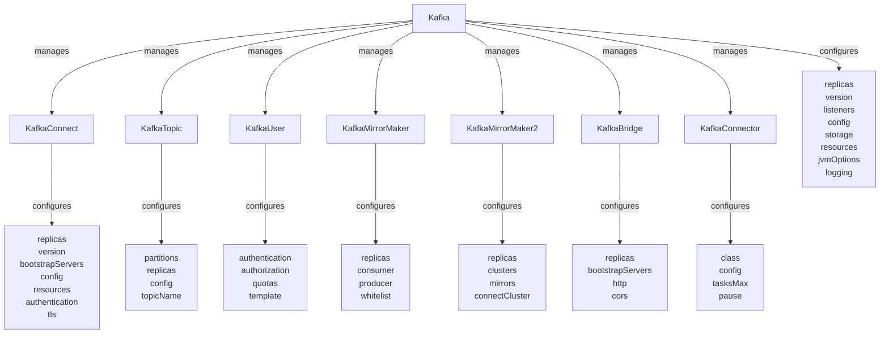
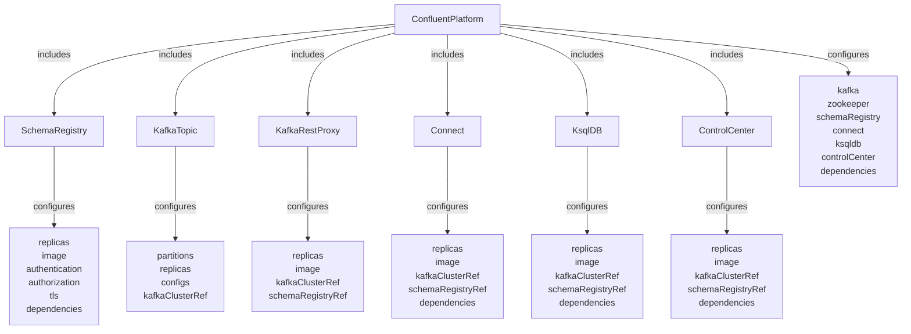
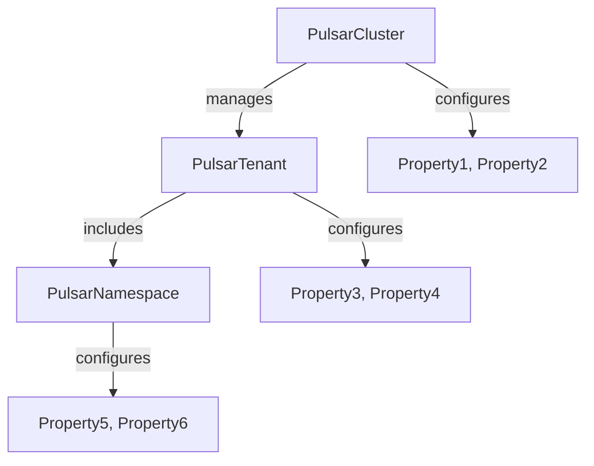
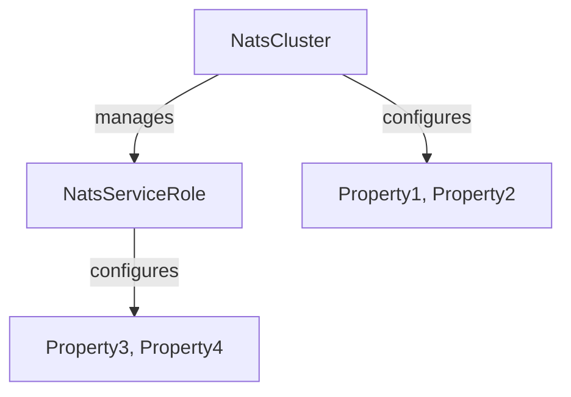
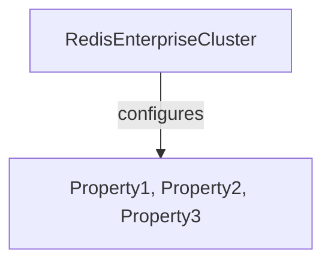
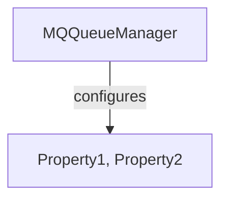
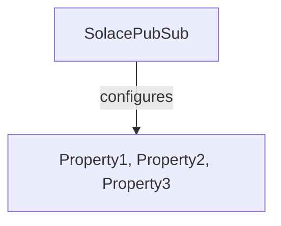
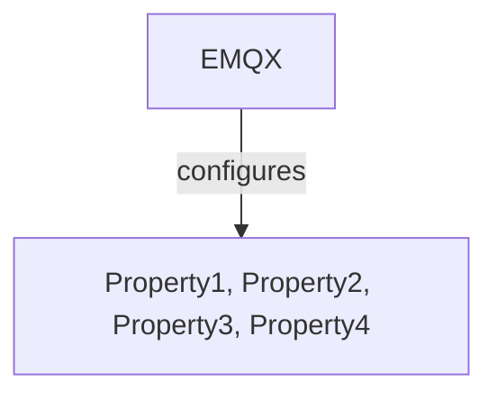

# Deployment Guide for Messaging Systems

This guide provides step-by-step instructions for deploying selected messaging solutions.

## Preparations

Before deploying any messaging solution, make sure to:

1. **Identify Requirements**: Understand your needs for scalability, durability, etc.
2. **Select Platform**: Choose between on-premises or cloud deployment.
3. **Resource Planning**: Allocate necessary compute, network, and storage resources.

## Default Operating Model: Kubernetes Operators

For modern cloud-native deployments, **Kubernetes operators are the default target operating model**. They provide declarative, automated management of messaging systems with advanced capabilities like auto-scaling, rolling updates, and disaster recovery.

### Kubernetes Operators Capability Matrix

| Messaging System | Operator Name | Maintainer | Capability Level | Default/Exception | Installation Method | Key Features |
|------------------|---------------|------------|------------------|-------------------|---------------------|---------------|
| **Apache Kafka** | Strimzi | Red Hat/Community | **Level 5** | ✅ **Default** | Helm/OLM | Auto-scaling, rolling updates, monitoring, security |
| **Apache Kafka** | Confluent for Kubernetes | Confluent | **Level 5** | ✅ **Default** | Helm/Operator | Enterprise features, RBAC, schema registry |
| **RabbitMQ** | RabbitMQ Cluster Operator | VMware/Pivotal | **Level 4** | ✅ **Default** | Helm/kubectl | Clustering, TLS, monitoring, backup |
| **Apache Pulsar** | Pulsar Operator | StreamNative | **Level 4** | ✅ **Default** | Helm/kubectl | Multi-tenant, geo-replication, auto-scaling |
| **NATS** | NATS Operator | Synadia | **Level 4** | ✅ **Default** | Helm/kubectl | JetStream, clustering, monitoring |
| **Redis** | Redis Enterprise Operator | Redis Labs | **Level 5** | ✅ **Default** | Helm/OLM | Active-active, scaling, backup, monitoring |
| **Redis** | Redis Operator | Opstree | **Level 3** | ⚠️ **Exception** | Helm/kubectl | Basic clustering, sentinel, monitoring |
| **IBM MQ** | IBM MQ Operator | IBM | **Level 4** | ✅ **Default** | OLM/Helm | Enterprise features, HA, security |
| **Solace** | Solace PubSub+ Operator | Solace | **Level 4** | ✅ **Default** | Helm/kubectl | HA, monitoring, DMR, scaling |
| **MQTT** | EMQX Operator | EMQX | **Level 4** | ✅ **Default** | Helm/kubectl | Clustering, persistence, monitoring |
| **MQTT** | Mosquitto Operator | Eclipse | **Level 2** | ❌ **Exception** | kubectl | Basic deployment, limited features |
| **AWS SQS/SNS** | AWS Controllers for Kubernetes (ACK) | AWS | **Level 3** | ⚠️ **Exception** | Helm/kubectl | Basic resource management, IAM integration |

### Kubernetes Operator CRD Objects with Mermaid.js Schemas

Each Kubernetes operator provides specific Custom Resource Definitions (CRDs) that define the desired state of the messaging systems. Below is a list of CRDs available for various messaging operators, along with Mermaid.js schemas to visualize dependencies and properties:

#### Apache Kafka (Strimzi)
Mermaid.js Schema:


- **Kafka**: Defines a complete Kafka cluster with brokers, Zookeeper, and entity operator
- **KafkaConnect**: Configuration for Kafka Connect clusters for streaming data integration
- **KafkaTopic**: Manages Kafka topics with partitions and replication settings
- **KafkaUser**: Manages Kafka user resources with authentication and authorization
- **KafkaMirrorMaker**: Manages Kafka MirrorMaker for cluster replication
- **KafkaMirrorMaker2**: Manages Kafka MirrorMaker 2.0 for advanced replication
- **KafkaBridge**: Manages Kafka Bridge for HTTP-based access
- **KafkaConnector**: Manages individual Kafka Connect connectors

#### Apache Kafka (Confluent)
Mermaid.js Schema:


- **ConfluentPlatform**: Comprehensive management of Confluent components including Kafka, Schema Registry, Connect, and ksqlDB
- **SchemaRegistry**: Defines schema registry deployments with authentication and authorization
- **KafkaTopic**: Manages topics with advanced configurations and cluster references
- **KafkaRestProxy**: Manages Kafka REST Proxy for HTTP-based access
- **Connect**: Manages Kafka Connect clusters for data integration
- **KsqlDB**: Manages ksqlDB for stream processing
- **ControlCenter**: Manages Confluent Control Center for monitoring and management

#### RabbitMQ
Mermaid.js Schema:


```mermaid
graph TD;
  RabbitmqCluster -->|manages| User;
  RabbitmqCluster -->|manages| Vhost;
  RabbitmqCluster -->|manages| Queue;
  RabbitmqCluster -->|manages| Exchange;
  RabbitmqCluster -->|manages| Binding;
  RabbitmqCluster -->|manages| Policy;
  RabbitmqCluster -->|manages| Permission;
  RabbitmqCluster -->|manages| SchemaReplication;
  RabbitmqCluster -->|manages| Shovel;
  RabbitmqCluster -->|manages| Federation;
  RabbitmqCluster -->|manages| TopicOperator;
  RabbitmqCluster -->|manages| Operator;
  
  RabbitmqCluster -->|configures| RCProps["replicas<br/>image<br/>service<br/>persistence<br/>resources<br/>rabbitmq<br/>tls<br/>override"];
  User -->|configures| UProps["username<br/>password<br/>passwordHash<br/>tags<br/>rabbitmqClusterReference"];
  Vhost -->|configures| VProps["name<br/>defaultQueueType<br/>tags<br/>tracing<br/>rabbitmqClusterReference"];
  Queue -->|configures| QProps["name<br/>vhost<br/>type<br/>durable<br/>autoDelete<br/>arguments<br/>rabbitmqClusterReference"];
  Exchange -->|configures| EProps["name<br/>vhost<br/>type<br/>durable<br/>autoDelete<br/>arguments<br/>rabbitmqClusterReference"];
  Binding -->|configures| BProps["source<br/>destination<br/>destinationType<br/>routingKey<br/>arguments<br/>vhost<br/>rabbitmqClusterReference"];
  Policy -->|configures| PProps["name<br/>vhost<br/>pattern<br/>applyTo<br/>definition<br/>priority<br/>rabbitmqClusterReference"];
  Permission -->|configures| PermProps["user<br/>vhost<br/>permissions<br/>rabbitmqClusterReference"];
  SchemaReplication -->|configures| SRProps["name<br/>endpoints<br/>upstreamSet<br/>ackMode<br/>rabbitmqClusterReference"];
  Shovel -->|configures| ShProps["name<br/>vhost<br/>uriSecret<br/>sourceQueue<br/>destQueue<br/>rabbitmqClusterReference"];
  Federation -->|configures| FProps["name<br/>vhost<br/>uriSecret<br/>expires<br/>messageTTL<br/>rabbitmqClusterReference"];
  TopicOperator -->|configures| TOProps["name<br/>vhost<br/>config<br/>bindings<br/>rabbitmqClusterReference"];
  Operator -->|configures| OpProps["name<br/>config<br/>permissions<br/>rabbitmqClusterReference"];
```

- **RabbitmqCluster**: Manages RabbitMQ clusters with high availability and clustering
- **User**: Configures RabbitMQ users with authentication and authorization
- **Vhost**: Manages virtual hosts for multi-tenancy
- **Queue**: Defines queues with durability and configuration options
- **Exchange**: Manages exchanges for message routing
- **Binding**: Creates bindings between exchanges and queues
- **Policy**: Defines policies for queues and exchanges
- **Permission**: Manages user permissions for vhosts
- **SchemaReplication**: Configures schema replication for distributed setups
- **Shovel**: Manages shovel plugins for message transfer
- **Federation**: Configures federation for distributed RabbitMQ
- **TopicOperator**: Provides topic management capabilities
- **Operator**: General RabbitMQ management operator including Messaging Topology Operator

#### Apache Pulsar
Mermaid.js Schema:


- **PulsarCluster**: Comprehensive cluster management
- **PulsarTenant**: Multi-tenancy setup
- **PulsarNamespace**: Defines namespaces within tenants

#### NATS
Mermaid.js Schema:


- **NatsCluster**: Manages NATS cluster resources
- **NatsServiceRole**: Defines roles and policies for NATS

#### Redis Enterprise
Mermaid.js Schema:


- **RedisEnterpriseCluster**: Management of Redis Enterprise clusters

#### IBM MQ
Mermaid.js Schema:


- **MQQueueManager**: Manages queue manager instances

#### Solace
Mermaid.js Schema:


- **SolacePubSub**: Configuration of Solace PubSub+ features

#### MQTT (EMQX Operator)
Mermaid.js Schema:


- **EMQX**: Manages EMQX deployments with clustering and persistence


### Capability Levels Explained

- **Level 1 - Basic Install**: Basic deployment and configuration
- **Level 2 - Seamless Upgrades**: Automated upgrades and patches
- **Level 3 - Full Lifecycle**: Backup, failure recovery, scaling
- **Level 4 - Deep Insights**: Metrics, alerts, log processing, workload analysis
- **Level 5 - Auto Pilot**: Auto-scaling, tuning, anomaly detection, capacity planning

### Operating Model Classification

- ✅ **Default**: Operators with Level 4+ capabilities, production-ready, actively maintained
- ⚠️ **Exception**: Operators with Level 3 capabilities, require additional tooling
- ❌ **Exception**: Operators with Level 1-2 capabilities, not recommended for production

### Deployment Preference Order

1. **Default Operators** (Level 4-5): Use these for production deployments
2. **Exception Operators** (Level 3): Use only when default operators are not available
3. **Manual Deployment**: Use only for development/testing environments

## Kubernetes Deployment Examples

### Apache Kafka with Strimzi Operator

```bash
# Install Strimzi operator
kubectl create namespace kafka
kubectl apply -f 'https://strimzi.io/install/latest?namespace=kafka' -n kafka

# Deploy Kafka cluster
kubectl apply -f - <<EOF
apiVersion: kafka.strimzi.io/v1beta2
kind: Kafka
metadata:
  name: my-cluster
  namespace: kafka
spec:
  kafka:
    version: 3.6.0
    replicas: 3
    listeners:
      - name: plain
        port: 9092
        type: internal
        tls: false
      - name: tls
        port: 9093
        type: internal
        tls: true
    config:
      offsets.topic.replication.factor: 3
      transaction.state.log.replication.factor: 3
      transaction.state.log.min.isr: 2
      default.replication.factor: 3
      min.insync.replicas: 2
    storage:
      type: persistent-claim
      size: 100Gi
      deleteClaim: false
  zookeeper:
    replicas: 3
    storage:
      type: persistent-claim
      size: 100Gi
      deleteClaim: false
  entityOperator:
    topicOperator: {}
    userOperator: {}
EOF
```

### RabbitMQ with Cluster Operator

```bash
# Install RabbitMQ Cluster Operator
kubectl apply -f https://github.com/rabbitmq/cluster-operator/releases/latest/download/cluster-operator.yml

# Deploy RabbitMQ cluster
kubectl apply -f - <<EOF
apiVersion: rabbitmq.com/v1beta1
kind: RabbitmqCluster
metadata:
  name: hello-world
  namespace: rabbitmq-system
spec:
  replicas: 3
  resources:
    requests:
      cpu: 256m
      memory: 1Gi
    limits:
      cpu: 256m
      memory: 1Gi
  rabbitmq:
    additionalConfig: |
      cluster_formation.peer_discovery_backend = rabbit_peer_discovery_k8s
      cluster_formation.k8s.host = kubernetes.default.svc.cluster.local
      cluster_formation.node_cleanup.interval = 30
      cluster_formation.node_cleanup.only_log_warning = true
      cluster_partition_handling = autoheal
      queue_master_locator = min-masters
      loopback_users.guest = false
  persistence:
    storageClassName: fast-ssd
    storage: 20Gi
EOF
```

### Redis with Redis Enterprise Operator

```bash
# Install Redis Enterprise Operator
kubectl apply -f https://raw.githubusercontent.com/RedisLabs/redis-enterprise-k8s-docs/master/bundle.yaml

# Deploy Redis Enterprise Cluster
kubectl apply -f - <<EOF
apiVersion: app.redislabs.com/v1
kind: RedisEnterpriseCluster
metadata:
  name: rec
  namespace: redis-enterprise
spec:
  nodes: 3
  persistentSpec:
    enabled: true
    volumeSize: 10Gi
    storageClassName: fast-ssd
  redisEnterpriseNodeResources:
    limits:
      cpu: 2000m
      memory: 4Gi
    requests:
      cpu: 2000m
      memory: 4Gi
  redisEnterpriseImageSpec:
    imagePullPolicy: IfNotPresent
EOF
```

### NATS with NATS Operator

```bash
# Install NATS Operator
kubectl apply -f https://raw.githubusercontent.com/nats-io/k8s/master/setup/nats-operator-prereqs.yaml
kubectl apply -f https://raw.githubusercontent.com/nats-io/k8s/master/setup/nats-operator-deploy.yaml

# Deploy NATS Cluster
kubectl apply -f - <<EOF
apiVersion: nats.io/v1alpha2
kind: NatsCluster
metadata:
  name: nats-cluster
  namespace: nats-io
spec:
  size: 3
  version: "2.10.7"
  serverImage: "nats:2.10.7-alpine"
  pod:
    resources:
      requests:
        cpu: 100m
        memory: 128Mi
      limits:
        cpu: 200m
        memory: 256Mi
  natsConfig:
    jetstream:
      enabled: true
      fileStorage:
        size: 10Gi
        storageClassName: fast-ssd
EOF
```

## Traditional Deployment Steps (Exception Cases)

### Apache Kafka (Non-Kubernetes)
1. **Install Zookeeper**: Needed for Kafka's distributed environment.
2. **Download Kafka**: Get the latest stable release.
3. **Configure Server**: Set up `server.properties` for your environment.
4. **Start Kafka**:
   ```bash
   bin/zookeeper-server-start.sh config/zookeeper.properties
   bin/kafka-server-start.sh config/server.properties
   ```
5. **Security Configurations**: Set ACLs and encryption if required.

### RabbitMQ
1. **Install Erlang**: Required for RabbitMQ.
2. **Download and Install RabbitMQ**: Use package manager or manual setup.
3. **Enable Plugins**:
   ```bash
   rabbitmq-plugins enable rabbitmq_management
   ```
4. **Start Server**: Run RabbitMQ service.
5. **Set Up Users & Permissions**: Configure vhosts and access controls.

### AWS SQS/SNS
1. **AWS Account Setup**: Make sure your AWS account is configured.
2. **Create Queues/Topics**: Use AWS SDK or console.
3. **Configure Policies**: Set necessary IAM policies.
4. **Integration Testing**: Use tools like AWS SDK or Postman.

### NATS Streaming
1. **Download NATS Server**: Obtain from official site.
2. **Start Server**:
   ```bash
   nats-server
   ```
3. **Connect Clients**: Use SDKs for client integration.
4. **Security Enhancement**: Apply TLS and user authentications.

## Kubernetes Operator Monitoring

### Prometheus Integration

Most operators provide Prometheus metrics out of the box:

```yaml
# Example ServiceMonitor for Kafka
apiVersion: monitoring.coreos.com/v1
kind: ServiceMonitor
metadata:
  name: kafka-metrics
  namespace: kafka
spec:
  selector:
    matchLabels:
      app.kubernetes.io/name: kafka
  endpoints:
  - port: tcp-prometheus
    interval: 30s
    path: /metrics
```

### Key Metrics to Monitor

| Messaging System | Key Metrics | Alert Thresholds |
|------------------|-------------|------------------|
| **Kafka** | kafka_server_replicamanager_underreplicated_partitions | > 0 |
| **RabbitMQ** | rabbitmq_queue_messages_ready | > 10000 |
| **Redis** | redis_memory_used_bytes | > 80% of limit |
| **NATS** | nats_jetstream_stream_messages | Monitor growth rate |
| **Pulsar** | pulsar_storage_size | > 90% of capacity |

### Grafana Dashboards

Recommended dashboard IDs:
- **Kafka**: 7589 (Strimzi Kafka Dashboard)
- **RabbitMQ**: 10991 (RabbitMQ Cluster)
- **Redis**: 11835 (Redis Enterprise)
- **NATS**: 12279 (NATS JetStream)

## Kubernetes Operator Troubleshooting

### Common Issues and Solutions

#### Operator Pod Issues
```bash
# Check operator status
kubectl get pods -n <operator-namespace>
kubectl logs -n <operator-namespace> <operator-pod>

# Check operator events
kubectl get events -n <operator-namespace> --sort-by=.metadata.creationTimestamp
```

#### Resource Creation Issues
```bash
# Check custom resource status
kubectl describe kafka my-cluster -n kafka
kubectl get kafka my-cluster -o yaml

# Check operator logs for specific resource
kubectl logs -n kafka deployment/strimzi-cluster-operator | grep my-cluster
```

#### Storage Issues
```bash
# Check PVC status
kubectl get pvc -n <namespace>
kubectl describe pvc <pvc-name> -n <namespace>

# Check storage class
kubectl get storageclass
```

#### Networking Issues
```bash
# Check service status
kubectl get svc -n <namespace>
kubectl describe svc <service-name> -n <namespace>

# Test connectivity
kubectl run test-pod --image=busybox --rm -it -- nslookup <service-name>.<namespace>.svc.cluster.local
```

### Best Practices for Operator Management

1. **Resource Limits**: Always set appropriate resource limits
2. **Monitoring**: Implement comprehensive monitoring from day one
3. **Backup Strategy**: Configure automated backups for stateful components
4. **Upgrade Testing**: Test operator upgrades in non-production environments
5. **Documentation**: Maintain runbooks for common operational tasks

## Verification & Testing

### Kubernetes-Specific Testing
```bash
# Test Kafka connectivity
kubectl run kafka-test --image=quay.io/strimzi/kafka:latest-kafka-3.6.0 --rm -it -- \
  bin/kafka-console-producer.sh --bootstrap-server my-cluster-kafka-bootstrap:9092 --topic test-topic

# Test RabbitMQ connectivity
kubectl run rabbitmq-test --image=rabbitmq:3.12-management --rm -it -- \
  rabbitmqctl -n rabbit@hello-world-server-0.hello-world-nodes.rabbitmq-system status

# Test Redis connectivity
kubectl run redis-test --image=redis:7-alpine --rm -it -- \
  redis-cli -h rec-ui.redis-enterprise ping
```

### Load Testing with Operators
- **Kafka**: Use kafka-producer-perf-test.sh and kafka-consumer-perf-test.sh
- **RabbitMQ**: Use rabbitmq-perf-test tool
- **Redis**: Use redis-benchmark
- **NATS**: Use nats bench utility

## Traditional Deployment Troubleshooting

### Log Analysis
- **Kafka**: Check server logs for error patterns
- **RabbitMQ**: Monitor management UI and logs
- **Redis**: Check redis-server logs
- **NATS**: Monitor server logs and metrics

### Configuration Refinement
- Tune performance settings based on workload
- Adjust memory and CPU allocations
- Configure appropriate replication factors

### Network Diagnostics
- Ensure proper DNS resolution
- Check firewall rules and security groups
- Verify load balancer configurations

## Deployment Best Practices
- Maintain version control for configurations.
- Automate deployment using scripts or tools like Ansible.
- Regular backups and disaster recovery plans.

## Conclusion
Deployment should align with organizational technical capabilities and constraints. Follow best practices to ensure smooth operation and maintenance.

