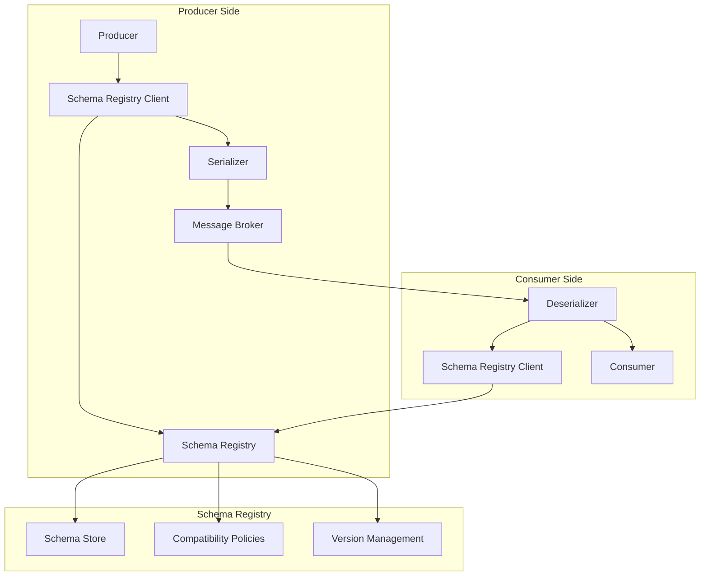

# Message Format Standards and Interoperability

This document provides comprehensive guidance on message format standards, interoperability best practices, and the use of schema registries in messaging systems.

## Message Format Standards

### Overview

Message formats define the structure and encoding of data transmitted between systems. Standardized formats ensure consistent data interpretation across different platforms and services.

### Common Message Formats

#### JSON (JavaScript Object Notation)
- **Advantages**: Human-readable, widely supported, simple to parse
- **Disadvantages**: Larger payload size, no schema validation by default
- **Best Use Cases**: Web APIs, configuration files, simple data exchange

```json
{
  "id": "12345",
  "timestamp": "2025-01-11T17:00:00Z",
  "event": "user_login",
  "data": {
    "userId": "user123",
    "source": "mobile_app"
  }
}
```

#### XML (eXtensible Markup Language)
- **Advantages**: Self-describing, strong schema validation, namespace support
- **Disadvantages**: Verbose, larger payload size, complex parsing
- **Best Use Cases**: Enterprise integration, document-centric applications

```xml
<?xml version="1.0" encoding="UTF-8"?>
<message>
  <id>12345</id>
  <timestamp>2025-01-11T17:00:00Z</timestamp>
  <event>user_login</event>
  <data>
    <userId>user123</userId>
    <source>mobile_app</source>
  </data>
</message>
```

#### Apache Avro
- **Advantages**: Compact binary format, schema evolution support, fast serialization
- **Disadvantages**: Not human-readable, requires schema registry
- **Best Use Cases**: High-throughput streaming, data pipelines

```json
{
  "type": "record",
  "name": "UserEvent",
  "fields": [
    {"name": "id", "type": "string"},
    {"name": "timestamp", "type": "long"},
    {"name": "event", "type": "string"},
    {"name": "data", "type": {
      "type": "record",
      "name": "EventData",
      "fields": [
        {"name": "userId", "type": "string"},
        {"name": "source", "type": "string"}
      ]
    }}
  ]
}
```

#### Protocol Buffers (protobuf)
- **Advantages**: Compact binary format, cross-language support, schema validation
- **Disadvantages**: Not human-readable, requires schema definition
- **Best Use Cases**: Microservices communication, gRPC services

```protobuf
syntax = "proto3";

message UserEvent {
  string id = 1;
  int64 timestamp = 2;
  string event = 3;
  EventData data = 4;
}

message EventData {
  string userId = 1;
  string source = 2;
}
```

#### MessagePack
- **Advantages**: Compact binary format, fast serialization, supports multiple data types
- **Disadvantages**: Not human-readable, limited schema validation
- **Best Use Cases**: High-performance applications, mobile applications

## Schema Registry

### Purpose and Benefits

A schema registry provides centralized management of message schemas, enabling:

- **Version Control**: Track schema evolution over time
- **Compatibility Checking**: Ensure backward and forward compatibility
- **Validation**: Verify message structure before processing
- **Documentation**: Centralized schema documentation

### Schema Registry Architecture



### Schema Evolution Strategies

#### Backward Compatibility
- New schema can read data written with old schema
- Add optional fields only
- Don't remove or rename existing fields

#### Forward Compatibility
- Old schema can read data written with new schema
- New fields must have default values
- Maintain field order and types

#### Full Compatibility
- Both backward and forward compatibility
- Most restrictive but safest approach

### Popular Schema Registry Solutions

#### Confluent Schema Registry
- **Features**: Avro, JSON Schema, Protobuf support
- **Compatibility**: Kafka ecosystem
- **Advantages**: Mature, well-documented, enterprise features

#### Apache Pulsar Schema Registry
- **Features**: Built-in schema registry
- **Compatibility**: Pulsar ecosystem
- **Advantages**: Native integration, multiple format support

#### AWS Glue Schema Registry
- **Features**: Managed service, supports Avro and JSON
- **Compatibility**: AWS ecosystem
- **Advantages**: Serverless, integrated with AWS services

## Interoperability Best Practices

### Design Principles

#### 1. Use Standard Formats
- Prefer widely adopted formats (JSON, XML, Avro)
- Avoid proprietary or custom formats
- Consider payload size vs. readability trade-offs

#### 2. Implement Schema Versioning
- Use semantic versioning for schemas
- Maintain backward compatibility when possible
- Document breaking changes clearly

#### 3. Include Metadata
- Add message headers for routing and processing
- Include timestamps and correlation IDs
- Embed schema version information

#### 4. Handle Errors Gracefully
- Implement proper error handling for schema validation
- Provide meaningful error messages
- Support fallback mechanisms

### Message Structure Best Practices

#### Envelope Pattern
Wrap business data in a standardized envelope:

```json
{
  "metadata": {
    "messageId": "uuid-12345",
    "timestamp": "2025-01-11T17:00:00Z",
    "version": "1.0.0",
    "source": "user-service",
    "correlationId": "trace-67890"
  },
  "payload": {
    "userId": "user123",
    "event": "user_login",
    "data": {
      "source": "mobile_app"
    }
  }
}
```

#### Content-Based Routing
Use message attributes for routing decisions:

```json
{
  "routingKey": "user.login.mobile",
  "eventType": "UserEvent",
  "priority": "normal",
  "payload": { ... }
}
```

## Data Contracts

### Definition
Data contracts define the structure, format, and semantics of data exchanged between systems, ensuring consistency and reliability.

### Components of Data Contracts

#### 1. Schema Definition
- Field names and types
- Required vs. optional fields
- Validation rules and constraints

#### 2. Semantic Meaning
- Business rules and logic
- Data transformations
- Field descriptions and usage

#### 3. SLA and Quality Metrics
- Data freshness requirements
- Accuracy expectations
- Availability guarantees

### Example Data Contract

```yaml
name: UserEvent
version: 1.0.0
description: User activity events from mobile and web applications
owner: user-experience-team
schema:
  type: object
  properties:
    userId:
      type: string
      format: uuid
      description: Unique identifier for the user
      required: true
    event:
      type: string
      enum: [login, logout, purchase, view]
      description: Type of user activity
      required: true
    timestamp:
      type: integer
      format: unix-timestamp
      description: Event occurrence time
      required: true
    source:
      type: string
      enum: [mobile_app, web_app, api]
      description: Source application
      required: true
sla:
  freshness: "< 5 minutes"
  accuracy: "> 99.9%"
  availability: "> 99.99%"
```

## Implementation Guidelines

### 1. Schema Registry Setup
- Deploy schema registry in high-availability mode
- Configure appropriate retention policies
- Set up authentication and authorization
- Enable schema validation enforcement

### 2. Client Configuration
- Configure schema registry endpoints
- Set up caching for performance
- Implement retry logic for failures
- Enable schema evolution checks

### 3. Monitoring and Observability
- Track schema registry performance
- Monitor schema validation failures
- Alert on compatibility violations
- Log schema evolution events

### 4. Governance and Policies
- Establish schema approval processes
- Define compatibility policies
- Document breaking change procedures
- Implement schema lifecycle management

## Anti-Patterns to Avoid

### Schema Anti-Patterns
- **Frequent Breaking Changes**: Avoid unnecessary schema modifications
- **Overly Complex Schemas**: Keep schemas simple and focused
- **Lack of Documentation**: Always document schema purpose and usage
- **Inconsistent Naming**: Use consistent naming conventions

### Integration Anti-Patterns
- **Tight Coupling**: Avoid dependencies on specific schema versions
- **Missing Validation**: Always validate messages against schemas
- **Ignoring Compatibility**: Don't ignore compatibility checks
- **Poor Error Handling**: Implement comprehensive error handling

## Conclusion

Implementing proper message format standards and interoperability practices is crucial for building robust, scalable messaging systems. By following these guidelines, organizations can ensure reliable data exchange, smooth system integration, and maintainable architectures.

Key takeaways:
- Choose appropriate message formats based on requirements
- Implement schema registry for centralized schema management
- Design for interoperability from the beginning
- Establish and maintain data contracts
- Monitor and govern schema evolution
