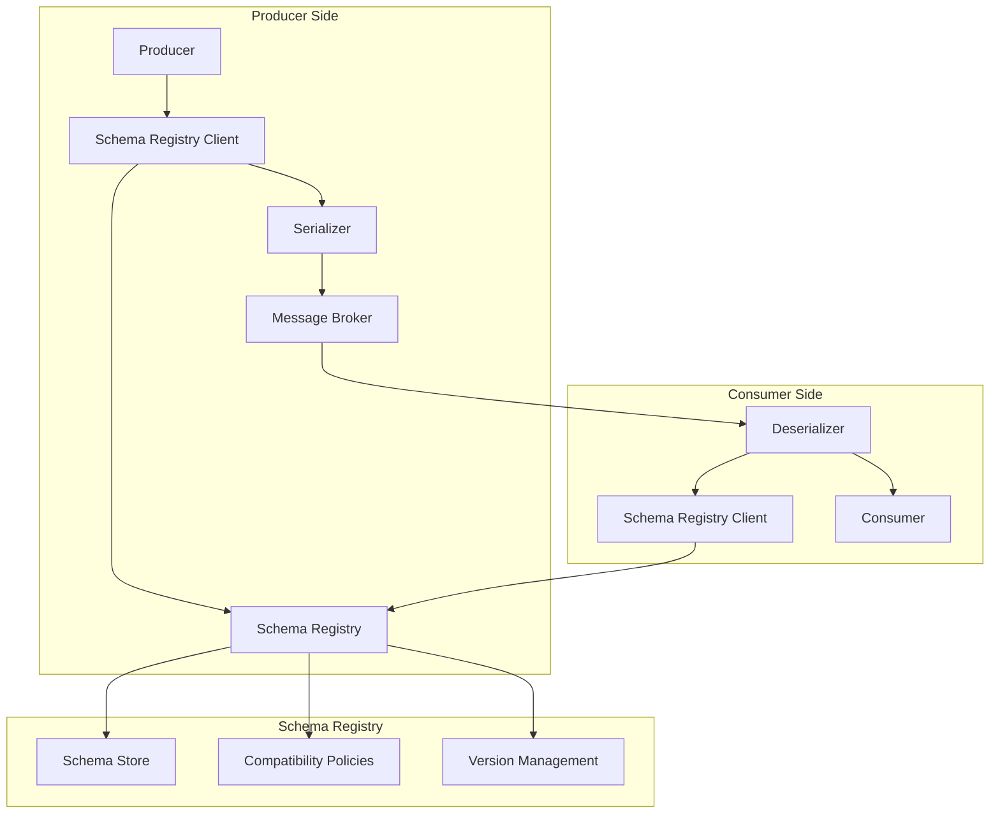

# Message Format Standards and Interoperability

This document provides comprehensive guidance on message format standards, interoperability best practices, and the use of schema registries in messaging systems.

## Message Format Standards

### Overview

Message formats define the structure and encoding of data transmitted between systems. Standardized formats ensure consistent data interpretation across different platforms and services.

### Common Message Formats

#### JSON (JavaScript Object Notation)
- **Advantages**: Human-readable, widely supported, simple to parse
- **Disadvantages**: Larger payload size, no schema validation by default
- **Best Use Cases**: Web APIs, configuration files, simple data exchange

```json
{
  "id": "12345",
  "timestamp": "2025-01-11T17:00:00Z",
  "event": "user_login",
  "data": {
    "userId": "user123",
    "source": "mobile_app"
  }
}
```

#### XML (eXtensible Markup Language)
- **Advantages**: Self-describing, strong schema validation, namespace support
- **Disadvantages**: Verbose, larger payload size, complex parsing
- **Best Use Cases**: Enterprise integration, document-centric applications

```xml
<?xml version="1.0" encoding="UTF-8"?>
<message>
  <id>12345</id>
  <timestamp>2025-01-11T17:00:00Z</timestamp>
  <event>user_login</event>
  <data>
    <userId>user123</userId>
    <source>mobile_app</source>
  </data>
</message>
```

#### Apache Avro
- **Advantages**: Compact binary format, schema evolution support, fast serialization
- **Disadvantages**: Not human-readable, requires schema registry
- **Best Use Cases**: High-throughput streaming, data pipelines

```json
{
  "type": "record",
  "name": "UserEvent",
  "fields": [
    {"name": "id", "type": "string"},
    {"name": "timestamp", "type": "long"},
    {"name": "event", "type": "string"},
    {"name": "data", "type": {
      "type": "record",
      "name": "EventData",
      "fields": [
        {"name": "userId", "type": "string"},
        {"name": "source", "type": "string"}
      ]
    }}
  ]
}
```

#### Protocol Buffers (protobuf)
- **Advantages**: Compact binary format, cross-language support, schema validation
- **Disadvantages**: Not human-readable, requires schema definition
- **Best Use Cases**: Microservices communication, gRPC services

```protobuf
syntax = "proto3";

message UserEvent {
  string id = 1;
  int64 timestamp = 2;
  string event = 3;
  EventData data = 4;
}

message EventData {
  string userId = 1;
  string source = 2;
}
```

#### MessagePack
- **Advantages**: Compact binary format, fast serialization, supports multiple data types
- **Disadvantages**: Not human-readable, limited schema validation
- **Best Use Cases**: High-performance applications, mobile applications

## Industry Standards for Event-Driven Architectures

### CloudEvents

**[CloudEvents](https://cloudevents.io/)** is a CNCF (Cloud Native Computing Foundation) specification that provides a standardized way to describe event data in a common format. It enables interoperability across different cloud providers and messaging systems.

#### Key Features
- **Vendor Neutrality**: Works across different cloud providers and messaging systems
- **Standardized Metadata**: Common set of attributes for all events
- **Multiple Encodings**: JSON, Avro, Protobuf, and XML support
- **HTTP and Message Binding**: Support for HTTP webhooks and message brokers

#### CloudEvents Specification

**Required Attributes:**
- `specversion`: CloudEvents specification version
- `type`: Event type (e.g., "com.example.user.created")
- `source`: Event source (e.g., "https://example.com/user-service")
- `id`: Unique event identifier

**Optional Attributes:**
- `time`: Event timestamp
- `subject`: Event subject
- `datacontenttype`: Data content type (e.g., "application/json")
- `data`: Event payload

#### CloudEvents Example

```json
{
  "specversion": "1.0",
  "type": "com.example.user.login",
  "source": "https://example.com/user-service",
  "id": "12345",
  "time": "2025-01-11T17:00:00Z",
  "subject": "user/user123",
  "datacontenttype": "application/json",
  "data": {
    "userId": "user123",
    "loginMethod": "oauth",
    "source": "mobile_app"
  }
}
```

#### CloudEvents Benefits
- **Interoperability**: Consistent event format across different systems
- **Tooling**: Rich ecosystem of tools and libraries
- **Cloud Integration**: Native support in major cloud platforms
- **Standardization**: Industry-wide adoption and standardization

### AsyncAPI

**[AsyncAPI](https://www.asyncapi.com/)** is an open-source specification for defining and documenting event-driven APIs. It's the equivalent of OpenAPI for asynchronous messaging.

#### Key Features
- **API Documentation**: Comprehensive documentation for async APIs
- **Code Generation**: Generate client libraries and server stubs
- **Validation**: Validate message schemas and API definitions
- **Tooling Ecosystem**: Rich set of tools and integrations

#### AsyncAPI Example

```yaml
asyncapi: 2.6.0
info:
  title: User Service API
  version: 1.0.0
  description: User management events

channels:
  user/login:
    publish:
      message:
        $ref: '#/components/messages/UserLogin'

components:
  messages:
    UserLogin:
      payload:
        type: object
        properties:
          userId:
            type: string
            format: uuid
          loginMethod:
            type: string
            enum: [oauth, password, sso]
          timestamp:
            type: string
            format: date-time
```

### Open Telemetry

**[OpenTelemetry](https://opentelemetry.io/)** provides observability standards for distributed systems, including message tracing and correlation.

#### Key Features
- **Distributed Tracing**: Track messages across system boundaries
- **Correlation IDs**: Link related events and messages
- **Metrics and Logs**: Comprehensive observability data
- **Vendor Neutral**: Works with multiple observability platforms

#### OpenTelemetry Message Headers

```json
{
  "traceparent": "00-4bf92f3577b34da6a3ce929d0e0e4736-00f067aa0ba902b7-01",
  "tracestate": "rojo=00f067aa0ba902b7,congo=t61rcWkgMzE",
  "baggage": "userId=user123,service=user-service"
}
```

### JSON Schema

**[JSON Schema](https://json-schema.org/)** is a vocabulary that allows you to annotate and validate JSON documents.

#### Key Features
- **Validation**: Validate JSON data structure and content
- **Documentation**: Self-documenting schemas
- **Code Generation**: Generate types and validation code
- **Tooling**: Extensive ecosystem of tools

#### JSON Schema Example

```json
{
  "$schema": "https://json-schema.org/draft/2020-12/schema",
  "$id": "https://example.com/user-event.schema.json",
  "title": "User Event",
  "description": "A user activity event",
  "type": "object",
  "properties": {
    "userId": {
      "type": "string",
      "format": "uuid",
      "description": "Unique user identifier"
    },
    "event": {
      "type": "string",
      "enum": ["login", "logout", "purchase"],
      "description": "Type of user activity"
    },
    "timestamp": {
      "type": "string",
      "format": "date-time",
      "description": "Event occurrence time"
    }
  },
  "required": ["userId", "event", "timestamp"]
}
```

## Standards Adoption by Messaging Systems

### CloudEvents Support Matrix

| Messaging System | CloudEvents Support | Implementation | Notes |
|------------------|-------------------|----------------|-------|
| **Apache Kafka** | Yes | Kafka Connect, Schema Registry | Native integration via connectors |
| **Apache Pulsar** | Yes | Built-in functions | Native CloudEvents support |
| **AWS EventBridge** | Yes | Native support | AWS native CloudEvents implementation |
| **Google Cloud Pub/Sub** | Yes | Native support | Google Cloud native support |
| **Azure Event Grid** | Yes | Native support | Microsoft Azure native support |
| **RabbitMQ** | Partial | Third-party libraries | Community-driven implementations |
| **NATS** | Yes | Libraries available | Community support |
| **Redis** | Partial | Application-level | Manual implementation required |
| **IBM MQ** | Partial | Custom implementation | Enterprise integration patterns |
| **Solace** | Yes | Event mesh integration | Enterprise-grade support |

### AsyncAPI Support Matrix

| Messaging System | AsyncAPI Support | Documentation | Code Generation |
|------------------|------------------|---------------|------------------|
| **Apache Kafka** | Yes | Full support | Yes |
| **Apache Pulsar** | Yes | Full support | Yes |
| **RabbitMQ** | Yes | Full support | Yes |
| **NATS** | Yes | Full support | Yes |
| **MQTT** | Yes | Full support | Yes |
| **WebSockets** | Yes | Full support | Yes |
| **AWS SQS/SNS** | Partial | Basic support | Limited |
| **Google Pub/Sub** | Partial | Basic support | Limited |
| **Azure Service Bus** | Partial | Basic support | Limited |

## Schema Registry

### Purpose and Benefits

A schema registry provides centralized management of message schemas, enabling:

- **Version Control**: Track schema evolution over time
- **Compatibility Checking**: Ensure backward and forward compatibility
- **Validation**: Verify message structure before processing
- **Documentation**: Centralized schema documentation

### Schema Registry Architecture



### Schema Evolution Strategies

#### Backward Compatibility
- New schema can read data written with old schema
- Add optional fields only
- Don't remove or rename existing fields

#### Forward Compatibility
- Old schema can read data written with new schema
- New fields must have default values
- Maintain field order and types

#### Full Compatibility
- Both backward and forward compatibility
- Most restrictive but safest approach

### Schema Registry Support Per Messaging Solution

| Messaging System | Schema Registry Support | Supported Formats                            | Implementation Details                                         |
|------------------|-------------------------|---------------------------------------------|---------------------------------------------------------------|
| Apache Kafka     | Yes                     | Avro, JSON Schema, Protobuf                 | Confluent Schema Registry, strong integration                 |
| RabbitMQ         | No                      | N/A                                         | Relies on application-level schema management                 |
| Apache Pulsar    | Yes (Built-in)          | Avro, JSON, Protobuf, and Custom Schemas    | Native schema registry with automatic validation             |
| NATS             | No                      | N/A                                         | Message format is application responsibility                  |
| Redis            | No                      | N/A                                         | Data structure validation at application level               |
| MQTT             | No                      | N/A                                         | Payload format defined by application                        |
| AWS SQS/SNS      | Yes (AWS Glue)          | Avro, JSON                                  | AWS Glue Schema Registry integration                          |
| IBM MQ           | No                      | N/A                                         | Message format validation through application logic          |
| Solace           | Yes (API-based)         | XML, JSON, Binary                           | Schema validation through API and event mesh features        |

#### Detailed Notes on Schema Registry Support

**Systems with Native Schema Registry Support:**

- **Apache Kafka**: Integrates seamlessly with Confluent Schema Registry. Producers and consumers can automatically serialize/deserialize messages using registered schemas. Supports schema evolution with compatibility checks.

- **Apache Pulsar**: Built-in schema registry that automatically validates messages against registered schemas. Supports multiple formats and provides automatic schema evolution.

- **AWS SQS/SNS**: Leverages AWS Glue Schema Registry for centralized schema management. Integrates with AWS ecosystem and provides automatic validation.

- **Solace**: Provides schema validation through its event mesh platform. Supports XML schema validation and custom binary formats through API-based validation.

**Systems without Native Schema Registry Support:**

- **RabbitMQ**: Does not provide built-in schema registry. Applications must implement their own schema validation logic or use external solutions.

- **NATS**: Focuses on simplicity and performance. Schema validation is left to application developers to implement.

- **Redis**: Primarily a data structure store. Schema validation for pub/sub messages is handled at the application level.

- **MQTT**: Lightweight protocol designed for IoT. Message payload format is entirely application-defined.

- **IBM MQ**: Enterprise messaging system that relies on application-level message format validation and transformation.

### Popular Schema Registry Solutions

#### Confluent Schema Registry
- **Features**: Avro, JSON Schema, Protobuf support
- **Compatibility**: Kafka ecosystem
- **Advantages**: Mature, well-documented, enterprise features

#### Apache Pulsar Schema Registry
- **Features**: Built-in schema registry
- **Compatibility**: Pulsar ecosystem
- **Advantages**: Native integration, multiple format support

#### AWS Glue Schema Registry
- **Features**: Managed service, supports Avro and JSON
- **Compatibility**: AWS ecosystem
- **Advantages**: Serverless, integrated with AWS services

### Best Practices for Schema Registry Implementation

#### For Systems with Native Schema Registry Support

**Apache Kafka + Confluent Schema Registry:**
```yaml
# Producer configuration
bootstrap.servers: localhost:9092
schema.registry.url: http://localhost:8081
key.serializer: io.confluent.kafka.serializers.KafkaAvroSerializer
value.serializer: io.confluent.kafka.serializers.KafkaAvroSerializer
```

**Apache Pulsar:**
```java
// Producer with schema
Producer<User> producer = client.newProducer(Schema.AVRO(User.class))
    .topic("user-events")
    .create();
```

**AWS SQS with Glue Schema Registry:**
```yaml
# Application configuration
aws.glue.schemaregistry.region: us-east-1
aws.glue.schemaregistry.registry.name: my-registry
aws.glue.schemaregistry.avro.compression: GZIP
```

#### For Systems without Native Schema Registry Support

**RabbitMQ with External Schema Validation:**
```python
# Python example with custom schema validation
import jsonschema
import json

def validate_message(message, schema):
    try:
        jsonschema.validate(json.loads(message), schema)
        return True
    except jsonschema.ValidationError:
        return False

# Producer
if validate_message(message, user_event_schema):
    channel.basic_publish(exchange='events', routing_key='user', body=message)
```

**MQTT with Application-Level Schema Management:**
```javascript
// Node.js example
const Ajv = require('ajv');
const ajv = new Ajv();

const userEventSchema = {
  type: 'object',
  properties: {
    userId: { type: 'string' },
    event: { type: 'string' },
    timestamp: { type: 'number' }
  },
  required: ['userId', 'event', 'timestamp']
};

const validate = ajv.compile(userEventSchema);

// Before publishing
if (validate(message)) {
  client.publish('user/events', JSON.stringify(message));
}
```

## Interoperability Best Practices

### Design Principles

#### 1. Use Standard Formats
- Prefer widely adopted formats (JSON, XML, Avro)
- Avoid proprietary or custom formats
- Consider payload size vs. readability trade-offs

#### 2. Implement Schema Versioning
- Use semantic versioning for schemas
- Maintain backward compatibility when possible
- Document breaking changes clearly

#### 3. Include Metadata
- Add message headers for routing and processing
- Include timestamps and correlation IDs
- Embed schema version information

#### 4. Handle Errors Gracefully
- Implement proper error handling for schema validation
- Provide meaningful error messages
- Support fallback mechanisms

### Message Structure Best Practices

#### Envelope Pattern
Wrap business data in a standardized envelope:

```json
{
  "metadata": {
    "messageId": "uuid-12345",
    "timestamp": "2025-01-11T17:00:00Z",
    "version": "1.0.0",
    "source": "user-service",
    "correlationId": "trace-67890"
  },
  "payload": {
    "userId": "user123",
    "event": "user_login",
    "data": {
      "source": "mobile_app"
    }
  }
}
```

#### Content-Based Routing
Use message attributes for routing decisions:

```json
{
  "routingKey": "user.login.mobile",
  "eventType": "UserEvent",
  "priority": "normal",
  "payload": { ... }
}
```

## Data Contracts

### Definition
Data contracts define the structure, format, and semantics of data exchanged between systems, ensuring consistency and reliability.

### Components of Data Contracts

#### 1. Schema Definition
- Field names and types
- Required vs. optional fields
- Validation rules and constraints

#### 2. Semantic Meaning
- Business rules and logic
- Data transformations
- Field descriptions and usage

#### 3. SLA and Quality Metrics
- Data freshness requirements
- Accuracy expectations
- Availability guarantees

### Example Data Contract

```yaml
name: UserEvent
version: 1.0.0
description: User activity events from mobile and web applications
owner: user-experience-team
schema:
  type: object
  properties:
    userId:
      type: string
      format: uuid
      description: Unique identifier for the user
      required: true
    event:
      type: string
      enum: [login, logout, purchase, view]
      description: Type of user activity
      required: true
    timestamp:
      type: integer
      format: unix-timestamp
      description: Event occurrence time
      required: true
    source:
      type: string
      enum: [mobile_app, web_app, api]
      description: Source application
      required: true
sla:
  freshness: "< 5 minutes"
  accuracy: "> 99.9%"
  availability: "> 99.99%"
```

## Implementation Guidelines

### 1. Schema Registry Setup
- Deploy schema registry in high-availability mode
- Configure appropriate retention policies
- Set up authentication and authorization
- Enable schema validation enforcement

### 2. Client Configuration
- Configure schema registry endpoints
- Set up caching for performance
- Implement retry logic for failures
- Enable schema evolution checks

### 3. Monitoring and Observability
- Track schema registry performance
- Monitor schema validation failures
- Alert on compatibility violations
- Log schema evolution events

### 4. Governance and Policies
- Establish schema approval processes
- Define compatibility policies
- Document breaking change procedures
- Implement schema lifecycle management

## Anti-Patterns to Avoid

### Schema Anti-Patterns
- **Frequent Breaking Changes**: Avoid unnecessary schema modifications
- **Overly Complex Schemas**: Keep schemas simple and focused
- **Lack of Documentation**: Always document schema purpose and usage
- **Inconsistent Naming**: Use consistent naming conventions

### Integration Anti-Patterns
- **Tight Coupling**: Avoid dependencies on specific schema versions
- **Missing Validation**: Always validate messages against schemas
- **Ignoring Compatibility**: Don't ignore compatibility checks
- **Poor Error Handling**: Implement comprehensive error handling

## Conclusion

Implementing proper message format standards and interoperability practices is crucial for building robust, scalable messaging systems. By following these guidelines, organizations can ensure reliable data exchange, smooth system integration, and maintainable architectures.

Key takeaways:
- Choose appropriate message formats based on requirements
- Implement schema registry for centralized schema management
- Design for interoperability from the beginning
- Establish and maintain data contracts
- Monitor and govern schema evolution
