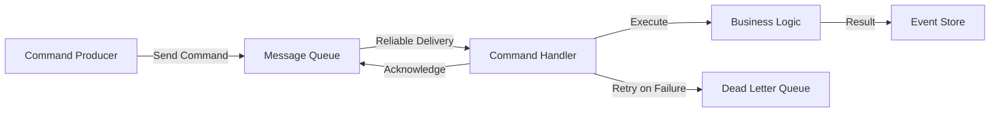
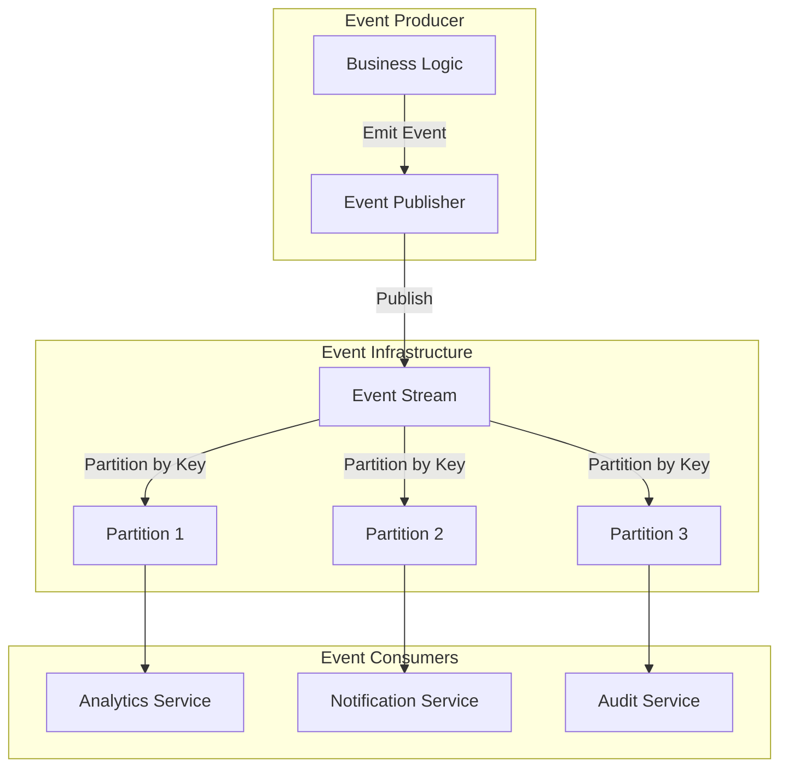
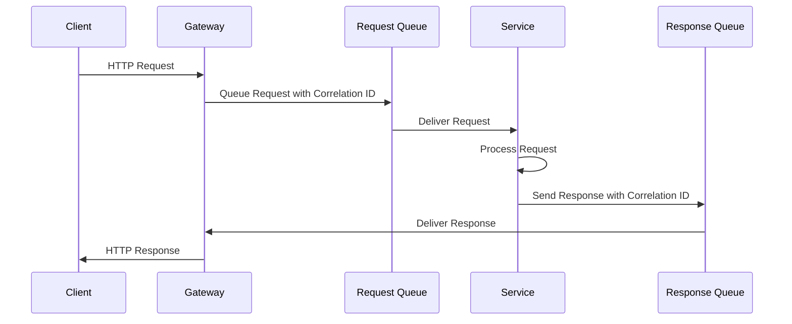

# Implementing Messaging Systems: Strategies by Message Type and Application

This comprehensive guide explores different implementation strategies for messaging systems based on message types, application domains, organizational patterns, and architectural considerations. Understanding these patterns enables architects and engineers to make informed decisions about messaging infrastructure that aligns with business requirements, technical constraints, and operational capabilities.

## Why Implementation Strategy Matters

The choice of implementation strategy directly impacts:

- **Performance**: Message throughput, latency, and resource utilization

- **Scalability**: Ability to handle growing workloads and user bases

- **Reliability**: System availability, fault tolerance, and data consistency

- **Maintainability**: Operational complexity and development velocity

- **Cost**: Infrastructure expenses and operational overhead

- **Compliance**: Regulatory requirements and audit capabilities

This guide provides battle-tested patterns and practical implementations used by organizations ranging from startups to Fortune 500 companies.

## Implementation Strategies

### By Message Type

Different message types require tailored implementation approaches to optimize for their specific characteristics and use cases. Understanding these patterns helps ensure optimal performance, reliability, and maintainability.

#### Command Messages

Command messages represent instructions to perform specific actions. They embody the Command pattern from distributed systems design and require careful handling to ensure reliable execution.

**Characteristics:**
- Imperative nature ("do this")
- Single target consumer
- Requires guaranteed delivery
- Often needs acknowledgment
- May require transaction semantics

**Implementation Strategy:**



**Technology Recommendations:**

- **RabbitMQ**: Excellent for command queuing with guaranteed delivery

- **AWS SQS**: Managed command queuing with dead letter queues

- **IBM MQ**: Enterprise-grade transactional messaging

**Configuration Example (RabbitMQ):**
```yaml
command_queue_config:
  queue_name: "user-commands"
  durable: true
  auto_delete: false
  arguments:
    x-message-ttl: 300000  # 5 minutes
    x-dead-letter-exchange: "user-commands-dlx"
    x-max-retries: 3
  
  consumer_config:
    prefetch_count: 1
    auto_ack: false
    retry_policy:
      initial_delay: 1000
      max_delay: 30000
      backoff_multiplier: 2.0
```

**Implementation Best Practices:**

1. **Idempotency**: Design command handlers to be idempotent
```python
class UserCommandHandler:
    def handle_create_user(self, command):
        # Check if user already exists (idempotency check)
        if self.user_repo.exists(command.user_id):
            return self.user_repo.get(command.user_id)
        
        # Create user atomically
        user = User.create(command)
        self.user_repo.save(user)
        return user
```

2. **Command Pattern Implementation**:
```python
from abc import ABC, abstractmethod

class Command(ABC):
    @abstractmethod
    def execute(self):
        pass

class CreateUserCommand(Command):
    def __init__(self, user_data):
        self.user_data = user_data
    
    def execute(self):
        return UserService.create_user(self.user_data)
```

#### Event Messages

Event messages represent something that has happened in the system. They follow the Observer pattern and enable loose coupling between system components.

**Characteristics:**
- Descriptive nature ("this happened")
- Multiple interested consumers
- Immutable once published
- Time-ordered
- Often requires replay capability

**Implementation Strategy:**



**Technology Recommendations:**

- **Apache Kafka**: Industry standard for event streaming

- **Apache Pulsar**: Multi-tenant event streaming with built-in schema registry

- **AWS Kinesis**: Managed event streaming service

- **Google Pub/Sub**: Serverless event messaging

**Configuration Example (Kafka):**
```yaml
event_stream_config:
  topic: "user-events"
  partitions: 12
  replication_factor: 3
  retention_ms: 604800000  # 7 days
  
  producer_config:
    acks: "all"
    retries: 2147483647  # Max int
    enable_idempotence: true
    max_in_flight_requests_per_connection: 5
    
  consumer_config:
    group_id: "analytics-consumer-group"
    auto_offset_reset: "earliest"
    enable_auto_commit: false
    isolation_level: "read_committed"
```

**Event Schema Design:**
```json
{
  "type": "record",
  "name": "UserRegisteredEvent",
  "namespace": "com.company.events.user",
  "fields": [
    {"name": "eventId", "type": "string"},
    {"name": "eventType", "type": "string", "default": "UserRegistered"},
    {"name": "timestamp", "type": "long"},
    {"name": "userId", "type": "string"},
    {"name": "email", "type": "string"},
    {"name": "registrationSource", "type": "string"},
    {"name": "metadata", "type": {"type": "map", "values": "string"}}
  ]
}
```

**Implementation Best Practices:**

1. **Event Sourcing Pattern**:
```python
class EventStore:
    def append_event(self, stream_id, event, expected_version):
        # Append event to stream with optimistic concurrency control
        pass
    
    def get_events(self, stream_id, from_version=0):
        # Retrieve events for replay
        pass

class UserAggregate:
    def __init__(self, user_id):
        self.user_id = user_id
        self.version = 0
        self.events = []
    
    def register_user(self, email, name):
        event = UserRegisteredEvent(self.user_id, email, name)
        self.apply_event(event)
        return event
    
    def apply_event(self, event):
        self.events.append(event)
        self.version += 1
        # Update aggregate state based on event
```

#### Request/Response Messages

Request/response messages implement synchronous communication patterns where a request expects a corresponding response within a defined timeframe.

**Characteristics:**
- Bidirectional communication
- Correlation between request and response
- Timeout-based failure handling
- Often requires low latency
- May support both sync and async patterns

**Implementation Strategy:**



**Technology Recommendations:**
- **NATS**: High-performance request/reply messaging
- **RabbitMQ**: RPC pattern implementation
- **gRPC**: Modern RPC framework with streaming support
- **HTTP/2**: Standard request/response over HTTP

**Configuration Example (NATS):**
```yaml
request_response_config:
  subject: "user.service.requests"
  timeout: 5000  # 5 seconds
  max_waiting: 100
  
  connection_config:
    servers: ["nats://nats1:4222", "nats://nats2:4222"]
    reconnect_wait: 2
    max_reconnect: 10
    ping_interval: 20
    max_pings_out: 2
```

**Implementation Example (Python with NATS):**
```python
import asyncio
import nats
import json
from typing import Optional

class RequestResponseClient:
    def __init__(self, nats_client):
        self.nc = nats_client
    
    async def request(self, subject: str, data: dict, timeout: float = 5.0) -> Optional[dict]:
        try:
            response = await self.nc.request(
                subject, 
                json.dumps(data).encode(), 
                timeout=timeout
            )
            return json.loads(response.data.decode())
        except asyncio.TimeoutError:
            return None
    
    async def setup_service_handler(self, subject: str):
        async def handler(msg):
            try:
                request_data = json.loads(msg.data.decode())
                result = await self.process_request(request_data)
                await msg.respond(json.dumps(result).encode())
            except Exception as e:
                error_response = {"error": str(e)}
                await msg.respond(json.dumps(error_response).encode())
        
        await self.nc.subscribe(subject, cb=handler)
```

#### Document Messages

Document messages carry structured data that represents entities or complex information. They are common in document-oriented architectures and data integration scenarios.

**Characteristics:**
- Self-contained structured data
- Often large payload size
- May require schema validation
- Version evolution support needed
- Sometimes requires transformation

**Implementation Strategy:**

```yaml
document_message_config:
  message_format: "avro"  # or json, protobuf
  compression: "gzip"
  max_message_size: "10MB"
  schema_registry:
    enabled: true
    compatibility: "BACKWARD"
  
  validation:
    strict_mode: true
    transform_on_read: false
```

**Schema Evolution Example:**
```json
{
  "type": "record",
  "name": "CustomerDocument",
  "namespace": "com.company.documents",
  "version": "2.0",
  "fields": [
    {"name": "customerId", "type": "string"},
    {"name": "personalInfo", "type": {
      "type": "record",
      "name": "PersonalInfo",
      "fields": [
        {"name": "firstName", "type": "string"},
        {"name": "lastName", "type": "string"},
        {"name": "email", "type": "string"},
        {"name": "phone", "type": ["null", "string"], "default": null}
      ]
    }},
    {"name": "preferences", "type": ["null", {
      "type": "record",
      "name": "Preferences",
      "fields": [
        {"name": "language", "type": "string", "default": "en"},
        {"name": "timezone", "type": "string", "default": "UTC"}
      ]
    }], "default": null},
    {"name": "documentVersion", "type": "string", "default": "2.0"}
  ]
}
```

### By Application

#### Financial Services
- **Requirements**: High reliability, security, and auditability.
- **Implementation Strategy**:
  - **Security**: Use TLS for all communications and implement strict authentication mechanisms.
  - **Audit Logging**: Maintain comprehensive logs for all message exchanges.
  - **Transactional Integrity**: Ensure atomic and consistent message processing with platforms like IBM MQ.

#### IoT Applications
- **Requirements**: Low power usage, lightweight protocols.
- **Implementation Strategy**:
  - **Efficiency**: Use MQTT for lightweight and energy-efficient messaging.
  - **Device Management**: Implement device registries and monitoring tools.
  - **Scalability**: Prepare for high device count and burst message loads with load balancing.

#### Microservices Architectures
- **Requirements**: Decoupling, scalability, and resilience.
- **Implementation Strategy**:
  - **Event-Driven Architecture (EDA)**: Use event streaming for decoupled microservices with platforms like Apache Kafka.
  - **Resilience**: Apply Circuit Breaker patterns for fault isolation.
  - **Service Mesh**: Implement service meshes to manage complex microservice interactions.

## Key Considerations

- **Compliance and Standards**: Ensure implementation complies with relevant industry standards and regulations.
- **Integration Requirements**: Understand integration points with existing systems and databases.
- **Cost Management**: Evaluate the cost implications of different messaging technologies, balancing features and budget.

## Conclusion
A well-thought-out messaging system implementation aligned with specific message types and applications can significantly enhance your organization's ability to process, analyze, and respond to information effectively. By choosing the right tools and strategies, you ensure scalability, reliability, and forward compatibility.
