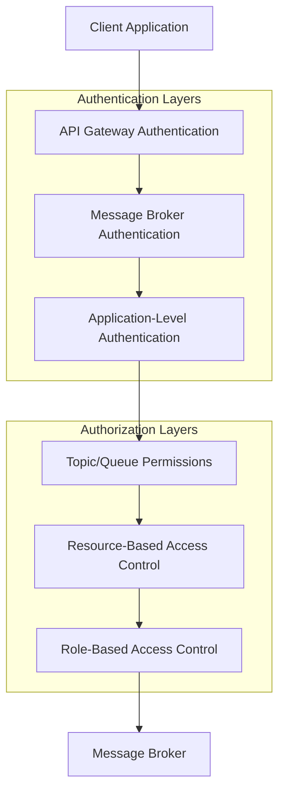
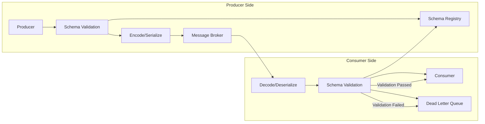
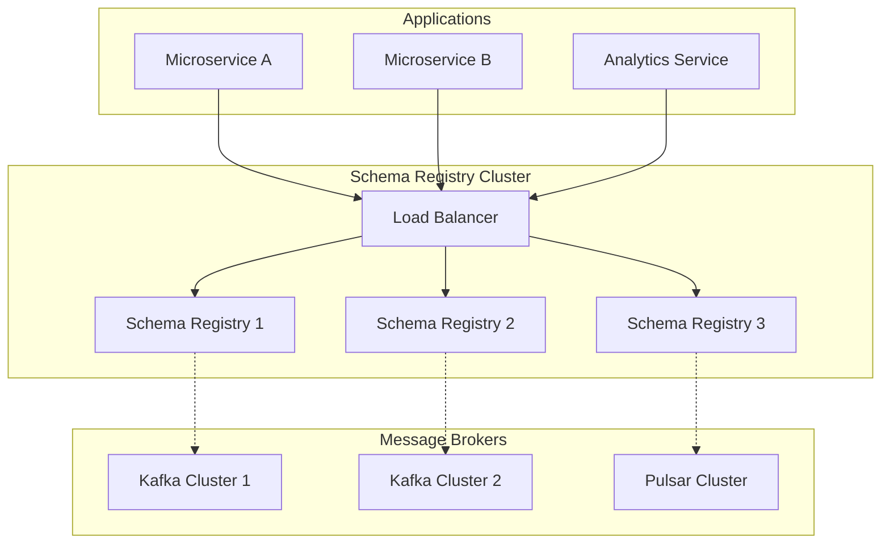
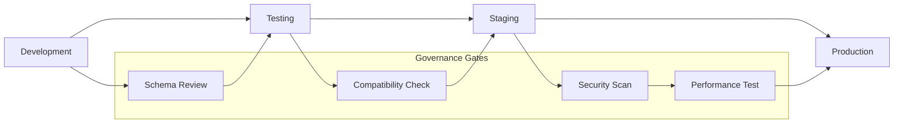

# Security, Data Quality, and Schema Registry Management

This comprehensive guide provides enterprise-grade best practices for implementing robust security measures, ensuring high data quality standards, and effectively managing schema registries in messaging systems. Whether you're working with Apache Kafka, RabbitMQ, Apache Pulsar, or other messaging platforms, these practices will help you build secure, reliable, and maintainable messaging infrastructure.

## Why This Guide Matters

In today's data-driven enterprise environments, messaging systems serve as the backbone for critical business operations. Poor security implementations can lead to data breaches, compliance violations, and significant financial losses. Inadequate data quality management results in unreliable analytics, failed integrations, and operational inefficiencies. Without proper schema governance, systems become fragile and difficult to evolve.

This guide addresses these challenges by providing:

- **Battle-tested security patterns** used by Fortune 500 companies

- **Quantifiable data quality frameworks** with measurable KPIs

- **Schema governance strategies** that enable rapid development while maintaining stability

- **Real-world implementation examples** with configuration templates

- **Compliance frameworks** for GDPR, HIPAA, and other regulations

## Security Management

### Authentication and Authorization

Authentication and authorization form the cornerstone of messaging system security. In enterprise environments, these systems often handle sensitive data across multiple organizational boundaries, making robust access control essential. A well-designed authentication and authorization strategy prevents unauthorized access, ensures data privacy, and maintains compliance with regulatory requirements.

#### Multi-layered Authentication

Multi-layered authentication provides defense in depth by implementing multiple security checkpoints. Each layer serves a specific purpose and adds an additional barrier against unauthorized access. This approach is particularly important in messaging systems where data flows through multiple components and network boundaries.

**Layer 1: API Gateway Authentication** - Validates client identity at the network perimeter

**Layer 2: Message Broker Authentication** - Verifies client credentials at the messaging platform level

**Layer 3: Application-Level Authentication** - Implements business-specific authentication logic

The authorization layers then determine what authenticated clients can access:

**Topic/Queue Permissions** - Fine-grained access control for specific messaging resources

**Resource-Based Access Control** - Permissions based on data classification and sensitivity

**Role-Based Access Control** - Permissions bundled into roles aligned with business functions



#### Implementation Strategies

**OAuth 2.0 / JWT Token Authentication:**
```yaml
# Kafka SASL/OAUTHBEARER configuration
sasl.mechanism: OAUTHBEARER
security.protocol: SASL_SSL
sasl.jaas.config: |
  org.apache.kafka.common.security.oauthbearer.OAuthBearerLoginModule required
  oauth.client.id="messaging-client"
  oauth.client.secret="client-secret"
  oauth.token.endpoint.url="https://auth.company.com/oauth/token";
```

**TLS Mutual Authentication:**
```properties
# Producer/Consumer TLS configuration
security.protocol=SSL
ssl.truststore.location=/path/to/kafka.client.truststore.jks
ssl.truststore.password=truststore-password
ssl.keystore.location=/path/to/kafka.client.keystore.jks
ssl.keystore.password=keystore-password
ssl.key.password=key-password
```

### Data Encryption

Data encryption serves as the last line of defense in messaging systems, protecting sensitive information even if other security controls fail. Modern messaging platforms handle vast amounts of data, often including personally identifiable information (PII), financial records, and proprietary business data. A comprehensive encryption strategy addresses both data at rest and data in transit, ensuring confidentiality throughout the entire data lifecycle.

#### Encryption at Rest

Encryption at rest protects stored data from unauthorized access, even if attackers gain physical access to storage media. This is particularly critical for messaging systems that maintain persistent message stores, transaction logs, and metadata repositories.

**Key Implementation Considerations:**

- **Message Persistence**: Encrypt all stored messages using industry-standard AES-256 encryption. This includes primary message content, message headers, and associated metadata.
- **Key Management**: Implement centralized key management using dedicated services like AWS KMS, Azure Key Vault, or HashiCorp Vault. Never store encryption keys alongside encrypted data.
- **Rotation Policies**: Establish automatic key rotation schedules (typically every 90-365 days) to limit the impact of potential key compromise.
- **Performance Impact**: Consider the CPU overhead of encryption/decryption operations and plan infrastructure capacity accordingly.

```yaml
# Apache Kafka encryption at rest example
log.dirs.encryption.key.provider.class=org.apache.kafka.common.security.encryption.KmsKeyProvider
log.dirs.encryption.key.id=arn:aws:kms:us-east-1:123456789012:key/12345678-1234-1234-1234-123456789012

# Additional encryption settings
log.dirs.encryption.algorithm=AES-256-GCM
log.dirs.encryption.key.rotation.interval.ms=7776000000  # 90 days
log.dirs.encryption.cache.size=1000
```

**Database and Storage Encryption:**
```yaml
# RabbitMQ encryption configuration
ssl_options:
  cacertfile: /path/to/ca_certificate.pem
  certfile: /path/to/server_certificate.pem
  keyfile: /path/to/server_key.pem
  verify: verify_peer
  fail_if_no_peer_cert: true

# Message store encryption
encryption:
  enabled: true
  algorithm: "AES-256-GCM"
  key_derivation: "PBKDF2"
```

#### Encryption in Transit

Encryption in transit protects data as it moves between clients and messaging brokers, and between different components of the messaging infrastructure. This prevents eavesdropping, man-in-the-middle attacks, and data tampering during transmission.

**Implementation Best Practices:**

- **TLS 1.3**: Use the latest TLS version for all client-broker communications. TLS 1.3 offers improved security and performance compared to earlier versions.
- **Certificate Validation**: Implement comprehensive certificate chain validation to prevent certificate-based attacks.
- **Perfect Forward Secrecy (PFS)**: Enable PFS cipher suites to ensure that even if long-term keys are compromised, past communications remain secure.
- **Certificate Management**: Implement automated certificate renewal and monitoring to prevent service disruptions due to expired certificates.

```properties
# Comprehensive TLS configuration for Kafka
security.protocol=SSL
ssl.protocol=TLSv1.3
ssl.enabled.protocols=TLSv1.2,TLSv1.3
ssl.cipher.suites=TLS_AES_256_GCM_SHA384,TLS_CHACHA20_POLY1305_SHA256,TLS_AES_128_GCM_SHA256
ssl.truststore.location=/path/to/kafka.client.truststore.jks
ssl.truststore.password=truststore-password
ssl.keystore.location=/path/to/kafka.client.keystore.jks
ssl.keystore.password=keystore-password
ssl.key.password=key-password
ssl.endpoint.identification.algorithm=HTTPS
ssl.client.auth=required
```

**Certificate Management Automation:**
```yaml
# Cert-manager configuration for automated certificate renewal
apiVersion: cert-manager.io/v1
kind: Certificate
metadata:
  name: messaging-tls-cert
spec:
  secretName: messaging-tls-secret
  issuerRef:
    name: company-ca-issuer
    kind: ClusterIssuer
  dnsNames:
  - messaging.company.com
  - "*.messaging.company.com"
  duration: 8760h  # 1 year
  renewBefore: 720h  # 30 days before expiry
```

### Access Control Implementation

#### Role-Based Access Control (RBAC)
```yaml
# Example RBAC configuration for Apache Kafka
roles:
  - name: "producer-role"
    permissions:
      - resource: "topic:user-events"
        operations: ["WRITE", "DESCRIBE"]
  - name: "consumer-role"
    permissions:
      - resource: "topic:user-events"
        operations: ["READ", "DESCRIBE"]
      - resource: "group:analytics-consumers"
        operations: ["READ"]
```

#### Attribute-Based Access Control (ABAC)
```json
{
  "policy": {
    "version": "1.0",
    "rules": [
      {
        "effect": "ALLOW",
        "subject": {
          "department": "analytics",
          "clearance_level": "confidential"
        },
        "resource": {
          "topic": "user-events",
          "classification": "confidential"
        },
        "action": ["READ", "DESCRIBE"]
      }
    ]
  }
}
```

## Data Quality Management

Data quality management in messaging systems ensures that information flowing through your infrastructure meets defined standards for accuracy, completeness, consistency, and timeliness. Poor data quality cascades through downstream systems, leading to incorrect analytics, failed business processes, and regulatory compliance issues. A comprehensive data quality strategy combines proactive validation, real-time monitoring, and automated remediation to maintain high data integrity standards.

### The Business Impact of Data Quality

Poor data quality costs organizations an average of $15 million annually according to Gartner research. In messaging systems, quality issues manifest as:

- **Analytical Errors**: Inaccurate business intelligence and reporting
- **Integration Failures**: Broken data pipelines and system outages
- **Compliance Violations**: Regulatory fines and audit failures
- **Operational Inefficiency**: Manual data cleanup and error handling
- **Customer Experience Issues**: Incorrect personalization and service delivery

### Schema-Driven Quality Assurance

Schema-driven quality assurance leverages message schemas as the foundation for data validation. This approach ensures that all messages conform to predefined structures, data types, and business rules before being processed by downstream systems. By implementing validation at multiple points in the data pipeline, organizations can catch and address quality issues early, preventing them from propagating through the system.

**Key Benefits:**
- **Early Detection**: Catch quality issues at the point of message production
- **Automated Validation**: Reduce manual quality checks and human error
- **Consistent Standards**: Enforce uniform data quality across all message types
- **Rapid Feedback**: Provide immediate feedback to producers about quality issues
- **Compliance Assurance**: Ensure messages meet regulatory and business requirements

#### Schema Validation Pipeline

The schema validation pipeline implements a comprehensive quality assurance process that validates messages at both production and consumption points. This dual validation approach ensures data quality even when producers and consumers are developed by different teams or organizations.


#### Data Quality Metrics
```yaml
data_quality_metrics:
  completeness:
    description: "Percentage of required fields present"
    threshold: 95%
    measurement: "required_fields_present / total_required_fields"
  
  validity:
    description: "Percentage of values conforming to format rules"
    threshold: 99%
    measurement: "valid_values / total_values"
  
  consistency:
    description: "Data consistency across related fields"
    threshold: 98%
    measurement: "consistent_records / total_records"
  
  timeliness:
    description: "Messages processed within SLA timeframe"
    threshold: 99.5%
    measurement: "on_time_messages / total_messages"
```

### Data Quality Monitoring

#### Real-time Quality Assessment
```python
# Example data quality validation
from jsonschema import validate, ValidationError
import logging

class DataQualityValidator:
    def __init__(self, schema_registry_client):
        self.schema_registry = schema_registry_client
        self.quality_metrics = {
            'total_messages': 0,
            'valid_messages': 0,
            'invalid_messages': 0,
            'missing_required_fields': 0
        }
    
    def validate_message(self, message, schema_id):
        try:
            schema = self.schema_registry.get_schema(schema_id)
            validate(instance=message, schema=schema)
            self.quality_metrics['valid_messages'] += 1
            return True
        except ValidationError as e:
            self.quality_metrics['invalid_messages'] += 1
            logging.error(f"Validation failed: {e.message}")
            return False
        finally:
            self.quality_metrics['total_messages'] += 1
    
    def get_quality_score(self):
        if self.quality_metrics['total_messages'] == 0:
            return 0
        return (self.quality_metrics['valid_messages'] / 
                self.quality_metrics['total_messages']) * 100
```

#### Quality Alerting System
```yaml
# Data quality alerting configuration
alerts:
  - name: "schema_validation_failure_rate"
    metric: "invalid_messages / total_messages"
    threshold: 0.05  # 5% failure rate
    severity: "HIGH"
    notification:
      - email: "data-ops@company.com"
      - slack: "#data-quality-alerts"
  
  - name: "missing_required_fields"
    metric: "missing_required_fields / total_messages"
    threshold: 0.02  # 2% missing fields
    severity: "MEDIUM"
    notification:
      - email: "data-engineers@company.com"
```

## Schema Registry Management

### Schema Registry Architecture Patterns

#### Centralized Schema Registry


### Schema Evolution Management

#### Compatibility Types Implementation

**Backward Compatibility:**
```json
{
  "type": "record",
  "name": "UserEvent",
  "namespace": "com.company.events",
  "fields": [
    {"name": "userId", "type": "string"},
    {"name": "eventType", "type": "string"},
    {"name": "timestamp", "type": "long"},
    {"name": "newOptionalField", "type": ["null", "string"], "default": null}
  ]
}
```

**Forward Compatibility:**
```json
{
  "type": "record",
  "name": "UserEvent",
  "namespace": "com.company.events",
  "fields": [
    {"name": "userId", "type": "string"},
    {"name": "eventType", "type": "string"},
    {"name": "timestamp", "type": "long"}
  ]
}
```

#### Schema Registry Configuration Examples

**Confluent Schema Registry:**
```properties
# Schema Registry configuration
listeners=http://0.0.0.0:8081
kafkastore.bootstrap.servers=kafka1:9092,kafka2:9092,kafka3:9092
kafkastore.topic=_schemas
kafkastore.topic.replication.factor=3
debug=false

# Security configuration
authentication.method=BASIC
authentication.roles=admin,write,read
authentication.realm=SchemaRegistry
```

**Apache Pulsar Schema Registry:**
```yaml
# Pulsar schema configuration
schemaRegistryConfig:
  schemaValidationEnabled: true
  schemaAutoUpdateCompatibilityStrategy: "BackwardTransitive"
  schemaCompatibilityChecks: true
```

### Schema Governance

#### Schema Lifecycle Management


#### Schema Registry Policies
```yaml
# Schema governance policies
governance:
  approval_workflow:
    enabled: true
    reviewers:
      - "data-architecture-team"
      - "security-team"
    
  compatibility_rules:
    default: "BACKWARD"
    exceptions:
      - subject: "critical-events-*"
        compatibility: "FULL"
    
  naming_conventions:
    - pattern: "^[a-z][a-z0-9-]*$"
      description: "Use lowercase with hyphens"
    - pattern: ".*-v[0-9]+$"
      description: "Include version suffix"
    
  security_policies:
    - encrypt_pii: true
    - data_classification: "CONFIDENTIAL|INTERNAL|PUBLIC"
    - retention_policy: "7_YEARS"
```

### Implementation Best Practices

#### Schema Registry High Availability
```yaml
# High availability configuration
schema_registry:
  cluster:
    nodes: 3
    replication_factor: 3
    min_insync_replicas: 2
  
  backup:
    enabled: true
    schedule: "0 2 * * *"  # Daily at 2 AM
    retention_days: 30
  
  monitoring:
    metrics_enabled: true
    health_checks:
      - endpoint: "/health"
        interval: 30s
      - endpoint: "/metrics"
        interval: 60s
```

#### Performance Optimization
```properties
# Schema Registry performance tuning
# Cache settings
schema.cache.size=1000
schema.cache.expiry.secs=300

# Connection pool settings
kafkastore.connection.pool.size=10
kafkastore.timeout.ms=5000

# Compression
compression.enable=true
compression.type=gzip
```

#### Monitoring and Alerting
```yaml
# Schema Registry monitoring
monitoring:
  metrics:
    - name: "schema_registry_requests_total"
      type: "counter"
      labels: ["method", "status"]
    
    - name: "schema_validation_duration_seconds"
      type: "histogram"
      buckets: [0.001, 0.01, 0.1, 1.0, 10.0]
    
    - name: "schema_registry_schemas_total"
      type: "gauge"
      description: "Total number of registered schemas"
  
  alerts:
    - name: "schema_registry_high_error_rate"
      condition: "rate(schema_registry_requests_total{status=~'4..|5..'}[5m]) > 0.1"
      severity: "warning"
    
    - name: "schema_registry_down"
      condition: "up{job='schema-registry'} == 0"
      severity: "critical"
```

## Security Compliance Framework

### Data Privacy and Protection

#### GDPR Compliance
```yaml
gdpr_compliance:
  data_classification:
    - type: "PII"
      fields: ["email", "phone", "address"]
      encryption: "AES-256"
      retention: "2_YEARS"
    
    - type: "SENSITIVE"
      fields: ["payment_info", "ssn"]
      encryption: "AES-256"
      retention: "7_YEARS"
  
  right_to_be_forgotten:
    enabled: true
    tombstone_messages: true
    purge_schedule: "weekly"
```

#### HIPAA Compliance
```yaml
hipaa_compliance:
  audit_logging:
    enabled: true
    log_all_access: true
    retention_period: "6_YEARS"
  
  encryption:
    at_rest: "AES-256"
    in_transit: "TLS_1_3"
    key_management: "HSM"
  
  access_controls:
    minimum_necessary: true
    role_based: true
    regular_reviews: "QUARTERLY"
```

## Conclusion

Implementing robust security, data quality management, and schema registry practices is essential for enterprise-grade messaging systems. Key takeaways:

- **Layered Security**: Implement multiple layers of authentication, authorization, and encryption
- **Proactive Quality Management**: Use schema-driven validation and real-time monitoring
- **Schema Governance**: Establish clear policies for schema evolution and lifecycle management
- **Compliance First**: Design systems with regulatory compliance in mind from the beginning
- **Continuous Monitoring**: Implement comprehensive monitoring and alerting for all components

Regular reviews and updates of these practices ensure your messaging infrastructure remains secure, reliable, and compliant with evolving requirements.
