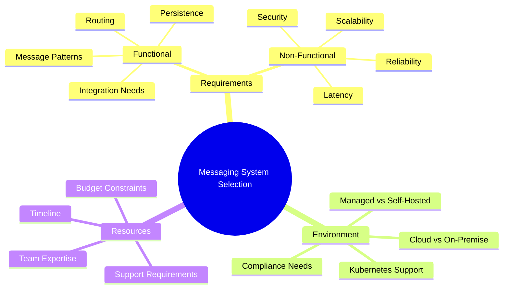

# Messaging System Selection Guide

!!! info "Purpose"
    This guide helps business units systematically choose the right messaging system based on their specific requirements, technical constraints, and business goals.

!!! note "Version Information"
    **Version:** 1.0.1 | **License:** MIT | **Last Updated:** January 2025

## Overview

Selecting the right messaging system is crucial for modern distributed applications. This guide provides a comprehensive framework to evaluate messaging solutions based on both functional and non-functional requirements.

## What You'll Find Here

### 📋 Requirements Analysis
- **[Functional vs Non-Functional Requirements](requirements/functional-vs-non-functional.md)** - Learn to distinguish between what your system must do vs how well it must perform
- **[Requirements Mapping](requirements/requirements-mapping.md)** - Map your business needs to technical capabilities

### 🌳 Decision Framework
- **[Decision Tree](decision-framework/decision-tree.md)** - Interactive decision tree to guide your selection process
- **[Selection Criteria](decision-framework/selection-criteria.md)** - Comprehensive criteria matrix for evaluation

### 🛠️ Messaging Solutions
- **[Architecture Overview](solutions/architecture-overview.md)** - Common messaging patterns and architectures
- **[Product Comparison](solutions/product-comparison.md)** - Detailed comparison of major messaging solutions
- **[Developer Guide](solutions/developer-guide.md)** - Development-focused comparison including SDKs, tooling, and developer experience

### 🚀 Implementation
- **[Deployment Guide](implementation/deployment-guide.md)** - How to deploy and configure your chosen solution
- **[Best Practices](implementation/best-practices.md)** - Industry best practices and common pitfalls

### 🎯 Use Cases
- **[Enterprise Integration](use-cases/enterprise-integration.md)** - Legacy system integration patterns
- **[Service Bus](use-cases/service-bus.md)** - IT integration and application connectivity
- **[IoT Messaging](use-cases/iot-messaging.md)** - Device-to-cloud communication patterns
- **[Microservices](use-cases/microservices.md)** - Service-to-service communication
- **[Real-time Analytics](use-cases/real-time-analytics.md)** - Event streaming and data processing

## Quick Start

1. **Define Your Requirements**: Start with [Requirements Analysis](requirements/functional-vs-non-functional.md)
2. **Use the Decision Tree**: Navigate through our [Decision Tree](decision-framework/decision-tree.md)
3. **Compare Solutions**: Review the [Product Comparison](solutions/product-comparison.md)
4. **Check Use Cases**: Find similar scenarios in our [Use Cases](use-cases/enterprise-integration.md)
5. **Plan Implementation**: Follow our [Deployment Guide](implementation/deployment-guide.md)

## Messaging Systems Covered

| Solution | Type | Best For |
|----------|------|----------|
| Apache Kafka | Event Streaming | Real-time analytics, event sourcing |
| RabbitMQ | Message Broker | Microservices, task queues |
| Apache Pulsar | Event Streaming | Multi-tenant, geo-replication |
| NATS | Lightweight Messaging | Cloud-native, microservices |
| Redis | In-Memory | Caching, real-time features |
| MQTT | IoT Protocol | IoT devices, telemetry |
| AWS SQS/SNS | Managed Cloud | Serverless, AWS ecosystem |
| IBM MQ | Enterprise | Legacy integration, transactions |
| Solace | Enterprise | Low-latency, enterprise features |

## Key Decision Factors

!!! tip "Best Practices"
    - Start with a proof of concept using the most promising solutions
    - Consider the total cost of ownership, not just licensing
    - Evaluate the ecosystem and community support
    - Plan for future scalability and feature needs

## Getting Started

Ready to begin? Start with our [Requirements Analysis](requirements/functional-vs-non-functional.md) to understand your needs, then use our [Decision Tree](decision-framework/decision-tree.md) for guided selection.

---

## About This Guide

| **Version** | **License** | **Last Updated** | **Contributors** |
|-------------|-------------|------------------|------------------|
| 1.0.1 | [MIT License](https://github.com/your-org/messaging-system-guide/blob/main/LICENSE) | January 2025 | Business Technology Team |

*This guide is designed to be practical and actionable. Each section builds upon the previous one to provide a comprehensive selection framework.*
