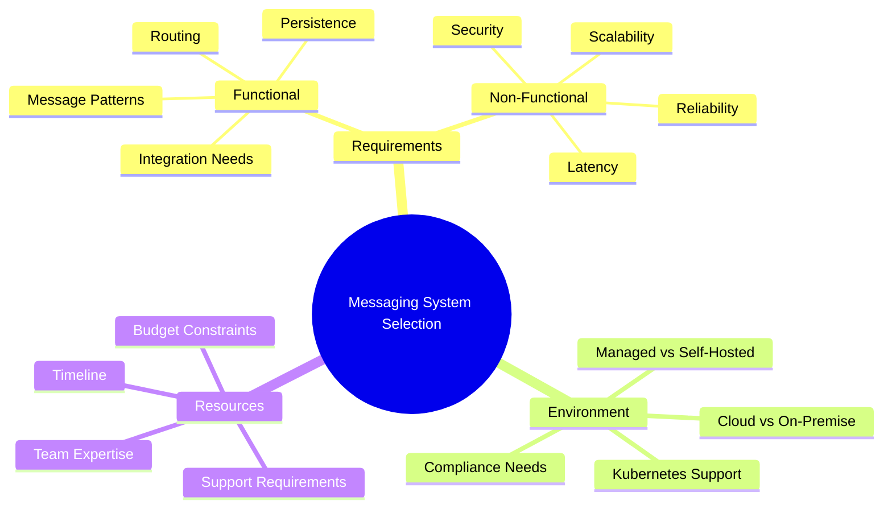

# Messaging System Selection Guide

!!! info "Purpose"
    This guide helps business units systematically choose the right messaging system based on their specific requirements, technical constraints, and business goals.

!!! note "Version Information"
    **Version:** 2.4.0 | **License:** MIT | **Last Updated:** July 2025

## Overview

Selecting the right messaging system is crucial for modern distributed applications. This guide provides a comprehensive framework to evaluate messaging solutions based on both functional and non-functional requirements.

## What You'll Find Here

### 📋 Requirements Analysis
- **[Functional vs Non-Functional Requirements](requirements/functional-vs-non-functional.md)** - Learn to distinguish between what your system must do vs how well it must perform
- **[Requirements Mapping](requirements/requirements-mapping.md)** - Map your business needs to technical capabilities with detailed examples and trade-offs
- **[Requirements Assessment Template](requirements/requirements-assessment-template.md)** - Structured template for systematic requirements gathering and evaluation

### 🌳 Decision Framework
- **[Decision Tree](decision-framework/decision-tree.md)** - Interactive decision tree with persona-based guidance and detailed examples
- **[Selection Criteria](decision-framework/selection-criteria.md)** - Comprehensive criteria matrix with business-focused evaluation framework

### 🛠️ Messaging Solutions
- **[Architecture Overview](solutions/architecture-overview.md)** - Common messaging patterns and architectures
- **[Product Comparison](solutions/product-comparison.md)** - Detailed comparison of major messaging solutions
- **[Developer Guide](solutions/developer-guide.md)** - Development-focused comparison including SDKs, tooling, and developer experience

### 🚀 Implementation
- **[Deployment Guide](implementation/deployment-guide.md)** - How to deploy and configure your chosen solution
- **[Best Practices](implementation/best-practices.md)** - Industry best practices and common pitfalls
- **[Message Format Standards](implementation/message-format-standards.md)** - Comprehensive guide to message formats, schema registries, and interoperability

### 🎯 Use Cases
- **[Enterprise Integration](use-cases/enterprise-integration.md)** - Legacy system integration patterns
- **[Service Bus](use-cases/service-bus.md)** - IT integration and application connectivity
- **[IoT Messaging](use-cases/iot-messaging.md)** - Device-to-cloud communication patterns
- **[Microservices](use-cases/microservices.md)** - Service-to-service communication
- **[Real-time Analytics](use-cases/real-time-analytics.md)** - Event streaming and data processing

## Quick Start

1. **Define Your Requirements**: Start with [Requirements Analysis](requirements/functional-vs-non-functional.md)
2. **Use the Decision Tree**: Navigate through our [Decision Tree](decision-framework/decision-tree.md)
3. **Compare Solutions**: Review the [Product Comparison](solutions/product-comparison.md)
4. **Check Use Cases**: Find similar scenarios in our [Use Cases](use-cases/enterprise-integration.md)
5. **Plan Implementation**: Follow our [Deployment Guide](implementation/deployment-guide.md)

## Messaging Systems Covered

| Solution | Type | Best For | Schema Registry | Latest Update |
|----------|------|----------|-----------------|---------------|
| **[Apache Kafka](messaging-systems/apache-kafka.md)** | Event Streaming | Real-time analytics, event sourcing | Yes (Confluent) | KRaft architecture |
| **[RabbitMQ](messaging-systems/rabbitmq.md)** | Message Broker | Microservices, task queues | No | Enhanced data model |
| **[Apache ActiveMQ](messaging-systems/apache-activemq.md)** | Message Broker | Integration, diverse systems | No | Multi-protocol support |
| **[Apache Pulsar](messaging-systems/apache-pulsar.md)** | Event Streaming | Multi-tenant, geo-replication | Yes (Built-in) | Multi-format support |
| **[NATS](messaging-systems/nats.md)** | Lightweight Messaging | Cloud-native, microservices | No | JetStream features |
| **[Redis](messaging-systems/redis.md)** | In-Memory | Caching, real-time features | No | Pub/Sub capabilities |
| **[MQTT](messaging-systems/mqtt.md)** | IoT Protocol | IoT devices, telemetry | No | Lightweight protocol |
| **[AWS SQS/SNS](messaging-systems/aws-sqs-sns.md)** | Managed Cloud | Serverless, AWS ecosystem | Yes (AWS Glue) | Serverless integration |
| **[IBM MQ](messaging-systems/ibm-mq.md)** | Enterprise | Legacy integration, transactions | No | Enterprise features |
| **[Solace](messaging-systems/solace.md)** | Enterprise | Low-latency, enterprise features | Yes (API-based) | Event mesh platform |

## Key Decision Factors

## What's New in Version 2.3.0

!!! success "Major Enhancements"
    **✨ New Features Added:**
    
    - **Interactive Mermaid Decision Tree** - Replaced text-based business decision tree with visual flowchart
    - **RabbitMQ Strategic Positioning** - Added RabbitMQ to business decision tree in three key positions
    - **Enhanced IoT Integration** - Moved IoT filtering to requirements definition for better decision flow
    - **Bank Assurance Use Case** - Added comprehensive bank assurance scenario to Quick Reference Guide
    - **Decision Node Visualization** - Color-coded decision nodes for better user experience
    - **Strategic Business Drivers** - Enhanced decision paths for cost, growth, advantage, risk, and innovation

!!! info "Key Improvements"
    **🔧 Enhanced Sections:**
    
    - **Business Decision Tree** - Interactive Mermaid flowchart with decision criteria
    - **Quick Reference Guide** - Added Bank Assurance with IBM MQ + ActiveMQ recommendation
    - **Decision Framework** - Better integration of IoT requirements and general messaging fallback
    - **RabbitMQ Positioning** - Strategic placement for open source preference, moderate expertise, and reliable solutions

!!! tip "Best Practices"
    - Start with our **Requirements Assessment Template** for structured evaluation
    - Use **persona-based guidance** to focus on your role's priorities
    - Consider **schema registry support** for data governance requirements
    - Evaluate **Total Cost of Ownership** using our business framework
    - Plan for **message format standards** and interoperability from the beginning

## Getting Started by Role

### 👨‍💼 **Business Decision Makers**
1. **[Business Decision Framework](decision-framework/selection-criteria.md#business-decision-makers-checklist)** - Strategic impact and ROI analysis
2. **[Cost Analysis](decision-framework/selection-criteria.md#5-total-cost-of-ownership-tco-analysis)** - TCO calculations and budget planning
3. **[Vendor Evaluation](decision-framework/selection-criteria.md#8-vendor-evaluation-criteria)** - Vendor stability and roadmap assessment

### 👩‍💻 **Technical Architects**
1. **[Technical Requirements](requirements/functional-vs-non-functional.md)** - Define functional and non-functional requirements
2. **[Architecture Patterns](solutions/architecture-overview.md)** - Understand messaging patterns and architectures
3. **[Solution Comparison](solutions/product-comparison.md)** - Detailed technical comparison matrix

### 🔧 **DevOps Engineers**
1. **[Deployment Guide](implementation/deployment-guide.md)** - Infrastructure and deployment considerations
2. **[Operational Complexity](decision-framework/selection-criteria.md#devops-engineers-operational-guide)** - Complexity assessment and monitoring
3. **[Best Practices](implementation/best-practices.md)** - Production deployment and maintenance

### 👨‍🔬 **Data Engineers**
1. **[Message Format Standards](implementation/message-format-standards.md)** - Schema management and data governance
2. **[Data Processing Patterns](decision-framework/selection-criteria.md#data-engineers-technical-guide)** - Streaming and batch processing
3. **[Integration Patterns](use-cases/real-time-analytics.md)** - Data pipeline architectures

## Universal Quick Start

New to messaging systems? Follow this path:

1. **[Requirements Assessment Template](requirements/requirements-assessment-template.md)** - Structured evaluation framework
2. **[Decision Tree](decision-framework/decision-tree.md)** - Interactive guidance for solution selection
3. **[Use Case Examples](use-cases/enterprise-integration.md)** - Find scenarios similar to your needs
4. **[Implementation Planning](implementation/deployment-guide.md)** - Plan your deployment strategy

---

## About This Guide

| **Version** | **License** | **Last Updated** | **Contributors** |
|-------------|-------------|------------------|------------------|
|| 2.3.3 | [MIT License](https://github.com/your-org/messaging-system-guide/blob/main/LICENSE) | July 2025 | Business Technology Team |

*This guide is designed to be practical and actionable. Each section builds upon the previous one to provide a comprehensive selection framework.*
