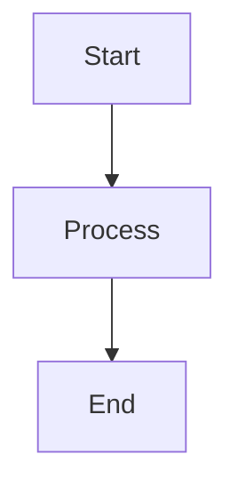

# Materials - Diagram Source Files

This page provides access to all diagram source files used in the messaging system tech watch documentation.

## Overview

All diagrams in this documentation are created using [Draw.io](https://app.diagrams.net/) and stored as `.drawio` files in the `docs/output/` directory. These files can be:

- **Opened directly** in Draw.io for editing
- **Imported** into other diagram tools
- **Version controlled** for collaborative editing
- **Exported** to various formats (PNG, SVG, PDF, etc.)

## Available Diagram Files

### 📊 **Core Documentation Diagrams**

| File | Description | Used In |
|------|-------------|---------|
| **[index_diagrams.drawio](output/index_diagrams.drawio)** | Main overview diagrams | [Home](index.md) |
| **[decision-tree_diagrams.drawio](output/decision-tree_diagrams.drawio)** | Decision tree flowcharts | [Decision Tree](decision-framework/decision-tree.md) |
| **[architecture-overview_diagrams.drawio](output/architecture-overview_diagrams.drawio)** | Architecture patterns | [Architecture Overview](solutions/architecture-overview.md) |
| **[message-format-standards_diagrams.drawio](output/message-format-standards_diagrams.drawio)** | Message format schemas | [Message Format Standards](implementation/message-format-standards.md) |
| **[deployment-guide_diagrams.drawio](output/deployment-guide_diagrams.drawio)** | Deployment architectures | [Deployment Guide](implementation/deployment-guide.md) |

### 🛠️ **Messaging Systems Diagrams**

| File | Description | Used In |
|------|-------------|---------|
| **[apache-kafka_diagrams.drawio](output/apache-kafka_diagrams.drawio)** | Kafka architecture diagrams | [Apache Kafka](messaging-systems/apache-kafka.md) |
| **[rabbitmq_diagrams.drawio](output/rabbitmq_diagrams.drawio)** | RabbitMQ architecture diagrams | [RabbitMQ](messaging-systems/rabbitmq.md) |
| **[apache-activemq_diagrams.drawio](output/apache-activemq_diagrams.drawio)** | ActiveMQ architecture diagrams | [Apache ActiveMQ](messaging-systems/apache-activemq.md) |
| **[apache-pulsar_diagrams.drawio](output/apache-pulsar_diagrams.drawio)** | Pulsar architecture diagrams | [Apache Pulsar](messaging-systems/apache-pulsar.md) |
| **[nats_diagrams.drawio](output/nats_diagrams.drawio)** | NATS architecture diagrams | [NATS](messaging-systems/nats.md) |
| **[redis_diagrams.drawio](output/redis_diagrams.drawio)** | Redis architecture diagrams | [Redis](messaging-systems/redis.md) |
| **[mqtt_diagrams.drawio](output/mqtt_diagrams.drawio)** | MQTT protocol diagrams | [MQTT](messaging-systems/mqtt.md) |
| **[aws-sqs-sns_diagrams.drawio](output/aws-sqs-sns_diagrams.drawio)** | AWS SQS/SNS diagrams | [AWS SQS/SNS](messaging-systems/aws-sqs-sns.md) |
| **[ibm-mq_diagrams.drawio](output/ibm-mq_diagrams.drawio)** | IBM MQ architecture diagrams | [IBM MQ](messaging-systems/ibm-mq.md) |
| **[solace_diagrams.drawio](output/solace_diagrams.drawio)** | Solace architecture diagrams | [Solace](messaging-systems/solace.md) |

### 🎯 **Use Case Diagrams**

| File | Description | Used In |
|------|-------------|---------|
| **[enterprise-integration_diagrams.drawio](output/enterprise-integration_diagrams.drawio)** | Enterprise integration patterns | [Enterprise Integration](use-cases/enterprise-integration.md) |
| **[service-bus_diagrams.drawio](output/service-bus_diagrams.drawio)** | Service bus architectures | [Service Bus](use-cases/service-bus.md) |
| **[iot-messaging_diagrams.drawio](output/iot-messaging_diagrams.drawio)** | IoT messaging patterns | [IoT Messaging](use-cases/iot-messaging.md) |
| **[microservices_diagrams.drawio](output/microservices_diagrams.drawio)** | Microservices communication | [Microservices](use-cases/microservices.md) |
| **[real-time-analytics_diagrams.drawio](output/real-time-analytics_diagrams.drawio)** | Real-time analytics flows | [Real-time Analytics](use-cases/real-time-analytics.md) |

## How to Use These Files

### 🔧 **Editing Diagrams**

1. **Download** the .drawio file you want to edit
2. **Open** [Draw.io](https://app.diagrams.net/) in your browser
3. **Import** the file using "File → Open from → Device"
4. **Edit** the diagrams as needed
5. **Save** the file back to the same location

### 📤 **Exporting Diagrams**

From Draw.io, you can export diagrams to various formats:

- **PNG** - For web documentation
- **SVG** - For scalable vector graphics
- **PDF** - For printable documentation
- **JPEG** - For general image use
- **XML** - For programmatic processing

### 🔄 **Version Control**

These .drawio files are version controlled with Git:

```bash
# To update a diagram file
git add docs/output/your-diagram_diagrams.drawio
git commit -m "feat: update diagram for [component]"
git push origin main
```

### 📋 **Creating New Diagrams**

When creating new diagrams:

1. **Create** a new .drawio file in `docs/output/`
2. **Follow naming convention**: `[page-name]_diagrams.drawio`
3. **Add to this materials.md** file
4. **Reference** in the appropriate documentation page

## Diagram Standards

### 🎨 **Style Guidelines**

- **Colors**: Use consistent color palette (blue: #2196F3, gray: #757575)
- **Fonts**: Use system fonts for better compatibility
- **Sizes**: Maintain consistent sizing across similar elements
- **Spacing**: Use consistent spacing and alignment

### 📐 **Technical Standards**

- **Resolution**: Design for web display (96 DPI)
- **Canvas Size**: Use appropriate canvas size for content
- **Layers**: Use layers for complex diagrams
- **Grouping**: Group related elements together

### 🏷️ **Naming Conventions**

- **File names**: `[page-name]_diagrams.drawio`
- **Diagram titles**: Clear, descriptive titles
- **Element names**: Consistent naming for similar elements
- **Layer names**: Descriptive layer names when using multiple layers

## Tools and Resources

### 🛠️ **Draw.io Resources**

- **[Draw.io Web App](https://app.diagrams.net/)** - Online editor
- **[Draw.io Desktop](https://github.com/jgraph/drawio-desktop)** - Desktop application
- **[Draw.io Documentation](https://desk.draw.io/)** - Official documentation
- **[Draw.io Shortcuts](https://app.diagrams.net/shortcuts.svg)** - Keyboard shortcuts

### 📚 **Diagram Templates**

Common diagram templates used in this documentation:

- **System Architecture**: Component diagrams with data flows
- **Network Topology**: Infrastructure and connectivity
- **Process Flow**: Step-by-step workflows
- **Data Flow**: Information movement patterns
- **Decision Trees**: Decision-making processes

### 🔗 **Integration with MkDocs**

These diagrams are referenced in the documentation using:

```markdown
<!-- For mermaid diagrams (preferred for simple diagrams) -->


<!-- For complex diagrams (exported from Draw.io) -->

```

## Contributing

When contributing diagram updates:

1. **Maintain consistency** with existing diagram styles
2. **Update this materials.md** when adding new diagram files
3. **Test exports** to ensure diagrams render correctly
4. **Follow commit conventions** for version control

## Support

For questions about diagram files or Draw.io usage:

- **Technical Issues**: Check the [Draw.io Community](https://github.com/jgraph/drawio/discussions)
- **Style Questions**: Reference existing diagrams for consistency
- **File Access**: Ensure you have appropriate permissions for the output directory

---

*This materials page is automatically updated when new diagram files are added to the `docs/output/` directory.*
