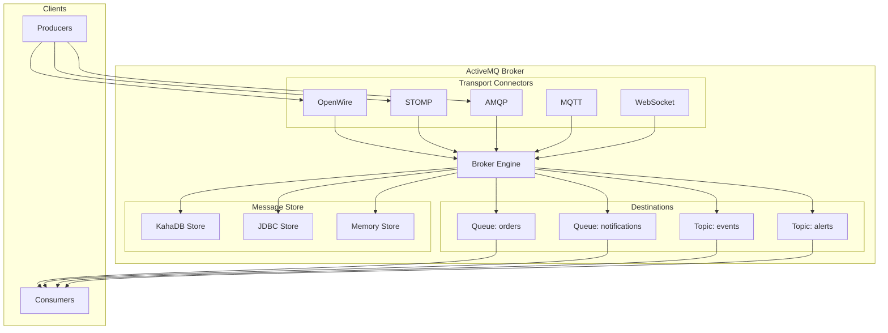
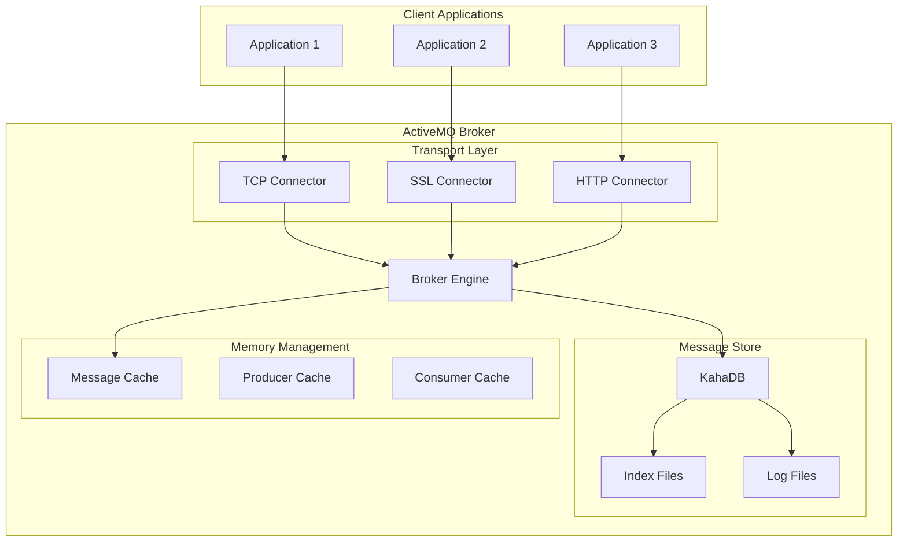
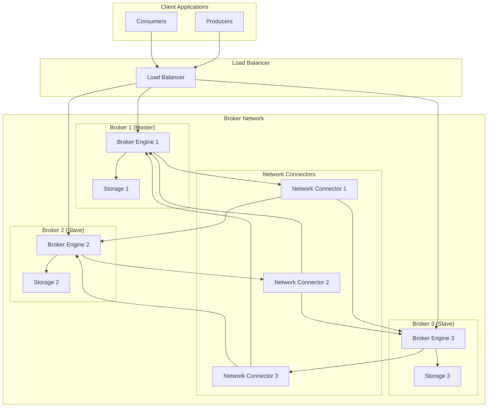

# Apache ActiveMQ

## Overview

Apache ActiveMQ is an open-source, multi-protocol, Java-based messaging server that implements the Java Message Service (JMS) API. It supports industry-standard protocols and provides reliable messaging for enterprise applications. ActiveMQ is known for its flexibility, ease of integration, and robust feature set, making it suitable for a wide range of messaging scenarios from simple point-to-point communication to complex enterprise integration patterns.

## Data Model

### Core Concepts



### Data Structure

- **Destinations**: Either queues (point-to-point) or topics (publish-subscribe)
- **Messages**: Structured data with headers, properties, and body
- **Connections**: Client connections to the broker
- **Sessions**: Context for producing and consuming messages
- **Producers**: Send messages to destinations
- **Consumers**: Receive messages from destinations

### Message Format

```json
{
  "messageId": "ID:broker-1-12345-1641234567890-1:1:1:1",
  "destination": "queue://orders",
  "headers": {
    "JMSType": "OrderMessage",
    "JMSPriority": 4,
    "JMSTimestamp": 1641234567890,
    "JMSExpiration": 1641234627890,
    "JMSCorrelationID": "order-123",
    "JMSReplyTo": "queue://order-replies"
  },
  "properties": {
    "customerId": "CUST-456",
    "orderType": "PURCHASE",
    "priority": "HIGH"
  },
  "body": {
    "orderId": "ORDER-789",
    "customerId": "CUST-456",
    "items": [
      {
        "productId": "PROD-001",
        "quantity": 2,
        "price": 29.99
      }
    ],
    "totalAmount": 59.98
  }
}
```

## Architecture Overview

### Single Broker Architecture



### Network of Brokers



## Target Operating Model (TOM)

### Without High Availability

#### Single Broker Setup

| Component | Specification | Purpose |
|-----------|---------------|---------|
| **ActiveMQ Broker** | 1 instance | Single point of message handling |
| **Message Store** | KahaDB or LevelDB | Message persistence |
| **Transport Connectors** | TCP, SSL, HTTP | Client connectivity |
| **Web Console** | Jetty-based | Management interface |

#### Resource Requirements

| Resource | Minimum | Recommended | Purpose |
|----------|---------|-------------|---------|
| **CPU** | 2 cores | 4+ cores | Message processing |
| **Memory** | 2GB | 4GB+ | JVM heap, message caching |
| **Storage** | 50GB | 200GB+ | Message persistence |
| **Network** | 100Mbps | 1Gbps+ | Client communication |

#### Configuration Example

```xml
<beans xmlns="http://www.springframework.org/schema/beans"
       xmlns:xsi="http://www.w3.org/2001/XMLSchema-instance"
       xsi:schemaLocation="http://www.springframework.org/schema/beans
       http://www.springframework.org/schema/beans/spring-beans.xsd">

  <broker xmlns="http://activemq.apache.org/schema/core"
          brokerName="localhost"
          dataDirectory="${activemq.data}"
          useJmx="true">

    <destinationPolicy>
      <policyMap>
        <policyEntries>
          <policyEntry topic=">"
                       producerFlowControl="true"
                       memoryLimit="64mb">
            <deadLetterStrategy>
              <individualDeadLetterStrategy
                  queuePrefix="DLQ."
                  useQueueForQueueMessages="true"/>
            </deadLetterStrategy>
          </policyEntry>
        </policyEntries>
      </policyMap>
    </destinationPolicy>

    <managementContext>
      <managementContext createConnector="false"/>
    </managementContext>

    <persistenceAdapter>
      <kahaDB directory="${activemq.data}/kahadb"/>
    </persistenceAdapter>

    <transportConnectors>
      <transportConnector name="openwire"
                         uri="tcp://0.0.0.0:61616?maximumConnections=1000&amp;wireFormat.maxFrameSize=104857600"/>
      <transportConnector name="amqp"
                         uri="amqp://0.0.0.0:5672?maximumConnections=1000&amp;wireFormat.maxFrameSize=104857600"/>
      <transportConnector name="stomp"
                         uri="stomp://0.0.0.0:61613?maximumConnections=1000&amp;wireFormat.maxFrameSize=104857600"/>
      <transportConnector name="mqtt"
                         uri="mqtt://0.0.0.0:1883?maximumConnections=1000&amp;wireFormat.maxFrameSize=104857600"/>
      <transportConnector name="ws"
                         uri="ws://0.0.0.0:61614?maximumConnections=1000&amp;wireFormat.maxFrameSize=104857600"/>
    </transportConnectors>

  </broker>

  <import resource="jetty.xml"/>

</beans>
```

### With High Availability

#### Master-Slave Cluster Setup

| Component | Specification | Purpose |
|-----------|---------------|---------|
| **Master Broker** | 1 active instance | Primary message handling |
| **Slave Brokers** | 2+ standby instances | Failover support |
| **Shared Storage** | NFS or shared database | Persistent message store |
| **Network Connectors** | Inter-broker communication | Message forwarding |

#### Resource Requirements (Per Broker)

| Resource | Minimum | Recommended | Purpose |
|----------|---------|-------------|---------|
| **CPU** | 4 cores | 8+ cores | Concurrent processing |
| **Memory** | 4GB | 8GB+ | JVM heap, caching |
| **Storage** | 200GB | 500GB+ | Message persistence |
| **Network** | 1Gbps | 10Gbps+ | Inter-broker communication |

#### HA Configuration

```xml
<beans xmlns="http://www.springframework.org/schema/beans"
       xmlns:xsi="http://www.w3.org/2001/XMLSchema-instance"
       xsi:schemaLocation="http://www.springframework.org/schema/beans
       http://www.springframework.org/schema/beans/spring-beans.xsd">

  <broker xmlns="http://activemq.apache.org/schema/core"
          brokerName="broker1"
          dataDirectory="${activemq.data}"
          useJmx="true">

    <destinationPolicy>
      <policyMap>
        <policyEntries>
          <policyEntry queue=">"
                       producerFlowControl="true"
                       memoryLimit="64mb"
                       optimizedDispatch="true">
            <deadLetterStrategy>
              <individualDeadLetterStrategy
                  queuePrefix="DLQ."
                  useQueueForQueueMessages="true"/>
            </deadLetterStrategy>
          </policyEntry>
        </policyEntries>
      </policyMap>
    </destinationPolicy>

    <managementContext>
      <managementContext createConnector="false"/>
    </managementContext>

    <networkConnectors>
      <networkConnector uri="static:(tcp://broker2:61616,tcp://broker3:61616)"
                       duplex="true"
                       decreaseNetworkConsumerPriority="true"/>
    </networkConnectors>

    <persistenceAdapter>
      <jdbcPersistenceAdapter dataDirectory="${activemq.data}"
                             dataSource="#mysql-ds"/>
    </persistenceAdapter>

    <transportConnectors>
      <transportConnector name="openwire"
                         uri="tcp://0.0.0.0:61616?maximumConnections=1000&amp;wireFormat.maxFrameSize=104857600"/>
      <transportConnector name="amqp"
                         uri="amqp://0.0.0.0:5672?maximumConnections=1000&amp;wireFormat.maxFrameSize=104857600"/>
    </transportConnectors>

  </broker>

  <bean id="mysql-ds" class="org.apache.commons.dbcp2.BasicDataSource" destroy-method="close">
    <property name="driverClassName" value="com.mysql.cj.jdbc.Driver"/>
    <property name="url" value="jdbc:mysql://mysql-server:3306/activemq?relaxAutoCommit=true"/>
    <property name="username" value="activemq"/>
    <property name="password" value="activemq"/>
  </bean>

</beans>
```

## Pros and Cons

### Pros

#### Protocol Support & Integration
- **Multi-Protocol Support**: OpenWire, STOMP, AMQP, MQTT, WebSocket
- **JMS Compliance**: Full JMS 2.0 API implementation
- **Language Bindings**: Java, .NET, C++, Python, Ruby, PHP
- **Easy Integration**: Works with Spring, Camel, and other frameworks

#### Reliability & Features
- **Message Persistence**: Multiple storage options (KahaDB, LevelDB, JDBC)
- **Transactional Support**: XA and local transactions
- **Message Selectors**: SQL-like filtering of messages
- **Dead Letter Queues**: Automatic handling of failed messages
- **Message TTL**: Time-to-live support for messages
- **Priority Queues**: Message prioritization

#### Management & Monitoring
- **Web Console**: Built-in management interface
- **JMX Support**: Comprehensive monitoring via JMX
- **Logging**: Detailed audit and debug logging
- **Statistics**: Built-in performance metrics

#### Deployment Flexibility
- **Embedded Mode**: Can run embedded in applications
- **Standalone Mode**: Traditional server deployment
- **Cloud Deployment**: Docker and Kubernetes support
- **Network of Brokers**: Distributed deployment patterns

### Cons

#### Performance Limitations
- **Throughput**: Lower than modern streaming platforms
- **Latency**: Higher latency compared to specialized solutions
- **Memory Usage**: Can be memory-intensive for large message volumes
- **Single-Threaded**: Some operations are single-threaded

#### Scalability Challenges
- **Vertical Scaling**: Limited horizontal scaling capabilities
- **Cluster Complexity**: Network of brokers can be complex to manage
- **Resource Contention**: Can experience contention under high load
- **Storage Limitations**: Persistent storage can become a bottleneck

#### Operational Complexity
- **Configuration**: Many configuration options can be overwhelming
- **Tuning**: Requires expertise for optimal performance
- **Monitoring**: Need to monitor multiple metrics and components
- **Troubleshooting**: Debugging issues can be complex

#### Modern Architecture Limitations
- **Cloud-Native**: Not designed for cloud-native environments
- **Microservices**: May be overkill for simple microservice communication
- **Event Streaming**: Not optimized for event streaming use cases
- **Auto-Scaling**: Limited auto-scaling capabilities

## Best Practices

### Production Deployment

1. **Hardware and Infrastructure**
   - Use dedicated hardware for production brokers
   - Ensure adequate disk I/O for message persistence
   - Configure appropriate network bandwidth
   - Monitor JVM heap usage and garbage collection

2. **Configuration Optimization**
   - Set appropriate memory limits for destinations
   - Configure producer flow control
   - Use message selectors to reduce unnecessary processing
   - Enable compression for large messages

3. **Security Implementation**
   - Enable SSL/TLS for transport security
   - Implement authentication and authorization
   - Use LDAP or database for user management
   - Configure firewall rules appropriately

4. **Monitoring and Alerting**
   - Monitor broker health and performance metrics
   - Set up alerts for queue depth and consumer lag
   - Use JMX for detailed monitoring
   - Implement log aggregation and analysis

### Development Guidelines

1. **Connection Management**
   - Use connection pooling for better performance
   - Implement proper connection lifecycle management
   - Handle connection failures gracefully
   - Use failover transport for high availability

2. **Message Design**
   - Keep messages small and focused
   - Use appropriate message types (TextMessage, BytesMessage, etc.)
   - Implement proper error handling
   - Use correlation IDs for request-reply patterns

3. **Performance Optimization**
   - Use asynchronous processing where possible
   - Implement proper batching for high-volume scenarios
   - Use persistent vs non-persistent messages appropriately
   - Monitor and optimize consumer processing

4. **Error Handling**
   - Implement dead letter queue strategies
   - Use message redelivery policies
   - Log errors appropriately for debugging
   - Implement circuit breaker patterns

## When to Choose ActiveMQ

### Ideal Use Cases

#### Enterprise Integration
- **Legacy System Integration**: Connect older systems with modern applications
- **EAI Patterns**: Enterprise Application Integration scenarios
- **B2B Communication**: Business-to-business messaging
- **Hybrid Cloud**: Bridge on-premises and cloud systems

#### JMS-Based Applications
- **Java EE Applications**: Traditional enterprise Java applications
- **Spring Applications**: Integration with Spring Framework
- **Application Servers**: WebLogic, WebSphere, JBoss integration
- **Middleware Solutions**: Message-oriented middleware

#### Protocol Diversity
- **Multi-Protocol Support**: Need to support various protocols
- **IoT Gateway**: MQTT support for IoT devices
- **Web Applications**: WebSocket support for real-time web apps
- **Mobile Applications**: STOMP support for mobile clients

#### Moderate Scale Operations
- **Medium Volume**: Thousands to tens of thousands of messages/second
- **Departmental Solutions**: Department-level messaging needs
- **Development/Testing**: Development and testing environments
- **Proof of Concepts**: Rapid prototyping and POCs

### Consider Alternatives When

#### High Performance Requirements
- **High Throughput**: Need millions of messages per second
- **Ultra-Low Latency**: Sub-millisecond latency requirements
- **Real-Time Analytics**: Stream processing and analytics
- **Event Sourcing**: Event-driven architecture patterns

#### Cloud-Native Architecture
- **Microservices**: Lightweight service-to-service communication
- **Container Orchestration**: Kubernetes-native messaging
- **Serverless**: Function-as-a-Service integration
- **Auto-Scaling**: Dynamic scaling requirements

#### Specialized Use Cases
- **IoT Scale**: Millions of IoT devices
- **Big Data**: Integration with big data platforms
- **Stream Processing**: Real-time stream processing
- **Machine Learning**: ML pipeline integration

#### Resource Constraints
- **Limited Resources**: Constrained CPU, memory, or storage
- **Operational Simplicity**: Need for simple, low-maintenance solutions
- **Cost Sensitivity**: Budget constraints for infrastructure
- **Skill Availability**: Lack of Java/JMS expertise
