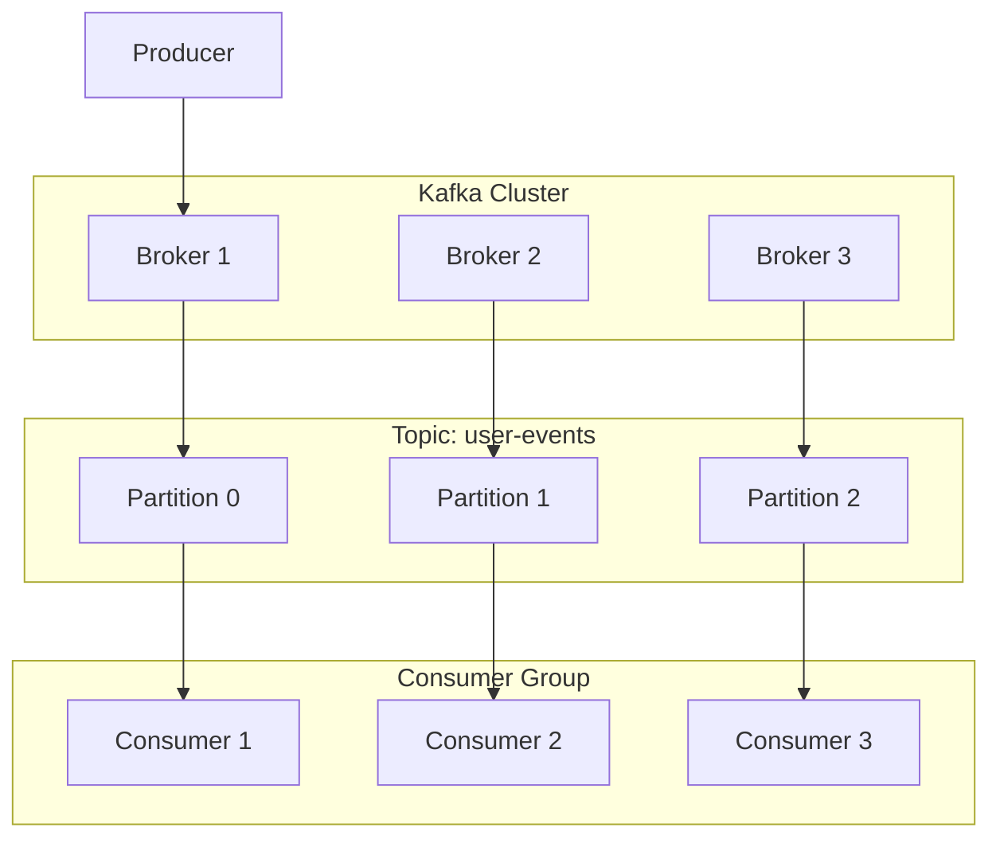
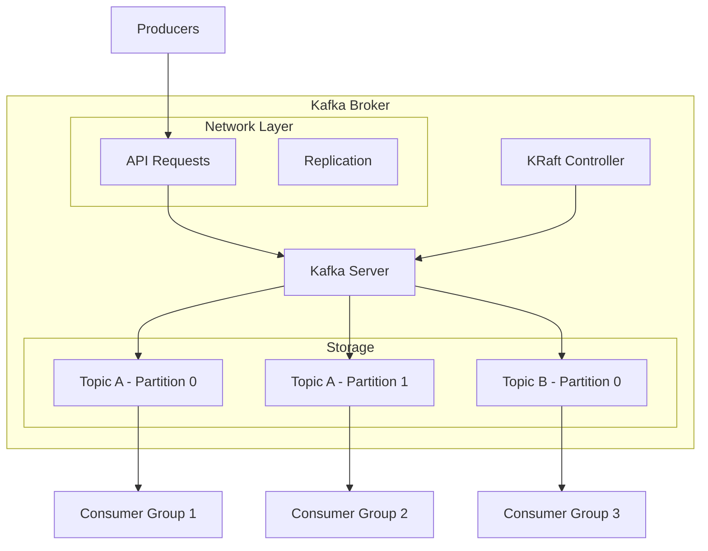
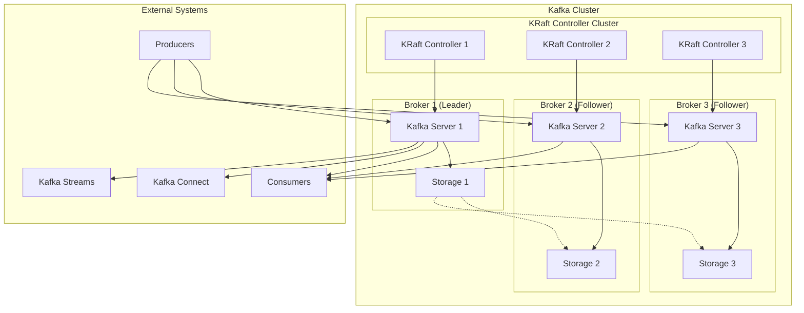
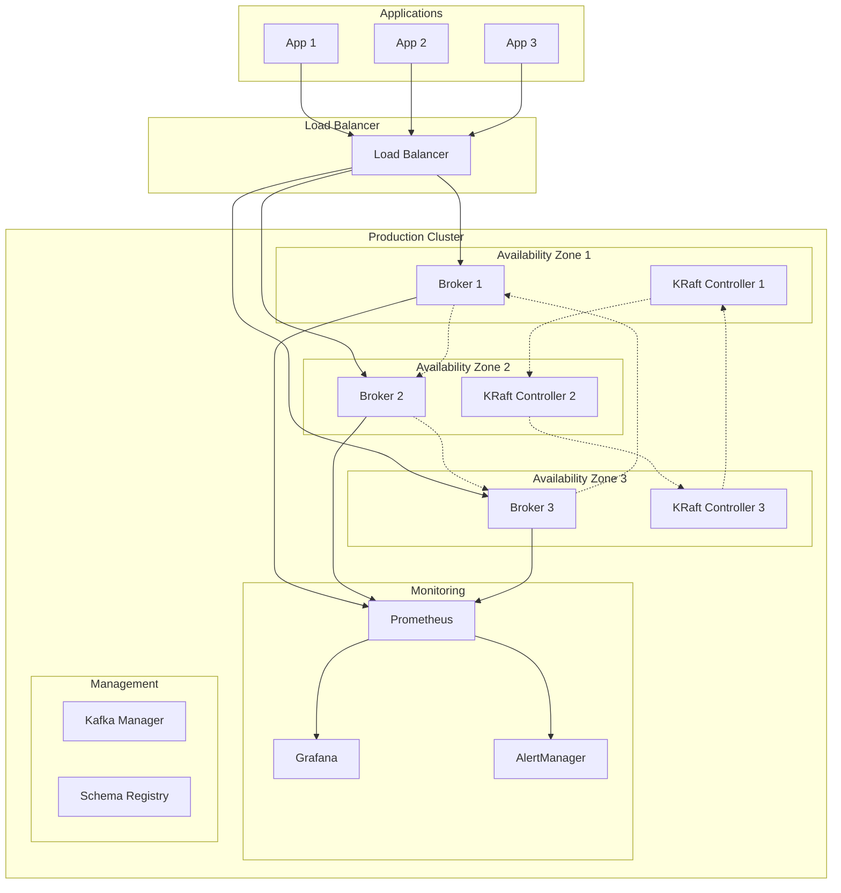

# Apache Kafka

## Overview

Apache Kafka is a distributed streaming platform designed to handle real-time data feeds. It combines the functionality of a messaging system with the characteristics of a distributed database log, making it ideal for building real-time data pipelines and streaming applications.

## Data Model

### Core Concepts



### Data Structure

- **Topics**: Categories of messages (e.g., "user-events", "order-updates")
- **Partitions**: Ordered sequences of records within a topic
- **Records**: Key-value pairs with metadata (timestamp, offset)
- **Offsets**: Unique sequential identifiers for each record in a partition

### Message Format

```json
{
  "key": "user-123",
  "value": {
    "userId": "user-123",
    "action": "login",
    "timestamp": "2025-01-11T16:54:15Z",
    "metadata": {
      "source": "web-app",
      "version": "1.2"
    }
  },
  "headers": {
    "correlation-id": "req-456",
    "content-type": "application/json"
  }
}
```

## Architecture Overview

### Single Node Architecture



### Distributed Architecture



## Target Operating Model (TOM)

### Without High Availability

#### Single Broker Setup

| Component | Specification | Purpose |
|-----------|---------------|---------|
| **Kafka Broker** | 1 instance | Single point of message handling |
| **KRaft Controller** | 1 instance | Cluster coordination |
| **Storage** | Local disk | Message persistence |
| **Network** | Single NIC | Client communication |

#### Resource Requirements

| Resource | Minimum | Recommended | Purpose |
|----------|---------|-------------|---------|
| **CPU** | 2 cores | 4+ cores | Message processing |
| **Memory** | 4GB | 8GB+ | Page cache, JVM heap |
| **Storage** | 100GB | 500GB+ | Message retention |
| **Network** | 100Mbps | 1Gbps+ | Throughput |

#### Configuration Example

```properties
# Single broker configuration
broker.id=0
listeners=PLAINTEXT://localhost:9092
log.dirs=/var/kafka-logs
num.network.threads=3
num.io.threads=8
socket.send.buffer.bytes=102400
socket.receive.buffer.bytes=102400
socket.request.max.bytes=104857600
log.retention.hours=168
log.segment.bytes=1073741824
log.retention.check.interval.ms=300000
process.roles=broker,controller
node.id=1
controller.quorum.voters=1@localhost:9093
```

### With High Availability

#### Multi-Broker Cluster Setup

| Component | Specification | Purpose |
|-----------|---------------|---------|
| **Kafka Brokers** | 3+ instances | Fault tolerance |
| **KRaft Controllers** | 3+ instances | Distributed coordination |
| **Storage** | Replicated across brokers | Data durability |
| **Load Balancer** | Optional | Client distribution |

#### Resource Requirements (Per Broker)

| Resource | Minimum | Recommended | Purpose |
|----------|---------|-------------|---------|
| **CPU** | 4 cores | 8+ cores | Concurrent processing |
| **Memory** | 8GB | 16GB+ | Caching, replication |
| **Storage** | 500GB | 1TB+ | Message retention |
| **Network** | 1Gbps | 10Gbps+ | Replication traffic |

#### Deployment Architecture



#### HA Configuration

```properties
# High availability configuration
broker.id=1  # Unique per broker
listeners=PLAINTEXT://broker1:9092
advertised.listeners=PLAINTEXT://broker1:9092
log.dirs=/var/kafka-logs
num.network.threads=8
num.io.threads=16
socket.send.buffer.bytes=102400
socket.receive.buffer.bytes=102400
socket.request.max.bytes=104857600

# Replication settings
default.replication.factor=3
min.insync.replicas=2
unclean.leader.election.enable=false
auto.create.topics.enable=false

# Retention settings
log.retention.hours=168
log.segment.bytes=1073741824
log.retention.check.interval.ms=300000

# KRaft configuration
process.roles=broker,controller
node.id=1
controller.quorum.voters=1@broker1:9093,2@broker2:9093,3@broker3:9093
controller.listener.names=CONTROLLER
listeners=PLAINTEXT://broker1:9092,CONTROLLER://broker1:9093
```

## Pros and Cons

### Pros

#### Performance & Scalability
- **High Throughput**: Handles millions of messages per second
- **Horizontal Scaling**: Easy to add brokers and partitions
- **Low Latency**: Sub-millisecond latencies possible
- **Efficient Storage**: Optimized for sequential disk I/O

#### Reliability & Durability
- **Fault Tolerance**: Built-in replication and failover
- **Data Durability**: Configurable persistence guarantees
- **Exactly-Once Semantics**: Transactional message processing
- **Long-term Storage**: Messages can be retained indefinitely

#### Ecosystem & Integration
- **Rich Ecosystem**: Kafka Connect, Kafka Streams, KSQL
- **Protocol Support**: Native protocol with many client libraries
- **Cloud Integration**: Available on all major cloud platforms
- **Enterprise Features**: Security, monitoring, management tools

#### Developer Experience
- **Mature Tooling**: Extensive monitoring and management tools
- **Strong Community**: Large user base and active development
- **Documentation**: Comprehensive documentation and examples
- **Flexible APIs**: Producer, Consumer, Admin, and Streams APIs

### Cons

#### Complexity
- **Operational Overhead**: Requires skilled operations team
- **Configuration Complex**: Many tuning parameters
- **KRaft Migration**: Transitioning from Zookeeper to KRaft
- **Learning Curve**: Steep learning curve for optimal usage

#### Resource Requirements
- **Memory Intensive**: Requires substantial RAM for good performance
- **Storage Costs**: Can be expensive for long-term retention
- **Network Bandwidth**: High bandwidth requirements for replication
- **JVM Management**: Requires JVM tuning expertise

#### Limitations
- **Message Ordering**: Only guaranteed within partitions
- **Small Message Overhead**: Higher overhead for small messages
- **Consumer Lag**: Can be challenging to manage consumer lag
- **Schema Evolution**: Requires careful planning for schema changes

#### Use Case Constraints
- **Simple Use Cases**: Overkill for basic messaging needs
- **Synchronous Processing**: Not designed for request-response patterns
- **Complex Routing**: Limited routing capabilities compared to message brokers
- **Protocol Limitations**: Kafka protocol only, no standard protocol support

## Best Practices

### Production Deployment

1. **Hardware Sizing**
   - Use dedicated hardware for production
   - Ensure adequate disk I/O and network capacity
   - Monitor JVM heap and garbage collection

2. **Monitoring & Alerting**
   - Monitor broker metrics (CPU, memory, disk, network)
   - Set up alerts for consumer lag and broker failures
   - Use tools like Prometheus, Grafana, and Kafka Manager

3. **Security**
   - Enable SSL/SASL authentication
   - Use ACLs for topic-level authorization
   - Encrypt data in transit and at rest

4. **Data Management**
   - Plan topic partitioning strategy
   - Set appropriate retention policies
   - Implement proper backup and disaster recovery

### Development Guidelines

1. **Producer Best Practices**
   - Use appropriate acknowledgment settings
   - Implement retry logic with exponential backoff
   - Batch messages for better throughput

2. **Consumer Best Practices**
   - Handle consumer rebalancing gracefully
   - Implement proper error handling
   - Monitor consumer lag

3. **Schema Management**
   - Use Schema Registry for schema evolution
   - Plan for backward/forward compatibility
   - Version your message schemas

## When to Choose Kafka

### Ideal Use Cases
- **Event Streaming**: Real-time event processing
- **Log Aggregation**: Centralized log collection
- **Data Integration**: ETL pipelines and data lakes
- **Activity Tracking**: User behavior analytics
- **Microservices**: Service-to-service communication

### Consider Alternatives When
- **Simple Messaging**: Basic point-to-point or pub/sub
- **Low Volume**: Less than 1000 messages/second
- **Request-Response**: Synchronous communication patterns
- **Resource Constraints**: Limited infrastructure resources
- **Operational Complexity**: Lack of operational expertise
