# Apache Pulsar

## Overview

Apache Pulsar is a multi-tenant, high-performance solution for server-to-server messaging. It combines the messaging capabilities of Apache Kafka with the flexibility of traditional message queues, featuring built-in support for multi-tenancy, geo-replication, and tiered storage.

## Data Model

### Core Concepts


### Multi-Tenant Structure

- **Tenants**: Top-level administrative units (e.g., organizations)
- **Namespaces**: Logical groupings within tenants (e.g., applications)
- **Topics**: Individual message streams within namespaces
- **Subscriptions**: Consumer groups with different consumption patterns

### Message Format

```json
{
  "messageId": "CAAQAw==",
  "properties": {
    "key": "user-123",
    "application": "order-service",
    "version": "1.0",
    "correlation-id": "req-456"
  },
  "payload": {
    "userId": "user-123",
    "orderId": "order-789",
    "amount": 99.99,
    "timestamp": "2025-01-11T16:56:59Z"
  },
  "metadata": {
    "producer": "order-producer-1",
    "sequence_id": 12345,
    "publish_time": 1641916619000,
    "schema_version": 2
  }
}
```

## Architecture Overview

### Single Cluster Architecture

```mermaid
graph TB
    subgraph "Pulsar Cluster"
        subgraph "Broker Tier"
            B1[Pulsar Broker 1]
            B2[Pulsar Broker 2]
        end
        
        subgraph "Storage Tier"
            BK1[BookKeeper 1]
            BK2[BookKeeper 2]
            BK3[BookKeeper 3]
        end
        
        subgraph "Coordination"
            ZK1[ZooKeeper 1]
            ZK2[ZooKeeper 2]
            ZK3[ZooKeeper 3]
        end
        
        subgraph "Management"
            ADMIN[Pulsar Admin]
            PROXY[Pulsar Proxy]
            MANAGER[Pulsar Manager]
        end
    end
    
    subgraph "Clients"
        PRODUCER[Producers]
        CONSUMER[Consumers]
        FUNCTION[Pulsar Functions]
    end
    
    PRODUCER --> PROXY
    CONSUMER --> PROXY
    FUNCTION --> PROXY
    
    PROXY --> B1
    PROXY --> B2
    
    B1 --> BK1
    B1 --> BK2
    B2 --> BK2
    B2 --> BK3
    
    ZK1 --> ZK2
    ZK2 --> ZK3
    ZK3 --> ZK1
    
    ZK1 --> B1
    ZK2 --> B2
    
    ADMIN --> B1
    MANAGER --> B1
```



### Multi-Cluster Geo-Replication


## Target Operating Model (TOM)

### Without High Availability

#### Single Node Setup

| Component | Specification | Purpose |
|-----------|---------------|---------|
| **Pulsar Broker** | 1 instance | Message routing |
| **BookKeeper** | 1 instance | Message storage |
| **ZooKeeper** | 1 instance | Coordination |
| **Pulsar Proxy** | Optional | Load balancing |

#### Resource Requirements

| Resource | Minimum | Recommended | Purpose |
|----------|---------|-------------|---------|
| **CPU** | 4 cores | 8+ cores | Concurrent processing |
| **Memory** | 8GB | 16GB+ | Message caching |
| **Storage** | 200GB | 1TB+ | Message persistence |
| **Network** | 1Gbps | 10Gbps+ | High throughput |

#### Configuration Example

```conf
# Pulsar broker configuration
brokerServicePort=6650
brokerServicePortTls=6651
webServicePort=8080
webServicePortTls=8443

# Storage configuration
managedLedgerDefaultEnsembleSize=1
managedLedgerDefaultWriteQuorum=1
managedLedgerDefaultAckQuorum=1

# ZooKeeper configuration
zookeeperServers=localhost:2181
configurationStoreServers=localhost:2181

# Cluster configuration
clusterName=standalone
```

### With High Availability

#### Multi-Node Cluster Setup

| Component | Specification | Purpose |
|-----------|---------------|---------|
| **Pulsar Brokers** | 3+ instances | Message routing |
| **BookKeeper Nodes** | 3+ instances | Distributed storage |
| **ZooKeeper Ensemble** | 3+ instances | Coordination |
| **Pulsar Proxy** | 2+ instances | Load balancing |

#### Resource Requirements (Per Node)

| Resource | Minimum | Recommended | Purpose |
|----------|---------|-------------|---------|
| **CPU** | 8 cores | 16+ cores | High concurrency |
| **Memory** | 16GB | 32GB+ | Caching and buffering |
| **Storage** | 1TB | 5TB+ | Data persistence |
| **Network** | 10Gbps | 25Gbps+ | Inter-node communication |

#### Deployment Architecture


#### HA Configuration

```conf
# Pulsar broker HA configuration
brokerServicePort=6650
brokerServicePortTls=6651
webServicePort=8080
webServicePortTls=8443

# Storage configuration
managedLedgerDefaultEnsembleSize=3
managedLedgerDefaultWriteQuorum=2
managedLedgerDefaultAckQuorum=2

# ZooKeeper configuration
zookeeperServers=zk1:2181,zk2:2181,zk3:2181
configurationStoreServers=zk1:2181,zk2:2181,zk3:2181

# Cluster configuration
clusterName=production-cluster
loadBalancerEnabled=true
loadBalancerPlacementStrategy=leastLoadedServer

# Replication configuration
replicationClusters=us-east,eu-west,ap-south
```

## Pros and Cons

### Pros

#### Architecture & Scalability
- **Separation of Concerns**: Compute and storage separated
- **Horizontal Scaling**: Independent scaling of brokers and storage
- **Multi-Tenancy**: Built-in tenant isolation
- **Geo-Replication**: Cross-region data replication

#### Performance & Reliability
- **High Throughput**: Millions of messages per second
- **Low Latency**: Sub-millisecond latencies
- **Durability**: Strong consistency with BookKeeper
- **Fault Tolerance**: Automatic failover and recovery

#### Enterprise Features
- **Tiered Storage**: Automatic data offloading to cloud storage
- **Schema Registry**: Built-in schema management
- **Functions**: Serverless computing with Pulsar Functions
- **SQL Support**: Presto integration for analytics

#### Operational Excellence
- **Multi-Protocol**: Support for multiple protocols
- **Monitoring**: Built-in metrics and dashboards
- **Security**: TLS, authentication, authorization
- **Administration**: Rich admin APIs and tools

### Cons

#### Complexity
- **Architecture Complexity**: More components than alternatives
- **Learning Curve**: Steeper learning curve
- **Operational Overhead**: Requires expertise in multiple systems
- **Configuration**: Complex configuration options

#### Resource Requirements
- **Memory Intensive**: High memory requirements
- **Storage Costs**: Additional storage for BookKeeper
- **Network Bandwidth**: High bandwidth for replication
- **CPU Overhead**: Significant CPU for multi-tenancy

#### Ecosystem Maturity
- **Newer Technology**: Less mature than Kafka
- **Community Size**: Smaller community
- **Third-party Tools**: Fewer third-party integrations
- **Documentation**: Less comprehensive documentation

#### Operational Challenges
- **Monitoring Complexity**: Multiple layers to monitor
- **Troubleshooting**: Complex debugging across layers
- **Upgrade Complexity**: Coordinated upgrades required
- **Backup/Recovery**: Complex backup strategies

## Best Practices

### Production Deployment

1. **Cluster Architecture**
   - Deploy brokers and BookKeepers on separate nodes
   - Use odd number of ZooKeeper nodes
   - Implement proper network segmentation

2. **Storage Management**
   - Configure appropriate journal and ledger storage
   - Set up tiered storage for cost optimization
   - Monitor disk usage and performance

3. **Multi-Tenancy**
   - Design proper tenant and namespace structure
   - Implement resource quotas and isolation
   - Use authentication and authorization

4. **Monitoring**
   - Monitor broker and BookKeeper metrics
   - Set up alerts for system health
   - Use Pulsar Manager for administration

### Development Guidelines

1. **Producer Optimization**
   - Use batching for better throughput
   - Implement proper error handling
   - Configure appropriate timeout values

2. **Consumer Patterns**
   - Choose appropriate subscription types
   - Handle consumer failures gracefully
   - Monitor consumer lag

3. **Schema Management**
   - Use schema registry for type safety
   - Plan for schema evolution
   - Implement proper versioning

## When to Choose Pulsar

### Ideal Use Cases
- **Multi-Tenant Environments**: SaaS platforms
- **Geo-Distributed Systems**: Global applications
- **Mixed Workloads**: Streaming and queuing
- **Cloud-Native Applications**: Kubernetes deployments
- **Enterprise Messaging**: Complex routing requirements

### Consider Alternatives When
- **Simple Use Cases**: Basic messaging needs
- **Resource Constraints**: Limited infrastructure
- **Kafka Ecosystem**: Heavy Kafka tooling dependency
- **Operational Simplicity**: Need for simpler operations
- **Mature Ecosystem**: Requirement for extensive third-party tools
