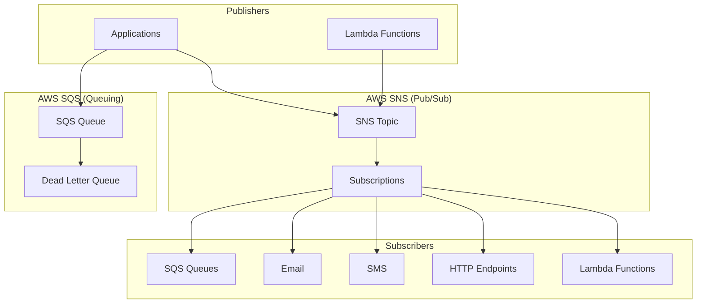
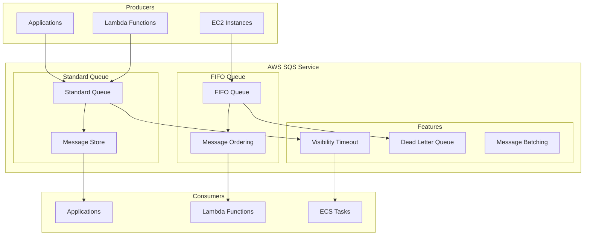
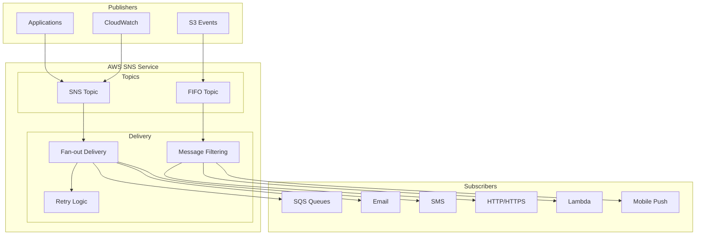
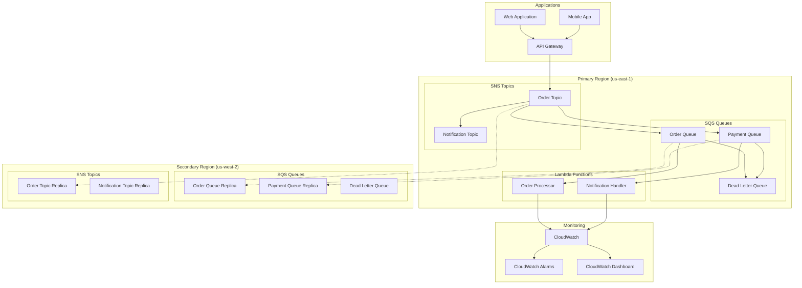

# AWS SQS/SNS

## Overview

AWS SQS (Simple Queue Service) and SNS (Simple Notification Service) are fully managed messaging services provided by Amazon Web Services. SQS provides reliable, highly-scalable message queuing, while SNS offers publish-subscribe messaging for distributed applications and microservices.

## Data Model

### Core Concepts



### Service Models

- **SQS Standard**: At-least-once delivery, high throughput
- **SQS FIFO**: Exactly-once processing, message ordering
- **SNS**: Fan-out messaging to multiple subscribers
- **SNS FIFO**: Ordered message delivery to FIFO SQS queues

### Message Format

```json
{
  "Records": [
    {
      "messageId": "059f36b4-87a3-44ab-83d2-661975830a7d",
      "receiptHandle": "AQEBwJnKyrHigUMZj6rYigCgxlaS3SLy0a...",
      "body": {
        "orderId": "order-123",
        "customerId": "cust-456",
        "timestamp": "2025-01-11T16:56:59Z",
        "amount": 99.99,
        "items": [
          {
            "productId": "prod-789",
            "quantity": 2
          }
        ]
      },
      "attributes": {
        "ApproximateReceiveCount": "1",
        "SentTimestamp": "1641916619000",
        "SenderId": "123456789012",
        "ApproximateFirstReceiveTimestamp": "1641916619000"
      },
      "messageAttributes": {
        "correlationId": {
          "stringValue": "req-456",
          "dataType": "String"
        }
      }
    }
  ]
}
```

## Architecture Overview

### SQS Architecture



### SNS Architecture



## Target Operating Model (TOM)

### Without High Availability

#### Basic Setup

| Component | Specification | Purpose |
|-----------|---------------|---------|
| **SQS Standard Queue** | Single queue | Message queuing |
| **SNS Topic** | Single topic | Pub/sub messaging |
| **IAM Roles** | Basic permissions | Access control |

#### Resource Requirements

| Resource | Specification | Purpose |
|----------|---------------|---------|
| **Throughput** | 3,000 msgs/sec | Standard queue limit |
| **Message Size** | 256KB max | Per message limit |
| **Retention** | 14 days max | Message retention |
| **Subscribers** | 100K per topic | SNS subscription limit |

#### Configuration Example

```yaml
# CloudFormation template for basic setup
Resources:
  OrderQueue:
    Type: AWS::SQS::Queue
    Properties:
      QueueName: order-processing-queue
      MessageRetentionPeriod: 1209600  # 14 days
      VisibilityTimeoutSeconds: 300
      ReceiveMessageWaitTimeSeconds: 20
      
  OrderTopic:
    Type: AWS::SNS::Topic
    Properties:
      TopicName: order-notifications
      DisplayName: Order Processing Notifications
      
  QueueSubscription:
    Type: AWS::SNS::Subscription
    Properties:
      TopicArn: !Ref OrderTopic
      Protocol: sqs
      Endpoint: !GetAtt OrderQueue.Arn
```

### With High Availability

#### Enterprise Setup

| Component | Specification | Purpose |
|-----------|---------------|---------|
| **SQS FIFO Queues** | Multiple queues | Ordered processing |
| **SNS Topics** | Multiple topics | Fan-out messaging |
| **Dead Letter Queues** | Error handling | Failed message processing |
| **Cross-Region Replication** | Multi-region | Disaster recovery |

#### Resource Requirements

| Resource | Specification | Purpose |
|----------|---------------|---------|
| **Throughput** | 300 msgs/sec (FIFO) | FIFO queue limit |
| **Message Size** | 256KB max | Per message limit |
| **Retention** | 14 days max | Message retention |
| **Durability** | 99.999999999% | AWS durability SLA |

#### Deployment Architecture



#### HA Configuration

```yaml
# CloudFormation template for HA setup
Resources:
  OrderQueueFIFO:
    Type: AWS::SQS::Queue
    Properties:
      QueueName: order-processing-queue.fifo
      FifoQueue: true
      ContentBasedDeduplication: true
      MessageRetentionPeriod: 1209600
      VisibilityTimeoutSeconds: 300
      RedrivePolicy:
        deadLetterTargetArn: !GetAtt OrderDLQ.Arn
        maxReceiveCount: 3
        
  OrderDLQ:
    Type: AWS::SQS::Queue
    Properties:
      QueueName: order-processing-dlq.fifo
      FifoQueue: true
      MessageRetentionPeriod: 1209600
      
  OrderTopicFIFO:
    Type: AWS::SNS::Topic
    Properties:
      TopicName: order-notifications.fifo
      FifoTopic: true
      ContentBasedDeduplication: true
      
  CrossRegionReplication:
    Type: AWS::SNS::Subscription
    Properties:
      TopicArn: !Ref OrderTopicFIFO
      Protocol: sqs
      Endpoint: !Sub 'arn:aws:sqs:us-west-2:${AWS::AccountId}:order-processing-queue-replica.fifo'
```

## Pros and Cons

### Pros

#### Fully Managed
- **No Infrastructure**: AWS handles all infrastructure
- **Auto Scaling**: Automatically scales with demand
- **High Availability**: Built-in redundancy and failover
- **Maintenance Free**: No patching or updates required

#### Reliability & Durability
- **99.999999999%**: Eleven 9's durability guarantee
- **At-least-once**: Standard queue delivery guarantee
- **Exactly-once**: FIFO queue processing guarantee
- **Dead Letter Queues**: Built-in error handling

#### Integration & Ecosystem
- **AWS Services**: Native integration with AWS services
- **IAM Integration**: Fine-grained access control
- **CloudWatch**: Built-in monitoring and alerting
- **AWS SDK**: Support for all major programming languages

#### Cost Effectiveness
- **Pay-per-use**: No upfront costs
- **Free Tier**: 1 million requests per month
- **Predictable Pricing**: Clear pricing model
- **No Idle Costs**: Pay only for what you use

### Cons

#### Vendor Lock-in
- **AWS Specific**: Tied to AWS ecosystem
- **Migration Complexity**: Difficult to migrate to other platforms
- **API Dependencies**: Applications depend on AWS APIs
- **Regional Limitations**: Limited to AWS regions

#### Feature Limitations
- **Message Size**: 256KB maximum message size
- **Throughput Limits**: 300 msgs/sec for FIFO queues
- **Retention Limits**: 14 days maximum retention
- **Limited Routing**: Basic routing capabilities

#### Cost Considerations
- **High Volume Costs**: Can be expensive for high volumes
- **Data Transfer**: Charges for data transfer between regions
- **Storage Costs**: Additional costs for message storage
- **Request Pricing**: Per-request pricing model

#### Operational Constraints
- **Limited Customization**: Cannot customize underlying infrastructure
- **AWS Outages**: Dependent on AWS service availability
- **Limited Monitoring**: CloudWatch-only monitoring
- **Compliance**: May not meet specific compliance requirements

## Best Practices

### Production Deployment

1. **Queue Configuration**
   - Choose appropriate queue type (Standard vs FIFO)
   - Configure dead letter queues
   - Set appropriate visibility timeouts
   - Enable long polling

2. **Security**
   - Use IAM policies for access control
   - Enable encryption in transit and at rest
   - Use VPC endpoints for private access
   - Implement least privilege principles

3. **Monitoring**
   - Set up CloudWatch alarms
   - Monitor queue depth and age
   - Track delivery failures
   - Use AWS X-Ray for tracing

4. **Cost Optimization**
   - Use batching to reduce requests
   - Implement message deduplication
   - Monitor usage patterns
   - Use reserved capacity where applicable

### Development Guidelines

1. **Error Handling**
   - Implement proper retry logic
   - Handle throttling gracefully
   - Use dead letter queues effectively
   - Design for idempotency

2. **Performance Optimization**
   - Use batch operations when possible
   - Implement connection pooling
   - Use long polling for consumers
   - Optimize message size

3. **Message Design**
   - Keep messages small and focused
   - Use message attributes effectively
   - Implement proper message formatting
   - Version your message schemas

## When to Choose AWS SQS/SNS

### Ideal Use Cases
- **AWS-Native Applications**: Applications built on AWS
- **Serverless Architectures**: Lambda-based applications
- **Microservices**: Service-to-service communication
- **Event-Driven Systems**: Decoupled architectures
- **Notification Systems**: Multi-channel notifications

### Consider Alternatives When
- **Multi-Cloud**: Need for cloud-agnostic solutions
- **High Throughput**: Millions of messages per second
- **Complex Routing**: Advanced routing requirements
- **Large Messages**: Messages larger than 256KB
- **Long Retention**: Need for longer message retention
