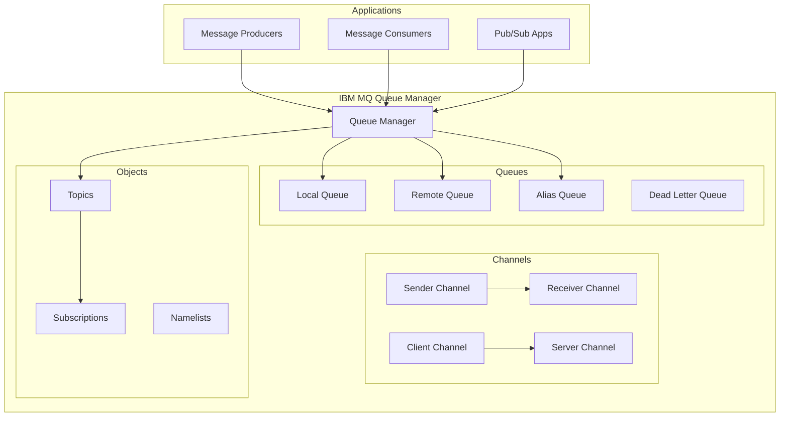
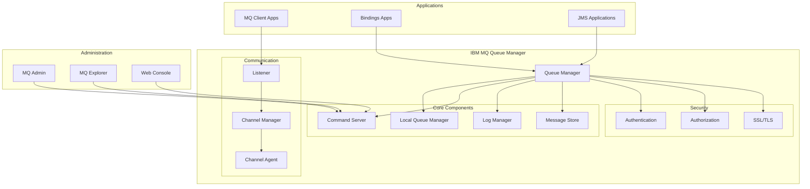
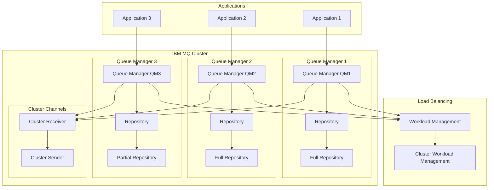
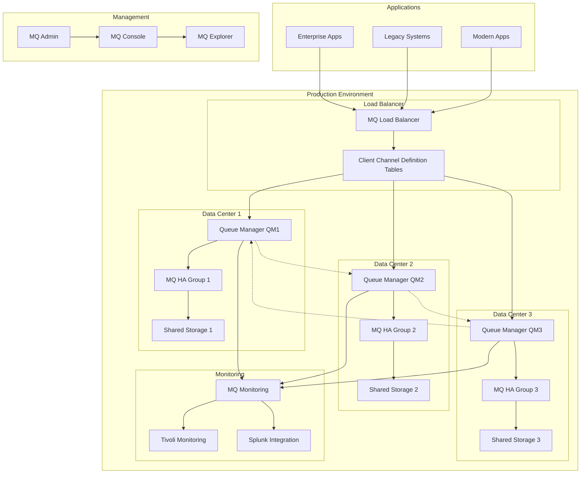

# IBM MQ

## Overview

IBM MQ (formerly IBM WebSphere MQ) is an enterprise-grade message queuing middleware that provides reliable, secure, and scalable messaging for business applications. It's designed for mission-critical applications requiring guaranteed message delivery and transactional messaging.

## Data Model

### Core Concepts



### Message Structure

- **Message Header**: Control information and routing
- **Message Properties**: User-defined attributes
- **Message Data**: Application payload
- **Message Descriptor**: Metadata about the message

### Message Format

```json
{
  "messageId": "414D5120514D312020202020202020203B4E4C5A61234567",
  "correlationId": "414D5120514D312020202020202020203B4E4C5A61234568",
  "messageType": "MQMT_DATAGRAM",
  "format": "MQFMT_STRING",
  "priority": 5,
  "persistence": "MQPER_PERSISTENT",
  "putDateTime": "2025-01-11T16:56:59Z",
  "replyToQueue": "RESPONSE.QUEUE",
  "replyToQueueManager": "QM1",
  "properties": {
    "correlationId": "req-456",
    "businessProcess": "order-processing",
    "version": "1.0"
  },
  "data": {
    "orderId": "order-123",
    "customerId": "cust-456",
    "amount": 99.99,
    "timestamp": "2025-01-11T16:56:59Z",
    "items": [
      {
        "productId": "prod-789",
        "quantity": 2
      }
    ]
  }
}
```

## Architecture Overview

### Single Queue Manager Architecture



### Multi-Queue Manager Cluster



## Target Operating Model (TOM)

### Without High Availability

#### Single Queue Manager Setup

| Component | Specification | Purpose |
|-----------|---------------|---------|
| **Queue Manager** | 1 instance | Message queuing |
| **Local Queues** | Multiple | Message storage |
| **Channels** | Point-to-point | Communication |
| **Listeners** | TCP/IP | Network connectivity |

#### Resource Requirements

| Resource | Minimum | Recommended | Purpose |
|----------|---------|-------------|---------|
| **CPU** | 2 cores | 4+ cores | Message processing |
| **Memory** | 4GB | 8GB+ | Queue buffering |
| **Storage** | 100GB | 500GB+ | Message persistence |
| **Network** | 100Mbps | 1Gbps+ | Channel communication |

#### Configuration Example

```properties
# Queue Manager configuration
DEFINE QMGR('QM1') +
       DESCR('Development Queue Manager') +
       MAXDEPTH(5000) +
       MAXHANDS(256) +
       MAXUMSGS(10000)

# Local Queue definition
DEFINE QLOCAL('ORDER.QUEUE') +
       DESCR('Order Processing Queue') +
       MAXDEPTH(5000) +
       MAXMSGL(4194304) +
       DEFPSIST(YES)

# Channel definition
DEFINE CHANNEL('TO.QM2') +
       CHLTYPE(SDR) +
       CONNAME('qm2.company.com(1414)') +
       XMITQ('QM2.XMIT')

# Listener
DEFINE LISTENER('TCP.1414') +
       TRPTYPE(TCP) +
       PORT(1414) +
       CONTROL(QMGR)
```

### With High Availability

#### Multi-Queue Manager Cluster Setup

| Component | Specification | Purpose |
|-----------|---------------|---------|
| **Queue Managers** | 3+ instances | High availability |
| **Cluster Queues** | Distributed | Load balancing |
| **Full Repositories** | 2+ instances | Cluster metadata |
| **Shared Storage** | Optional | Queue sharing |

#### Resource Requirements (Per Queue Manager)

| Resource | Minimum | Recommended | Purpose |
|----------|---------|-------------|---------|
| **CPU** | 4 cores | 8+ cores | Cluster processing |
| **Memory** | 8GB | 16GB+ | Cluster management |
| **Storage** | 500GB | 1TB+ | Message persistence |
| **Network** | 1Gbps | 10Gbps+ | Cluster communication |

#### Deployment Architecture



#### HA Configuration

```properties
# Cluster Queue Manager configuration
DEFINE QMGR('QM1') +
       DESCR('Production Cluster Queue Manager') +
       REPOS(QM1.CLUSTER) +
       REPOSNL(QM1.CLUSTER.NAMELIST)

# Cluster receiver channel
DEFINE CHANNEL('TO.QM1') +
       CHLTYPE(CLUSRCVR) +
       CONNAME('qm1.company.com(1414)') +
       CLUSTER('PRODUCTION.CLUSTER')

# Cluster sender channel
DEFINE CHANNEL('TO.QM2') +
       CHLTYPE(CLUSSDR) +
       CONNAME('qm2.company.com(1414)') +
       CLUSTER('PRODUCTION.CLUSTER')

# Cluster queue
DEFINE QLOCAL('ORDER.CLUSTER.QUEUE') +
       DESCR('Clustered Order Processing Queue') +
       CLUSTER('PRODUCTION.CLUSTER') +
       CLWLPRTY(5) +
       CLWLRANK(5) +
       CLWLUSEQ(QMGR)

# High availability configuration
DEFINE QMGR('QM1') +
       CONNAUTH('USE.LDAP') +
       CERTVPOL('ANY') +
       SSLCRYP('ALL') +
       CHAD(ENABLED)
```

## Pros and Cons

### Pros

#### Enterprise Features
- **Guaranteed Delivery**: Assured message delivery with persistence
- **Transactional Messaging**: Full ACID transaction support
- **Security**: Comprehensive security features
- **Reliability**: Proven in mission-critical environments

#### Scalability & Performance
- **High Throughput**: Thousands of messages per second
- **Clustering**: Built-in clustering for scalability
- **Load Balancing**: Automatic workload distribution
- **Queue Sharing**: Multiple queue managers sharing queues

#### Integration & Standards
- **JMS Support**: Full JMS 2.0 compliance
- **Multi-Platform**: Runs on multiple operating systems
- **Protocol Support**: Multiple protocol support
- **Legacy Integration**: Excellent legacy system integration

#### Management & Monitoring
- **Rich Tooling**: Comprehensive management tools
- **Monitoring**: Built-in monitoring capabilities
- **Administration**: Advanced administrative features
- **Backup/Recovery**: Robust backup and recovery options

### Cons

#### Cost & Licensing
- **Expensive**: High licensing costs
- **Complex Pricing**: CPU-based pricing model
- **Support Costs**: Additional support and maintenance fees
- **Hardware Requirements**: Requires substantial hardware resources

#### Complexity
- **Configuration**: Complex configuration and setup
- **Learning Curve**: Steep learning curve for administrators
- **Skills Requirements**: Requires specialized MQ expertise
- **Maintenance**: Ongoing maintenance complexity

#### Operational Overhead
- **Resource Intensive**: High CPU and memory usage
- **Administrative Burden**: Requires dedicated administrators
- **Monitoring Complexity**: Complex monitoring requirements
- **Upgrade Complexity**: Complex upgrade procedures

#### Modern Limitations
- **Legacy Architecture**: Traditional enterprise architecture
- **Cloud Integration**: Limited cloud-native features
- **DevOps Integration**: Limited DevOps tooling integration
- **Containerization**: Limited container support

## Best Practices

### Production Deployment

1. **High Availability Design**
   - Use clustering for scalability
   - Implement queue sharing for availability
   - Deploy across multiple data centers
   - Use shared storage for persistence

2. **Security Implementation**
   - Enable connection authentication
   - Use SSL/TLS for encryption
   - Implement proper authorization
   - Regular security audits

3. **Performance Optimization**
   - Tune queue manager parameters
   - Optimize channel settings
   - Monitor queue depths
   - Implement proper workload management

4. **Monitoring & Maintenance**
   - Set up comprehensive monitoring
   - Implement alerting for critical issues
   - Regular backup procedures
   - Plan for capacity management

### Development Guidelines

1. **Application Design**
   - Design for message persistence
   - Implement proper error handling
   - Use appropriate message formats
   - Plan for message ordering requirements

2. **Connection Management**
   - Use connection pooling
   - Implement proper connection cleanup
   - Handle connection failures gracefully
   - Use client channel definition tables

3. **Message Design**
   - Use appropriate message properties
   - Implement message correlation
   - Design for message versioning
   - Consider message size limitations

## When to Choose IBM MQ

### Ideal Use Cases
- **Enterprise Applications**: Mission-critical enterprise systems
- **Legacy Integration**: Integrating with existing IBM environments
- **Financial Services**: Banking and financial applications
- **Regulated Industries**: Industries requiring compliance
- **Transactional Systems**: Systems requiring guaranteed delivery

### Consider Alternatives When
- **Cloud-Native**: Building cloud-native applications
- **Cost Constraints**: Budget limitations
- **Simple Requirements**: Basic messaging needs
- **Modern Architecture**: Microservices architectures
- **High-Volume Streaming**: Real-time data streaming requirements
