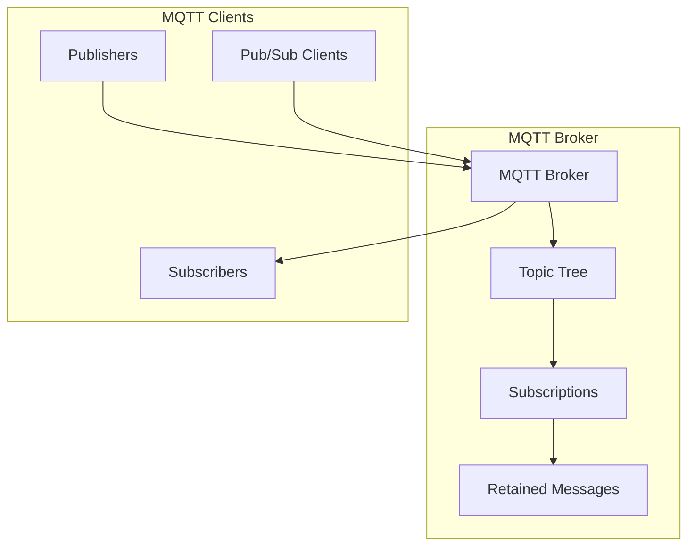
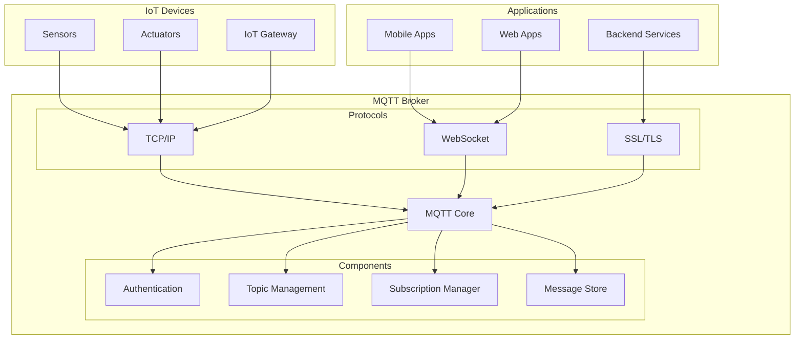
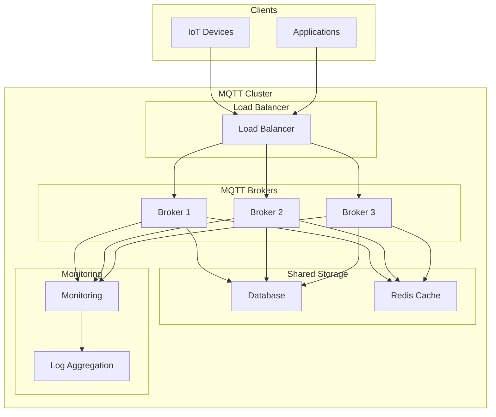
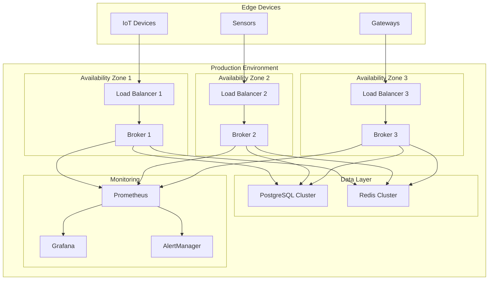

# MQTT

## Overview

MQTT (Message Queuing Telemetry Transport) is a lightweight, publish-subscribe messaging protocol designed for IoT devices and low-bandwidth, high-latency, or unreliable networks. It follows a client-server architecture with a central broker handling message routing.

## Data Model

### Core Concepts



### Topic Hierarchy

- **Topics**: Hierarchical structure with forward slashes (e.g., `home/sensors/temperature`)
- **Wildcards**: `+` (single level), `#` (multi-level)
- **Retained Messages**: Last message on a topic is retained for new subscribers
- **Last Will and Testament**: Message sent when client disconnects unexpectedly

### Message Format

```json
{
  "topic": "home/sensors/temperature",
  "payload": {
    "deviceId": "sensor-001",
    "temperature": 23.5,
    "humidity": 65.2,
    "timestamp": "2025-01-11T16:56:59Z",
    "location": "living-room"
  },
  "qos": 1,
  "retain": true,
  "messageId": 12345
}
```

## Architecture Overview

### Single Broker Architecture



### Clustered MQTT Architecture



## Target Operating Model (TOM)

### Without High Availability

#### Single Broker Setup

| Component | Specification | Purpose |
|-----------|---------------|---------|
| **MQTT Broker** | 1 instance | Message routing |
| **Local Storage** | File system | Message persistence |
| **Authentication** | Basic | Client authentication |

#### Resource Requirements

| Resource | Minimum | Recommended | Purpose |
|----------|---------|-------------|---------|
| **CPU** | 1 core | 2+ cores | Message processing |
| **Memory** | 512MB | 2GB+ | Connection handling |
| **Storage** | 10GB | 100GB+ | Message persistence |
| **Network** | 10Mbps | 100Mbps+ | IoT connectivity |

#### Configuration Example

```conf
# Mosquitto broker configuration
port 1883
protocol mqtt

# Persistence
persistence true
persistence_location /var/lib/mosquitto/
persistence_file mosquitto.db

# Logging
log_dest file /var/log/mosquitto/mosquitto.log
log_type all

# Security
allow_anonymous true
password_file /etc/mosquitto/passwd
acl_file /etc/mosquitto/acl

# Limits
max_connections 1000
max_queued_messages 100
```

### With High Availability

#### Cluster Setup

| Component | Specification | Purpose |
|-----------|---------------|---------|
| **MQTT Brokers** | 3+ instances | High availability |
| **Load Balancer** | 1+ instances | Traffic distribution |
| **Shared Database** | Cluster | Session/message storage |
| **Monitoring** | Centralized | System health |

#### Resource Requirements (Per Node)

| Resource | Minimum | Recommended | Purpose |
|----------|---------|-------------|---------|
| **CPU** | 2 cores | 4+ cores | Concurrent connections |
| **Memory** | 2GB | 8GB+ | Session management |
| **Storage** | 50GB | 500GB+ | Message persistence |
| **Network** | 100Mbps | 1Gbps+ | High throughput |

#### Deployment Architecture



#### HA Configuration

```conf
# HiveMQ cluster configuration
cluster {
  enabled = true
  node-id = "node-1"
  
  transport {
    type = "tcp"
    bind-address = "0.0.0.0"
    bind-port = 7800
  }
  
  discovery {
    type = "static"
    static {
      node-addresses = [
        "node-1:7800",
        "node-2:7800",
        "node-3:7800"
      ]
    }
  }
}

# Persistence
persistence {
  type = "file"
  file-persistence {
    enabled = true
    storage-directory = "/opt/hivemq/data"
  }
}

# Security
security {
  allow-empty-client-id = false
  payload-format-validation = true
  
  authentication {
    type = "file"
    file = "/opt/hivemq/conf/credentials.xml"
  }
}
```

## Pros and Cons

### Pros

#### Lightweight & Efficient
- **Low Overhead**: Minimal protocol overhead
- **Battery Friendly**: Designed for low-power devices
- **Bandwidth Efficient**: Optimized for slow networks
- **Small Footprint**: Minimal resource requirements

#### IoT Optimized
- **QoS Levels**: Three quality of service levels
- **Retained Messages**: Last message retained for new subscribers
- **Last Will**: Automatic notification of client disconnection
- **Keep-Alive**: Heartbeat mechanism for connection monitoring

#### Flexible & Scalable
- **Topic Wildcards**: Flexible subscription patterns
- **Hierarchical Topics**: Organized topic structure
- **Session Persistence**: Persistent client sessions
- **Bridge Support**: Broker-to-broker communication

#### Industry Standard
- **OASIS Standard**: Internationally standardized protocol
- **Wide Adoption**: Extensive IoT ecosystem support
- **Mature Ecosystem**: Many broker implementations available
- **Interoperability**: Cross-platform compatibility

### Cons

#### Security Limitations
- **Basic Security**: Limited built-in security features
- **No Encryption**: Plain text by default
- **Simple Auth**: Basic authentication mechanisms
- **Limited Authorization**: Topic-level access control

#### Reliability Constraints
- **Broker Dependency**: Single point of failure
- **No Guaranteed Delivery**: Even with QoS 2
- **Limited Durability**: Message retention depends on broker
- **Connection Management**: Requires careful connection handling

#### Scalability Challenges
- **Vertical Scaling**: Limited horizontal scaling options
- **Memory Usage**: High memory usage for many connections
- **Topic Explosion**: Performance degradation with many topics
- **Broker Bottleneck**: Centralized broker architecture

#### Feature Limitations
- **Simple Protocol**: Limited advanced messaging features
- **No Transactions**: No transactional message support
- **Limited Routing**: Basic routing capabilities
- **No Load Balancing**: No built-in consumer load balancing

## Best Practices

### Production Deployment

1. **Security Implementation**
   - Enable TLS/SSL encryption
   - Implement proper authentication
   - Use access control lists (ACLs)
   - Regular security audits

2. **High Availability**
   - Deploy multiple brokers
   - Use load balancing
   - Implement clustering
   - Plan for failover scenarios

3. **Monitoring & Maintenance**
   - Monitor broker performance
   - Track connection metrics
   - Set up alerting
   - Regular backup procedures

4. **Topic Design**
   - Design hierarchical topic structure
   - Use meaningful topic names
   - Avoid topic explosion
   - Plan for scalability

### Development Guidelines

1. **Connection Management**
   - Implement reconnection logic
   - Handle connection failures gracefully
   - Use appropriate keep-alive settings
   - Manage client sessions properly

2. **QoS Selection**
   - Choose appropriate QoS levels
   - Understand delivery guarantees
   - Balance reliability vs performance
   - Handle duplicate messages

3. **Message Design**
   - Keep messages small and efficient
   - Use appropriate data formats
   - Implement message versioning
   - Handle message ordering

## When to Choose MQTT

### Ideal Use Cases
- **IoT Applications**: Device-to-cloud communication
- **Telemetry Systems**: Sensor data collection
- **Mobile Applications**: Push notifications
- **Remote Monitoring**: Industrial monitoring systems
- **Home Automation**: Smart home devices

### Consider Alternatives When
- **High Throughput**: Millions of messages per second
- **Complex Routing**: Advanced routing requirements
- **Enterprise Integration**: Complex business logic
- **Stream Processing**: Real-time analytics
- **Guaranteed Delivery**: Strong consistency requirements
