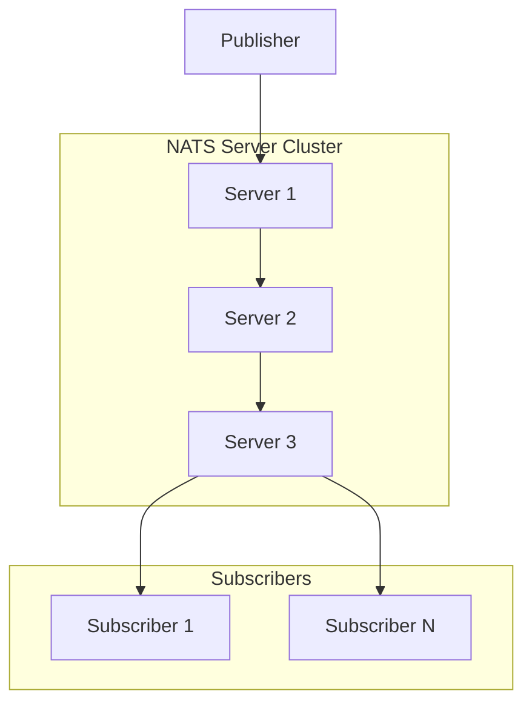
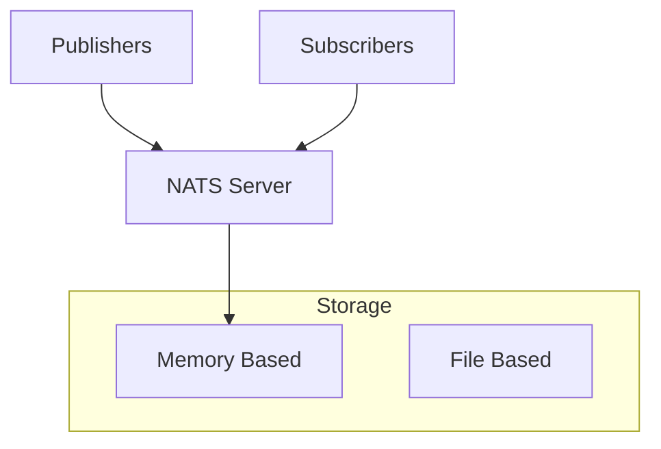
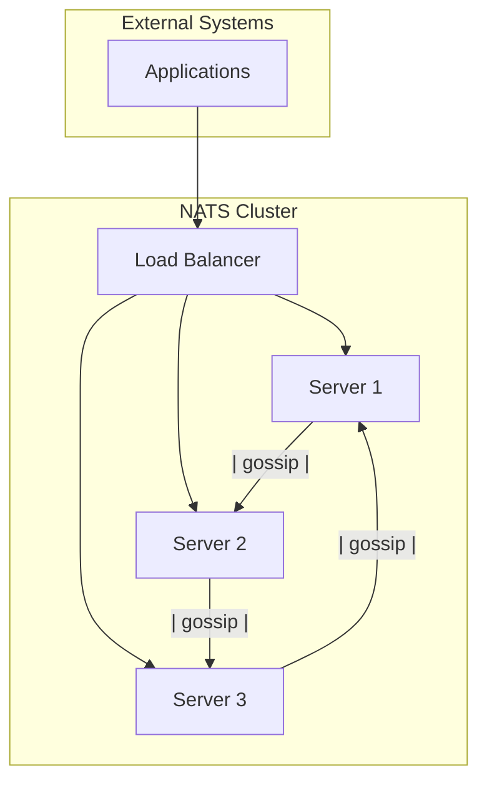
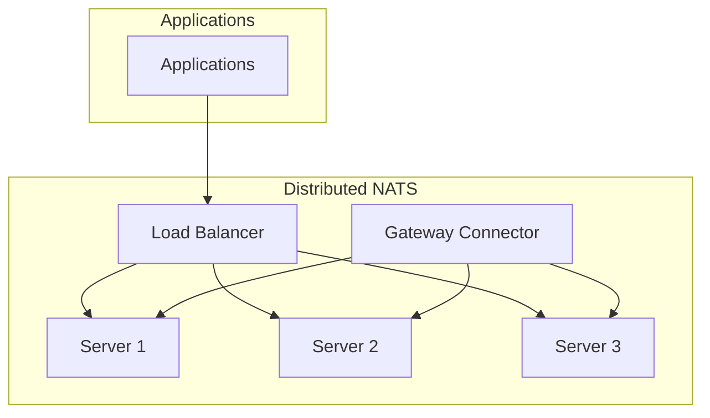

# NATS

## Overview

NATS is a simple, secure, and high-performance messaging system designed for cloud-native applications, IoT messaging, and microservices architectures. It is lightweight and offers a highly scalable Pub/Sub model with unique features like subjects and wildcards.

## Data Model

### Core Concepts



### Messaging Model

- **Subjects**: The primary means to organize messages (e.g., `foo.bar`, `service.updates`)
- **Wildcards**: Flexible filtering with `*` and `>` (e.g., `foo.*`, `foo.>`)
- **Queues**: Implement consumer load balancing

### Message Format

```json
{
  "subject": "orders.created",
  "data": {
    "orderId": "order-123",
    "customerId": "cust-456",
    "timestamp": "2025-01-11T16:56Z",
    "items": [
      {
        "productId": "prod-789",
        "quantity": 2
      }
    ]
  },
  "headers": {
    "correlation-id": "req-12345"
  }
}
```

## Architecture Overview

### Single Node Architecture



### Clustered NATS



## Target Operating Model (TOM)

### Without High Availability

#### Single Server Setup

| Component | Specification | Purpose |
|-----------|---------------|---------|
| **NATS Server** | 1 instance | Lightweight messaging |
| **Memory Storage** | RAM | High-speed message handling |

#### Resource Requirements

| Resource | Minimum | Recommended | Purpose |
|----------|---------|-------------|---------|
| **CPU** | 1 core | 2+ cores | Message processing |
| **Memory** | 256MB | 1GB+ | Queue storage |
| **Storage** | N/A | N/A | Messages in memory |
| **Network** | 100Mbps | 1Gbps+ | Client connectivity |

#### Configuration Example

```conf
# NATS server configuration
port: 4222
http: 8222

# No authentication
no_auth_user: anonymous

# Logging
log_time: true
log_file: "/var/log/nats.log"

# Allow any subject publish/subscribe
permissions {
  publish: ["foo.bar", "foo.>"]
  subscribe: ["foo.bar", "foo.>"]
}
```

### With High Availability

#### Clustered Setup

| Component | Specification | Purpose |
|-----------|---------------|---------|
| **NATS Servers** | 3+ instances | High availability |
| **Load Balancer** | Optional | Traffic distribution |
| **Storage** | Optional | Persistent queues |

#### Resource Requirements (Per Node)

| Resource | Minimum | Recommended | Purpose |
|----------|---------|-------------|---------|
| **CPU** | 2 cores | 4+ cores | Cluster communication |
| **Memory** | 1GB | 4GB+ | Subject and subscription handling |
| **Storage** | Optional | Network of persistent data |
| **Network** | 1Gbps | 10Gbps+ | Inter-node connectivity |

#### Deployment Architecture



#### HA Configuration

```conf
# NATS clustered configuration
port: 4222
http: 8222

cluster {
  listen: "0.0.0.0:6222"
  routes = [
    "nats://nats1:6222",
    "nats://nats2:6222",
    "nats://nats3:6222"
  ]
}

# Authorization
authorization {
  user: admin
  password: "supersecret"
}
```

## Pros and Cons

### Pros

#### Lightweight and Simple
- **Low Resource Usage**: Minimal memory and CPU requirements
- **Ease of Use**: Simple setup and configuration
- **High Performance**: Sub-millisecond latencies
- **Dynamic Topology**: Flexible clustering and scaling

#### Flexibility and Features
- **Subjects and Wildcards**: Fine-grained topic management
- **Queues**: Support for load-balanced consumers
- **TLS Support**: Secure communications
- **Portable Design**: Easily embedded in edge devices

#### Cloud Native
- **Kubernetes Support**: NATS Operator for Kubernetes
- **Multi-Tenancy**: Accounts and users for isolation
- **Resiliency**: Designed for fault tolerance
- **Event Streaming**: JetStream for persistence and streaming

#### Developer Experience
- **Client Libraries**: Available for multiple languages
- **Active Community**: Strong community support
- **Extensive Tutorials**: Helpful learning resources
- **Gateway Connectivity**: Bridge NATS clusters

### Cons

#### Feature Limitations
- **No Persistence**: Transient messaging by default
- **Simplistic Model**: Lacks advanced messaging patterns
- **Limited QoS**: Basic quality of service configurations
- **Minimal Tooling**: Limited third-party integration

#### Scalability Challenges
- **Memory Bound**: Higher memory for large-scale 
- **Network Dependency**: Significant network demands
- **Message Retention**: Not designed for long-term storage
- **Data Distribution**: Limited to real-time propagation

#### Operational Challenges
- **NATS Configuration**: Basic configuration options
- **Security Features**: Simple authorization
- **Monitoring**: Basic observability capabilities
- **Deployment Complexity**: Advanced setups require expertise

## Best Practices

### Production Deployment

1. **Cluster Configuration**
   - Deploy in odd numbers (3, 5, 7)
   - Utilize load balancing for resilience
   - Properly configure client permissions

2. **Monitoring and Alerts**
   - Track server health and latencies
   - Set up alerts for disconnections
   - Leverage NATS monitoring tools

3. **Security**
   - Implement TLS encryption
   - Use token-based authentication
   - Enforce permissions and isolation

4. **Scaling Strategies**
   - Increase instance count for load
   - Optimize connection handling
   - Plan for horizontal scaling

### Development Guidelines

1. **Message Schema**
   - Use well-defined data contracts
   - Plan for forward/backward compatibility
   - Implement versioning where needed

2. **Consumer Design**
   - Distribute workload with queues
   - Design for failure tolerance
   - Implement client-side buffering

3. **Testing and Validation**
   - Conduct performance testing
   - Simulate failover scenarios
   - Validate application messaging flows

## When to Choose NATS

### Ideal Use Cases
- **Cloud-Native Apps**: Modern applications
- **IoT Messaging**: Device communication
- **Microservices**: Internal service bus
- **Event-Driven Architectures**: Lightweight event processing

### Consider Alternatives When
- **Persistence Needs**: Long-term message retention
- **Complex Routing**: Advanced routing requirements
- **Large Workloads**: Enterprise-scale systems
- **Robust Security**: Detailed access control needed
