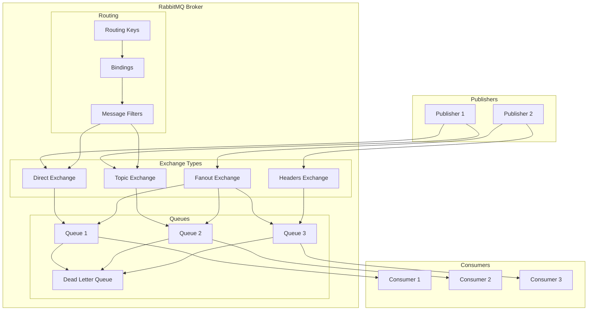
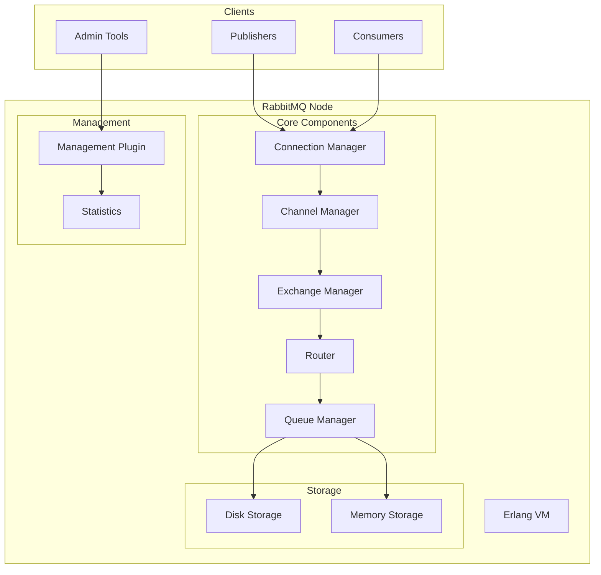
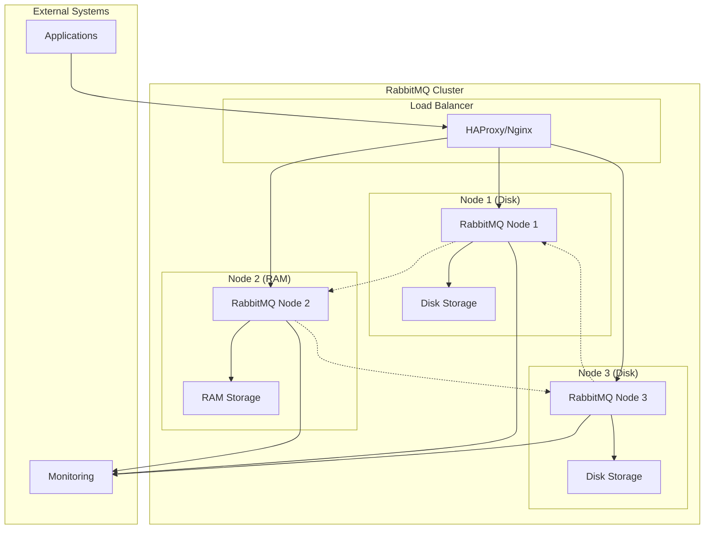
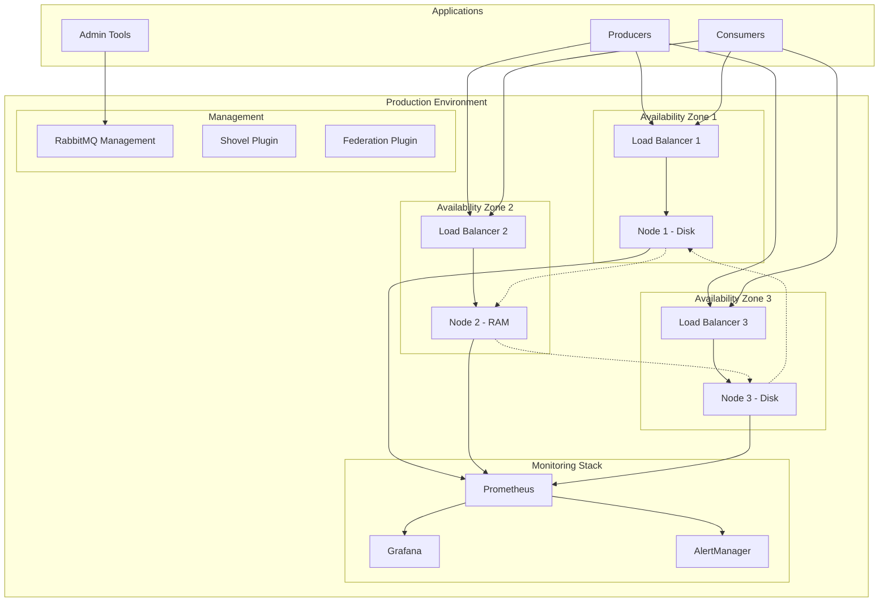

# RabbitMQ

## Overview

RabbitMQ is a robust, feature-rich message broker that implements the Advanced Message Queuing Protocol (AMQP). It's designed to handle complex routing scenarios, reliable message delivery, and enterprise-grade messaging requirements with support for multiple messaging patterns.

## Data Model

### Core Concepts



### Data Structure Components

#### Exchanges
- **Direct Exchange**: Routes messages with exact routing key match
- **Topic Exchange**: Routes messages with pattern matching using wildcards (* and #)
- **Fanout Exchange**: Broadcasts messages to all bound queues (ignores routing key)
- **Headers Exchange**: Routes based on message headers instead of routing keys

#### Queues
- **Standard Queues**: FIFO message storage with persistence options
- **Priority Queues**: Messages with higher priority are consumed first
- **Dead Letter Queues**: Store messages that cannot be processed
- **Lazy Queues**: Move messages to disk as early as possible to reduce memory usage

#### Routing Components
- **Routing Keys**: String values used to route messages to specific queues
- **Bindings**: Link between an exchange and a queue with routing criteria
- **Message Filters**: Additional criteria for message routing based on headers or properties

### Message Format

```json
{
  "properties": {
    "message_id": "msg-12345",
    "correlation_id": "req-67890",
    "reply_to": "response-queue",
    "delivery_mode": 2,
    "priority": 5,
    "timestamp": 1641916455000,
    "type": "order.created",
    "content_type": "application/json",
    "content_encoding": "utf-8",
    "headers": {
      "source": "order-service",
      "version": "1.0"
    }
  },
  "body": {
    "orderId": "order-123",
    "customerId": "cust-456",
    "items": [
      {
        "productId": "prod-789",
        "quantity": 2
      }
    ]
  }
}
```

## Architecture Overview

### Single Node Architecture



### Clustered Architecture



## Target Operating Model (TOM)

### Without High Availability

#### Single Node Setup

| Component | Specification | Purpose |
|-----------|---------------|---------|
| **RabbitMQ Node** | 1 instance | Message broker |
| **Erlang VM** | Single process | Runtime environment |
| **Storage** | Local disk | Message persistence |
| **Management** | Web UI enabled | Administration |

#### Resource Requirements

| Resource | Minimum | Recommended | Purpose |
|----------|---------|-------------|---------|
| **CPU** | 2 cores | 4+ cores | Message processing |
| **Memory** | 2GB | 4GB+ | Message buffering |
| **Storage** | 50GB | 200GB+ | Message persistence |
| **Network** | 100Mbps | 1Gbps+ | Client communication |

#### Configuration Example

```erlang
%% Single node configuration
[
  {rabbit, [
    {tcp_listeners, [5672]},
    {ssl_listeners, [5671]},
    {disk_free_limit, {mem_relative, 1.0}},
    {vm_memory_high_watermark, 0.4},
    {heartbeat, 60},
    {cluster_nodes, {[], disc}},
    {cluster_name, <<"rabbit@localhost">>}
  ]},
  {rabbitmq_management, [
    {listener, [{port, 15672}]}
  ]}
].
```

### With High Availability

#### Cluster Setup

| Component | Specification | Purpose |
|-----------|---------------|---------|
| **RabbitMQ Nodes** | 3+ instances | Fault tolerance |
| **Load Balancer** | HAProxy/Nginx | Traffic distribution |
| **Shared Storage** | Optional | Persistent data |
| **Monitoring** | Prometheus/Grafana | Cluster health |

#### Resource Requirements (Per Node)

| Resource | Minimum | Recommended | Purpose |
|----------|---------|-------------|---------|
| **CPU** | 4 cores | 8+ cores | Concurrent processing |
| **Memory** | 4GB | 8GB+ | Cluster coordination |
| **Storage** | 100GB | 500GB+ | Message persistence |
| **Network** | 1Gbps | 10Gbps+ | Inter-node communication |

#### Deployment Architecture



#### HA Configuration

```erlang
%% High availability cluster configuration
[
  {rabbit, [
    {tcp_listeners, [5672]},
    {ssl_listeners, [5671]},
    {disk_free_limit, {mem_relative, 1.0}},
    {vm_memory_high_watermark, 0.4},
    {heartbeat, 60},
    {cluster_nodes, {['rabbit@node1', 'rabbit@node2', 'rabbit@node3'], disc}},
    {cluster_name, <<"production-cluster">>},
    {ha_policy, [
      {pattern, ".*"},
      {definition, [
        {ha_mode, exactly},
        {ha_params, 2},
        {ha_sync_mode, automatic}
      ]}
    ]}
  ]},
  {rabbitmq_management, [
    {listener, [{port, 15672}]}
  ]},
  {rabbitmq_shovel, []},
  {rabbitmq_federation, []}
].
```

## Pros and Cons

### Pros

#### Flexibility & Features
- **Rich Routing**: Complex routing with exchanges and bindings
- **Multiple Protocols**: AMQP, STOMP, MQTT, HTTP support
- **Message Patterns**: Request-reply, pub/sub, routing, topics
- **Plugin System**: Extensible with community plugins

#### Reliability & Durability
- **Message Persistence**: Durable queues and messages
- **Acknowledgments**: Flexible acknowledgment modes
- **Clustering**: Built-in clustering support
- **High Availability**: Queue mirroring and federation

#### Enterprise Features
- **Security**: SSL, SASL, LDAP integration
- **Management**: Web-based management interface
- **Monitoring**: Built-in metrics and monitoring
- **Priority Queues**: Message priority support

#### Developer Experience
- **Client Libraries**: Libraries for most programming languages
- **Documentation**: Comprehensive documentation
- **Community**: Active community and support
- **Standards Compliance**: AMQP 0-9-1 compliant

### Cons

#### Performance Limitations
- **Throughput**: Lower throughput compared to Kafka
- **Latency**: Higher latency for high-volume scenarios
- **Memory Usage**: Can be memory-intensive
- **Scaling**: Vertical scaling limitations

#### Operational Complexity
- **Erlang Dependency**: Requires Erlang/OTP knowledge
- **Configuration**: Complex configuration options
- **Clustering**: Cluster management complexity
- **Monitoring**: Requires specialized monitoring setup

#### Resource Requirements
- **Memory Intensive**: High memory usage for large queues
- **CPU Overhead**: Significant CPU for message routing
- **Storage**: Persistent storage requirements
- **Network**: Cluster communication overhead

#### Use Case Constraints
- **High Volume**: Not ideal for very high-volume scenarios
- **Stream Processing**: Limited stream processing capabilities
- **Long-term Storage**: Not designed for long-term message retention
- **Ordering**: No guaranteed message ordering

## Best Practices

### Production Deployment

1. **Cluster Configuration**
   - Use odd number of nodes (3 or 5)
   - Mix of disk and RAM nodes
   - Proper network configuration

2. **Queue Design**
   - Use appropriate queue types (classic vs quorum)
   - Set proper TTL and dead letter exchanges
   - Implement queue mirroring for HA

3. **Monitoring**
   - Monitor queue depths and consumer rates
   - Set up alerts for memory and disk usage
   - Use RabbitMQ management plugin

4. **Security**
   - Enable SSL/TLS encryption
   - Use proper authentication and authorization
   - Implement network security

### Development Guidelines

1. **Connection Management**
   - Use connection pooling
   - Handle connection failures gracefully
   - Implement proper cleanup

2. **Message Design**
   - Use appropriate message persistence
   - Implement proper error handling
   - Design for idempotency

3. **Performance Optimization**
   - Batch message publishing
   - Use appropriate prefetch settings
   - Monitor and tune queue performance

## When to Choose RabbitMQ

### Ideal Use Cases
- **Complex Routing**: Multi-step message routing
- **Enterprise Integration**: Legacy system integration
- **Task Queues**: Background job processing
- **Request-Reply**: Synchronous communication patterns
- **Microservices**: Service-to-service messaging

### Consider Alternatives When
- **High Volume**: Millions of messages per second
- **Stream Processing**: Real-time analytics
- **Long-term Storage**: Event sourcing requirements
- **Simple Pub/Sub**: Basic publish-subscribe patterns
- **Resource Constraints**: Limited memory/CPU resources
