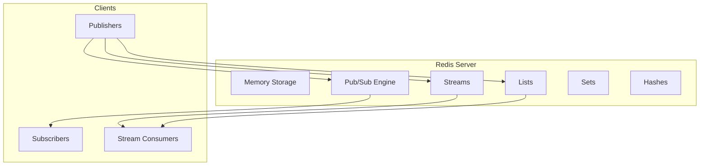
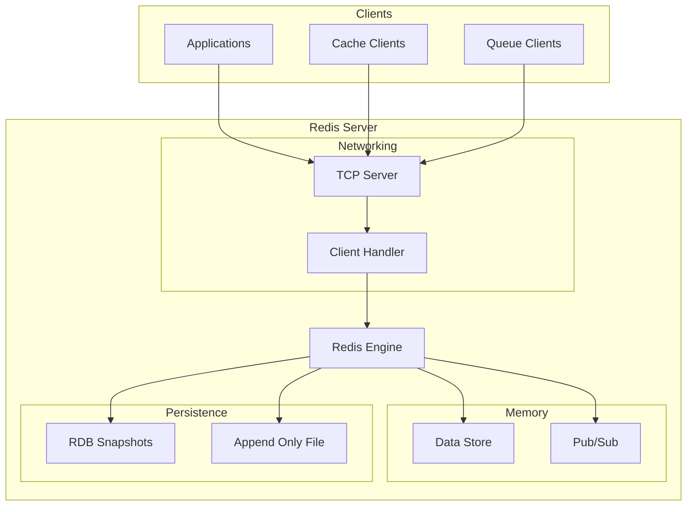
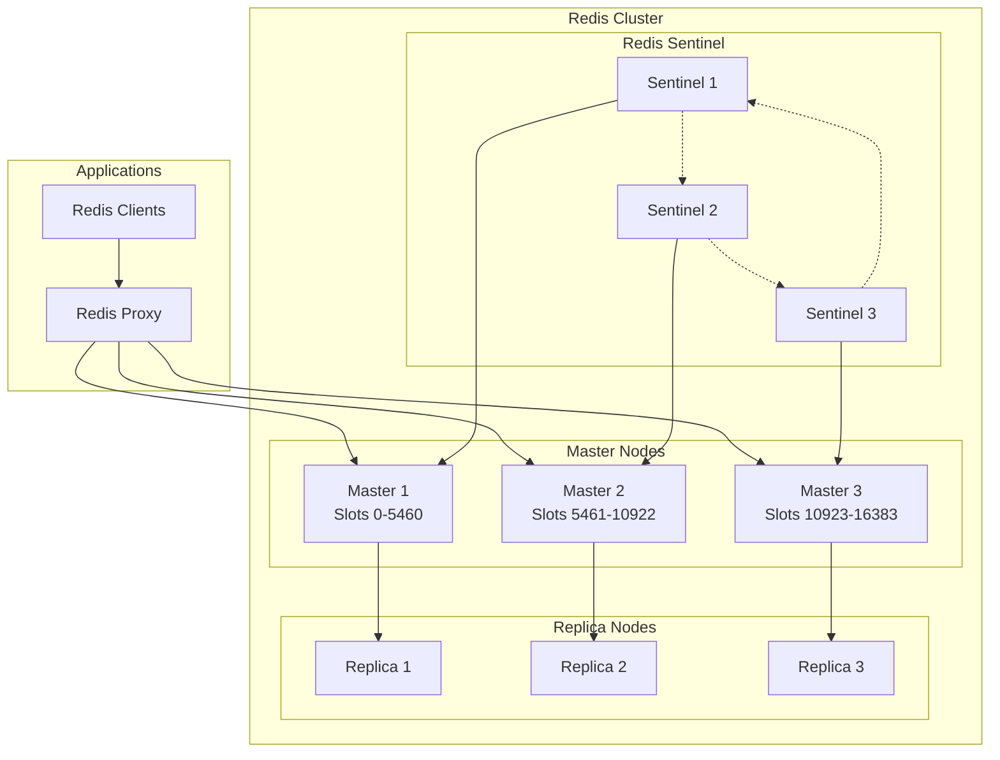
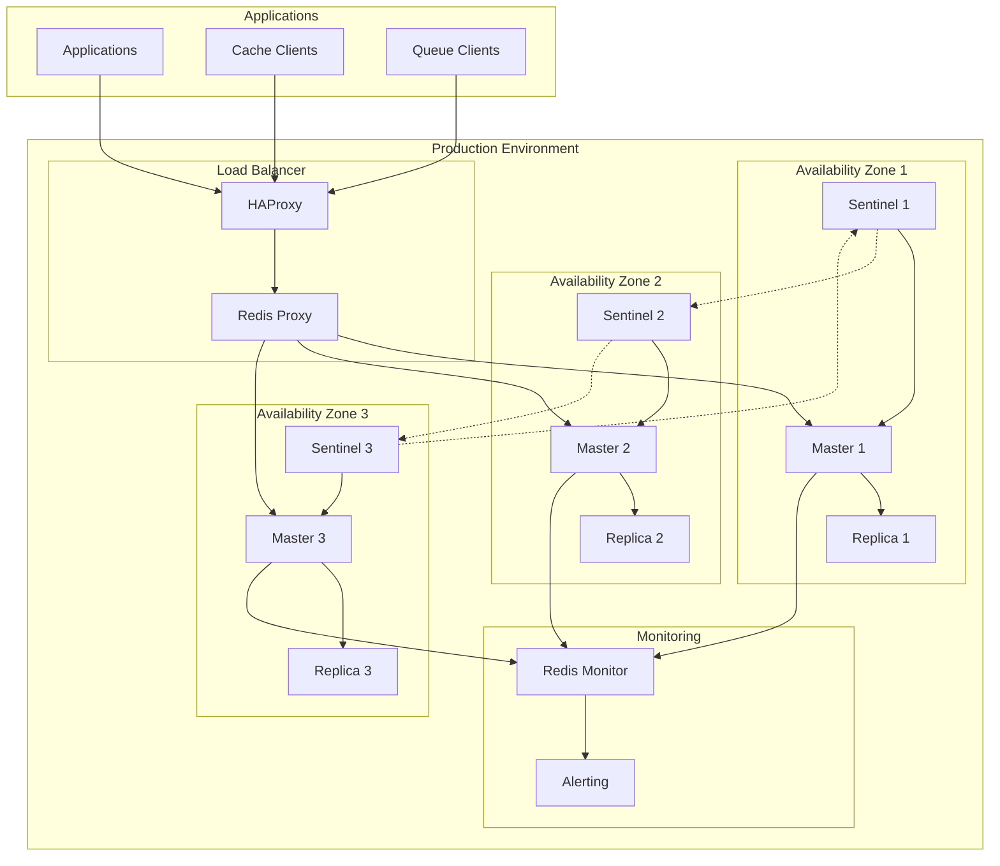

# Redis

## Overview

Redis (Remote Dictionary Server) is an in-memory data structure store that can be used as a database, cache, and message broker. It supports various data structures such as strings, lists, sets, and hashes, and provides pub/sub messaging capabilities for real-time applications.

## Data Model

### Core Concepts



### Data Structures for Messaging

- **Pub/Sub**: Traditional publish-subscribe messaging
- **Lists**: Queues with LPUSH/RPOP operations
- **Streams**: Log-like data structure with consumer groups
- **Sets**: Unique message handling

### Message Format

```json
{
  "channel": "orders",
  "message": {
    "id": "order-123",
    "customer": "cust-456",
    "timestamp": "2025-01-11T16:56:59Z",
    "items": [
      {
        "product": "prod-789",
        "quantity": 2
      }
    ]
  }
}
```

## Architecture Overview

### Single Node Architecture



### Redis Cluster Architecture



## Target Operating Model (TOM)

### Without High Availability

#### Single Node Setup

| Component | Specification | Purpose |
|-----------|---------------|---------|
| **Redis Server** | 1 instance | In-memory messaging |
| **Memory** | RAM-based | High-speed operations |
| **Persistence** | RDB/AOF | Data durability |

#### Resource Requirements

| Resource | Minimum | Recommended | Purpose |
|----------|---------|-------------|---------|
| **CPU** | 1 core | 2+ cores | Single-threaded operations |
| **Memory** | 1GB | 8GB+ | Data storage |
| **Storage** | 10GB | 100GB+ | Persistence files |
| **Network** | 100Mbps | 1Gbps+ | Client connections |

#### Configuration Example

```conf
# Redis single node configuration
port 6379
bind 127.0.0.1
protected-mode yes

# Memory configuration
maxmemory 2gb
maxmemory-policy allkeys-lru

# Persistence
save 900 1
save 300 10
save 60 10000

appendonly yes
appendfsync everysec

# Pub/Sub
notify-keyspace-events ""
```

### With High Availability

#### Cluster Setup

| Component | Specification | Purpose |
|-----------|---------------|---------|
| **Redis Masters** | 3+ instances | Data sharding |
| **Redis Replicas** | 3+ instances | Failover protection |
| **Redis Sentinel** | 3+ instances | Monitoring and failover |
| **Redis Proxy** | Optional | Connection pooling |

#### Resource Requirements (Per Node)

| Resource | Minimum | Recommended | Purpose |
|----------|---------|-------------|---------|
| **CPU** | 2 cores | 4+ cores | Cluster operations |
| **Memory** | 4GB | 16GB+ | Distributed data |
| **Storage** | 50GB | 500GB+ | Persistence and logs |
| **Network** | 1Gbps | 10Gbps+ | Cluster communication |

#### Deployment Architecture



#### HA Configuration

```conf
# Redis cluster configuration
port 7000
cluster-enabled yes
cluster-config-file nodes.conf
cluster-node-timeout 5000
cluster-announce-ip 192.168.1.100
cluster-announce-port 7000
cluster-announce-bus-port 17000

# Replication
replicaof 192.168.1.101 7000
replica-read-only yes
replica-serve-stale-data yes

# Sentinel configuration
sentinel monitor mymaster 192.168.1.100 7000 2
sentinel down-after-milliseconds mymaster 5000
sentinel failover-timeout mymaster 10000
sentinel parallel-syncs mymaster 1
```

## Pros and Cons

### Pros

#### Performance
- **Ultra-Fast**: In-memory operations with microsecond latencies
- **High Throughput**: Hundreds of thousands of operations per second
- **Single-threaded**: No locking overhead
- **Efficient Protocol**: Optimized Redis protocol

#### Versatility
- **Multiple Data Types**: Strings, lists, sets, hashes, streams
- **Messaging Patterns**: Pub/Sub, queues, streams
- **Scripting**: Lua scripting for complex operations
- **Modules**: Extensible with Redis modules

#### Operational Simplicity
- **Easy Setup**: Simple installation and configuration
- **Minimal Dependencies**: Standalone binary
- **Rich Tooling**: Redis CLI and monitoring tools
- **Memory Efficient**: Optimized data structures

#### Developer Experience
- **Simple API**: Intuitive command set
- **Client Libraries**: Available for all major languages
- **Documentation**: Comprehensive documentation
- **Community**: Large and active community

### Cons

#### Persistence Limitations
- **Data Loss Risk**: Potential data loss during failures
- **Memory Bound**: Limited by available RAM
- **Persistence Overhead**: Performance impact of durability
- **Recovery Time**: Slow startup with large datasets

#### Scalability Challenges
- **Single-threaded**: Limited by single CPU core
- **Memory Limitations**: Expensive to scale vertically
- **Cluster Complexity**: Complex sharding and rebalancing
- **Network Overhead**: High network usage in clusters

#### Messaging Limitations
- **No Persistence**: Pub/Sub messages are not persistent
- **Limited Guarantees**: No delivery guarantees
- **Simple Routing**: Basic routing capabilities
- **Consumer Groups**: Limited consumer group features

#### Operational Challenges
- **Memory Management**: Requires careful memory monitoring
- **Backup Complexity**: Challenging backup strategies
- **Security**: Basic security features
- **Monitoring**: Limited built-in monitoring

## Best Practices

### Production Deployment

1. **Memory Management**
   - Monitor memory usage and set appropriate limits
   - Use memory policies for eviction
   - Plan for memory growth

2. **Persistence Strategy**
   - Choose appropriate persistence method (RDB vs AOF)
   - Configure backup schedules
   - Test recovery procedures

3. **High Availability**
   - Deploy with Redis Sentinel or Cluster
   - Use replicas for read scaling
   - Implement proper failover procedures

4. **Monitoring**
   - Monitor key metrics (memory, CPU, connections)
   - Set up alerts for critical issues
   - Use Redis monitoring tools

### Development Guidelines

1. **Connection Management**
   - Use connection pooling
   - Handle connection failures gracefully
   - Implement proper timeouts

2. **Data Structure Selection**
   - Choose appropriate data structures for use cases
   - Understand performance characteristics
   - Plan for data growth

3. **Pub/Sub Design**
   - Handle message loss scenarios
   - Implement proper subscriber patterns
   - Consider using streams for persistence

## When to Choose Redis

### Ideal Use Cases
- **Caching**: High-performance caching layer
- **Session Storage**: User session management
- **Real-time Analytics**: Live counters and metrics
- **Task Queues**: Simple background job processing
- **Pub/Sub**: Real-time notifications

### Consider Alternatives When
- **Persistent Messaging**: Guaranteed message delivery
- **Complex Routing**: Advanced routing requirements
- **Large Datasets**: Data larger than available memory
- **Strong Consistency**: ACID transaction requirements
- **Enterprise Features**: Advanced security and compliance
