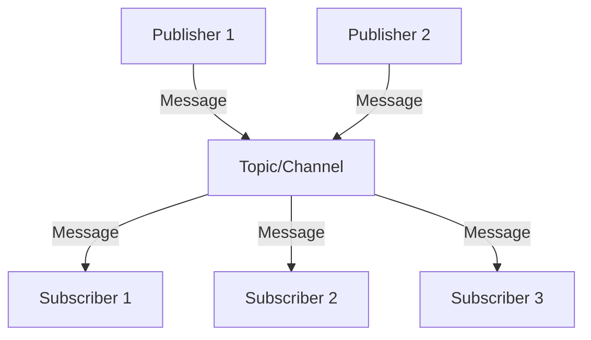
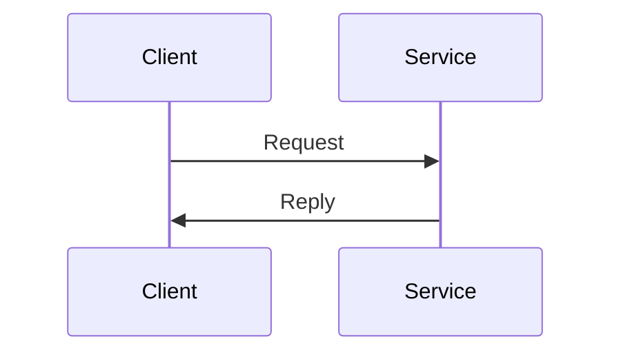
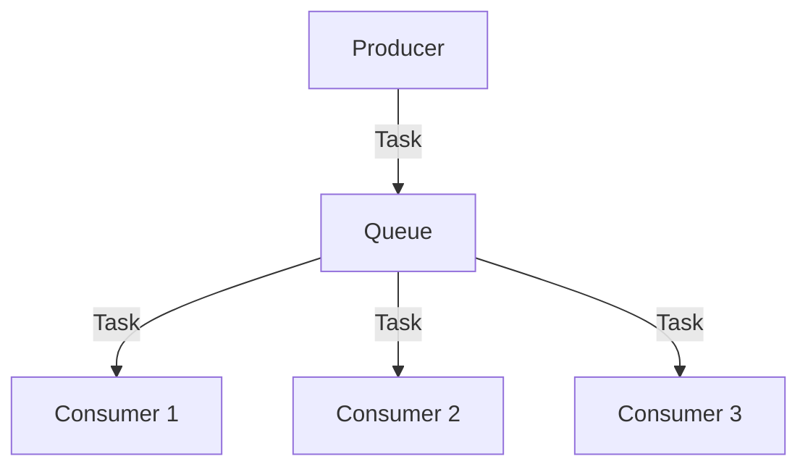
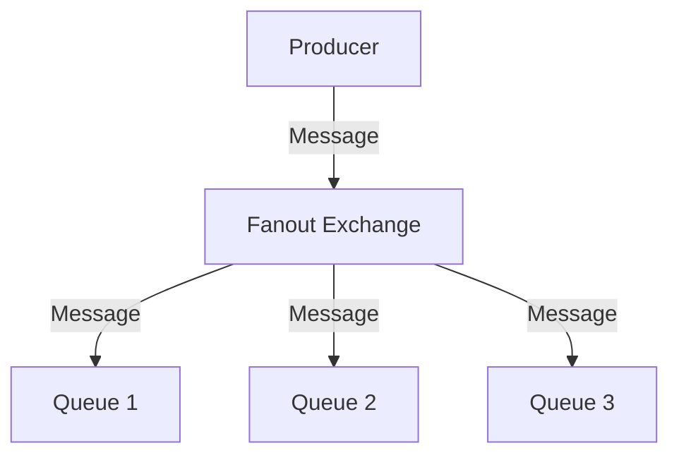
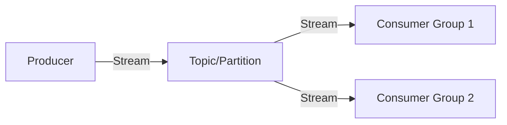
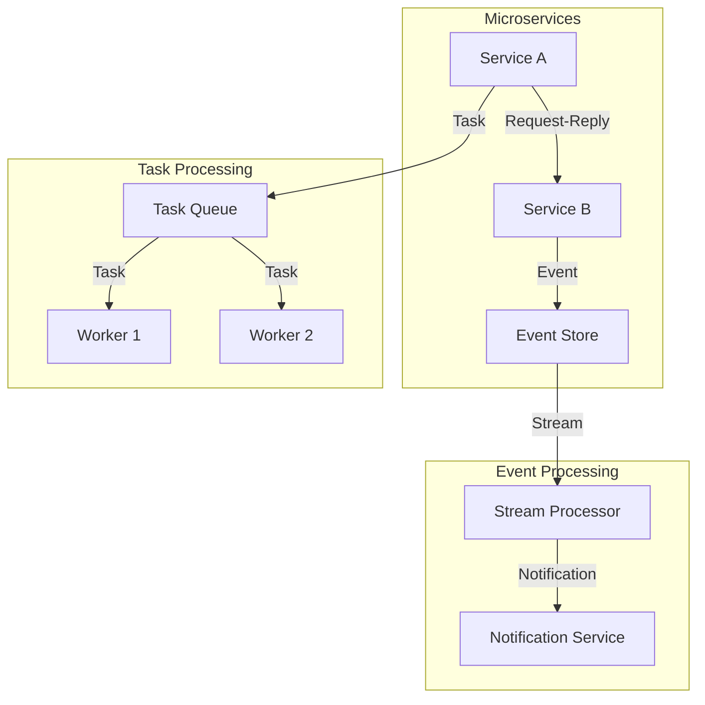

# Messaging System Architectures Overview

This document provides an overview of common messaging system architectures and their use cases.

## Common Messaging Architectures

### 1. Publish-Subscribe (Pub-Sub)
Publishers send messages to a topic; subscribers receive messages from topics asynchronously.

**Use Cases:**
- Event-driven architectures
- Real-time notifications
- Broadcasting information to multiple consumers

**Examples:** Kafka, RabbitMQ, Solace

### 2. Request-Reply
Clients send requests and await replies, often used in service bus architectures.

**Use Cases:**
- Synchronous communication
- RPC-style messaging
- Service-to-service communication

**Examples:** IBM MQ, RabbitMQ, TIBCO

### 3. Push-Pull (Work Queue)
Tasks are distributed among multiple consumers for parallel processing.

**Use Cases:**
- Task distribution
- Load balancing
- Background job processing

**Examples:** RabbitMQ, Amazon SQS, Redis

### 4. Fanout
A message sent to an exchange is delivered to all bound queues.

**Use Cases:**
- Broadcasting updates
- Event replication
- Multi-consumer scenarios

**Examples:** RabbitMQ, Apache Pulsar

### 5. Streaming
Continuous data flow processing with ordered message sequences.

**Use Cases:**
- Real-time analytics
- Event sourcing
- Log aggregation

**Examples:** Apache Kafka, Apache Pulsar, AWS Kinesis

## Architecture Selection Guide

| Pattern | Best For | Scalability | Complexity |
|---------|----------|-------------|------------|
| Pub-Sub | Event-driven systems | High | Medium |
| Request-Reply | Synchronous communication | Medium | Low |
| Push-Pull | Task distribution | High | Low |
| Fanout | Broadcasting | Medium | Low |
| Streaming | Real-time processing | Very High | High |

## Hybrid Architectures

Many modern systems combine multiple patterns:

## Choosing the Right Architecture

Consider these factors when selecting an architecture:

1. **Communication Pattern**: Synchronous vs. asynchronous
2. **Message Volume**: Low, medium, or high throughput
3. **Durability Requirements**: Temporary vs. persistent messages
4. **Ordering Requirements**: Strict ordering vs. parallel processing
5. **Scalability Needs**: Horizontal scaling requirements
6. **Latency Tolerance**: Real-time vs. batch processing

## Next Steps

Once you've identified the appropriate architecture pattern, proceed to the [Product Comparison](product-comparison.md) to evaluate specific implementations.
