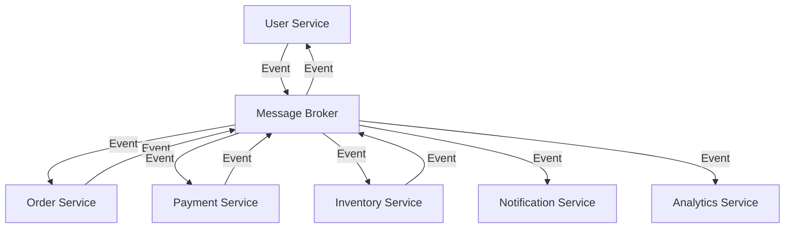
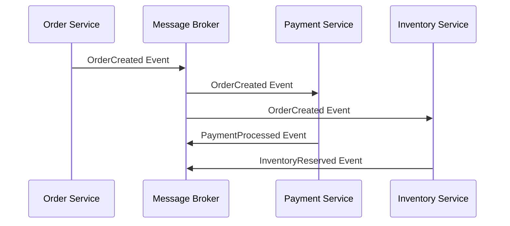
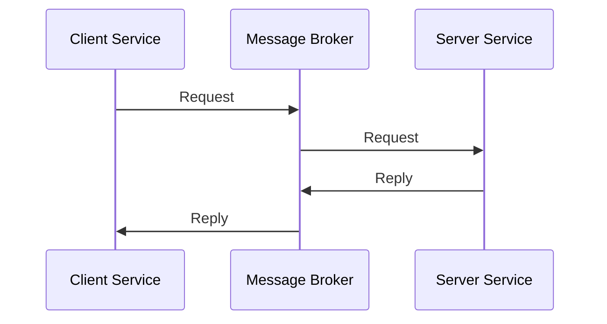
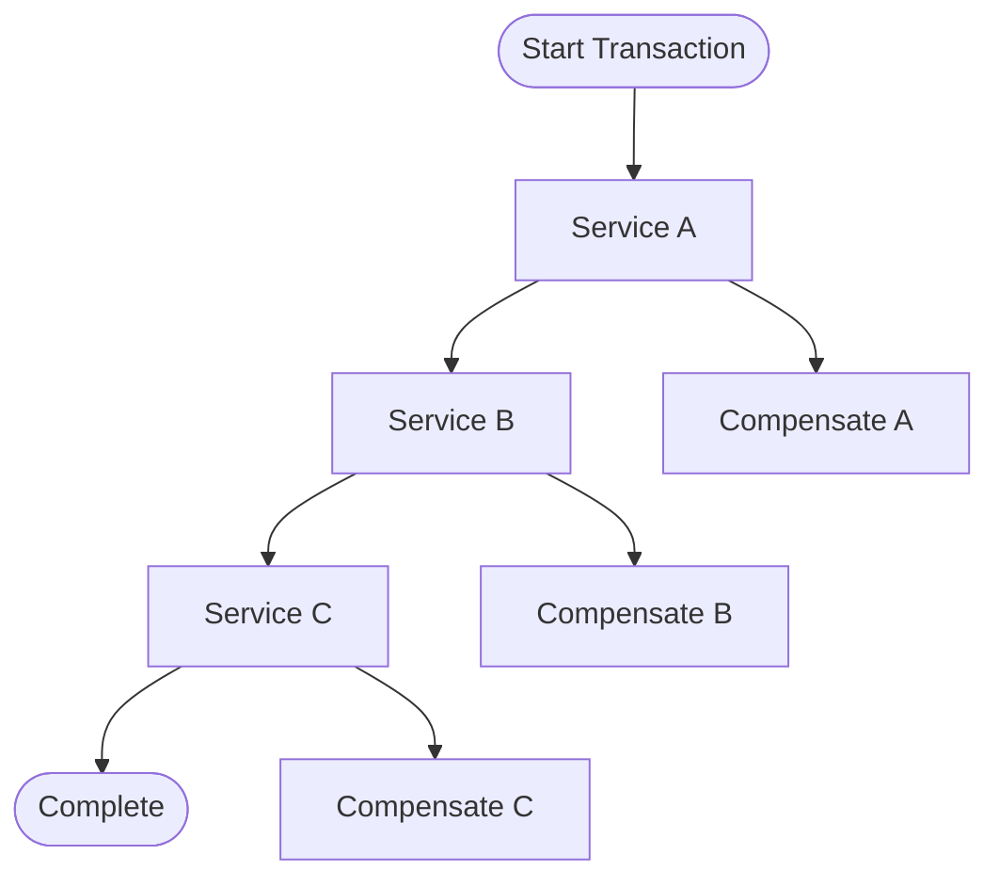

# Microservices Communication Using Messaging Systems

Microservices architecture relies heavily on messaging systems to enable seamless service-to-service communication.

## Key Considerations

- **Service Decoupling**: Ensure services can operate independently without tight coupling.
- **Asynchronous Communication**: Enable non-blocking communication patterns for better performance.
- **Message Ordering**: Maintain message order when required for consistency.
- **Fault Tolerance**: Implement retry mechanisms and circuit breakers.
- **Service Discovery**: Facilitate dynamic service discovery and registration.

## Architecture Overview

Microservices typically use message brokers to handle inter-service communication.

## Communication Patterns

### 1. Event-Driven Architecture
Services publish events when their state changes, allowing other services to react accordingly.

### 2. Request-Reply Pattern
Synchronous communication when immediate response is required.

### 3. Saga Pattern
Manage distributed transactions across multiple services.

## Implementation Steps

1. **Design Service Boundaries**: Define clear service responsibilities and boundaries.
2. **Choose Messaging Pattern**: Select appropriate patterns (Pub-Sub, Request-Reply, etc.).
3. **Implement Message Schemas**: Define consistent message formats and schemas.
4. **Set Up Message Broker**: Deploy and configure the messaging infrastructure.
5. **Implement Error Handling**: Add retry logic, dead letter queues, and circuit breakers.
6. **Monitor and Trace**: Implement distributed tracing and monitoring.

## Recommended Technologies

### For High-Throughput Systems
- **Apache Kafka**: Excellent for event streaming and high-throughput scenarios
- **Apache Pulsar**: Good for multi-tenant environments with geo-replication

### For General Microservices
- **RabbitMQ**: Feature-rich with good routing capabilities
- **NATS**: Lightweight and simple, perfect for cloud-native applications

### For Cloud-Native
- **AWS SQS/SNS**: Fully managed services for AWS environments
- **Google Cloud Pub/Sub**: Scalable messaging for Google Cloud Platform

## Best Practices

### Message Design
- **Use Event Sourcing**: Store events as the source of truth
- **Implement Idempotency**: Ensure messages can be processed multiple times safely
- **Version Your Messages**: Plan for schema evolution

### Error Handling
- **Dead Letter Queues**: Handle failed messages appropriately
- **Circuit Breakers**: Prevent cascading failures
- **Retry Strategies**: Implement exponential backoff and jitter

### Monitoring
- **Distributed Tracing**: Track requests across service boundaries
- **Message Metrics**: Monitor queue depths, processing times, and error rates
- **Health Checks**: Implement comprehensive service health monitoring

## Common Pitfalls

1. **Distributed Monolith**: Avoid creating tightly coupled services
2. **Message Ordering Issues**: Handle out-of-order message processing
3. **Poison Messages**: Implement proper error handling for malformed messages
4. **Resource Leaks**: Ensure proper connection and resource management

## Case Study: E-commerce Platform

An e-commerce platform used RabbitMQ to handle communication between:
- **Order Service**: Manages order creation and updates
- **Payment Service**: Processes payments and refunds
- **Inventory Service**: Tracks product availability
- **Notification Service**: Sends customer notifications

**Results:**
- 99.9% uptime achieved
- 50% reduction in response times
- Improved scalability and maintainability

## Testing Strategies

### Unit Testing
- Mock message brokers for isolated testing
- Test message serialization/deserialization

### Integration Testing
- Test service interactions through message brokers
- Verify message routing and transformation

### End-to-End Testing
- Test complete workflows across multiple services
- Validate saga implementations and compensation logic

## Conclusion

Messaging systems are essential for successful microservices architecture. Choose the right messaging pattern and technology based on your specific requirements for throughput, latency, and consistency. Implement proper error handling, monitoring, and testing strategies to ensure reliable service communication.

## Next Steps

- Review the [Architecture Overview](../solutions/architecture-overview.md) for detailed messaging patterns
- Check the [Product Comparison](../solutions/product-comparison.md) to select the right solution
- Follow the [Deployment Guide](../implementation/deployment-guide.md) for implementation details
