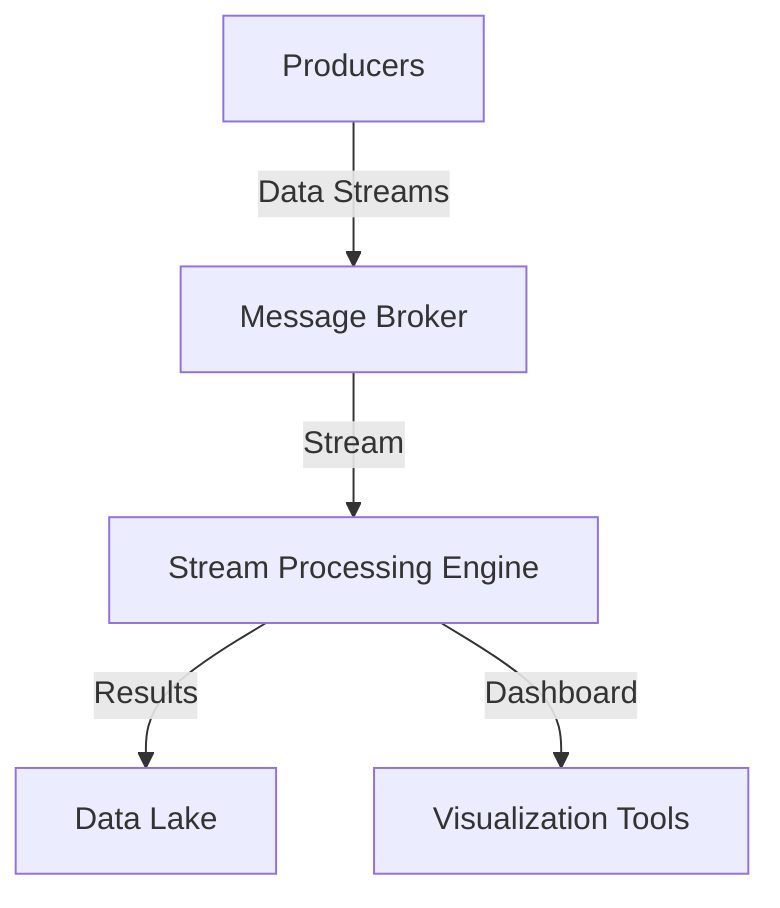

# Real-time Analytics with Messaging Systems

Real-time analytics involves processing and analyzing data as it becomes available. Messaging systems provide a backbone for transporting and processing large volumes of data quickly and efficiently.

## Key Considerations

- **Latency**: Choosing a low-latency messaging system is crucial.
- **Scalability**: The system must handle an increasing volume of data without degradation.
- **Fault Tolerance**: Ensure that data is reliably delivered and processed.

## Architecture Overview

Real-time analytics often involves streaming data to a processing engine.

## Implementation Steps

1. **Identify Data Sources**: Determine all relevant sources for data collection.
2. **Choose a Messaging System**: Prefer systems like Apache Kafka or Pulsar.
3. **Set Up Stream Processing**: Utilize engines like Apache Flink or Spark Streaming.
4. **Deploy Visualization Tools**: Integrate tools like Grafana or Kibana.
5. **Ensure Data Storage**: Use databases or data lakes for long-term storage.

## Example Technologies

- **Apache Kafka**: Offers robust stream processing capabilities with low latency.
- **Apache Pulsar**: Provides geo-replication and multi-tenancy.
- **AWS Kinesis**: Fully managed service for real-time data streaming.

## Case Study

A financial services company used Apache Kafka and Flink to process stock trades in real-time, delivering valuable insights and alerts for trading strategies.

## Conclusion

Real-time analytics requires a solid messaging system to ensure timely, reliable data processing. By carefully selecting the right tools and following best practices, organizations can gain insights faster and improve decision-making processes.

