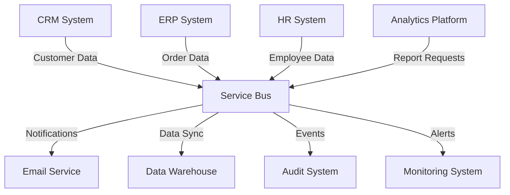
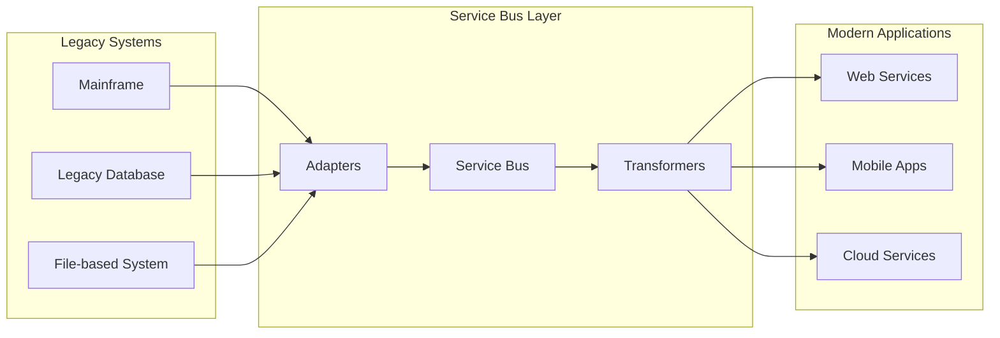
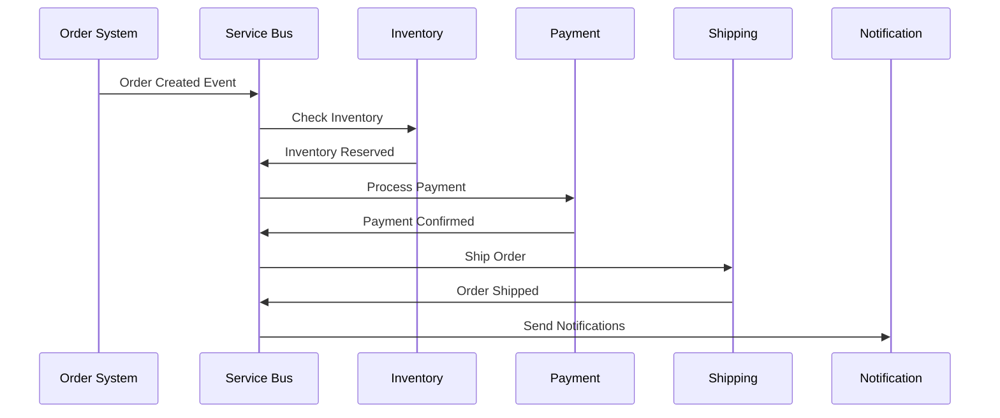

# Service Bus for IT Integration

Service Bus is a critical use case for IT departments, providing a centralized messaging infrastructure that enables reliable, scalable, and secure communication between applications, services, and systems.

## What is a Service Bus?

A Service Bus is a messaging infrastructure that acts as an intermediary between applications, providing:
- **Decoupling**: Applications don't need to know about each other directly
- **Reliability**: Guaranteed message delivery with error handling
- **Scalability**: Handle varying loads and multiple endpoints
- **Security**: Centralized authentication and authorization
- **Monitoring**: Unified view of message flows and system health

## Key Use Cases

### 1. Application Integration
Connect disparate applications across the organization without tight coupling.

### 2. Legacy System Modernization
Gradually modernize legacy systems by introducing a service bus as an integration layer.

### 3. Event-Driven Architecture
Implement event-driven patterns for real-time business process automation.

## IT Benefits

### Operational Benefits
- **Reduced Complexity**: Centralized messaging reduces point-to-point integrations
- **Improved Reliability**: Built-in retry mechanisms and dead letter queues
- **Better Monitoring**: Unified view of all message flows
- **Faster Integration**: Reusable connectors and adapters
- **Cost Reduction**: Shared infrastructure and reduced maintenance

### Technical Benefits
- **Scalability**: Handle peak loads without system degradation
- **Flexibility**: Easy to add new applications and services
- **Security**: Centralized security policies and audit trails
- **Performance**: Optimized message routing and caching
- **Standards Compliance**: Support for industry-standard protocols

## Implementation Patterns

### 1. Hub-and-Spoke Pattern
Central service bus with multiple connected systems.

**Pros:**
- Centralized management
- Reduced complexity
- Consistent security policies

**Cons:**
- Single point of failure
- Potential bottleneck
- Scaling limitations

### 2. Federated Service Bus
Multiple interconnected service buses across different domains.

**Pros:**
- Distributed architecture
- Domain-specific optimization
- Better fault isolation

**Cons:**
- Increased complexity
- Coordination challenges
- Multiple management points

### 3. Hybrid Integration
Combination of cloud and on-premises service bus instances.

**Pros:**
- Flexibility in deployment
- Gradual cloud migration
- Regulatory compliance

**Cons:**
- Network latency
- Security complexity
- Management overhead

## Recommended Technologies

### Enterprise Service Bus (ESB)
| Solution | Best For | Key Features |
|----------|----------|--------------|
| **MuleSoft Anypoint** | Enterprise integration | API management, connectors, cloud/on-premises |
| **IBM WebSphere** | Large enterprises | Robust security, legacy integration, high availability |
| **Microsoft BizTalk** | Microsoft ecosystem | .NET integration, Azure hybrid, workflow automation |
| **Apache Camel** | Open source | Lightweight, extensive connectors, Spring integration |

### Cloud Service Bus
| Solution | Best For | Key Features |
|----------|----------|--------------|
| **Azure Service Bus** | Microsoft Azure | Managed service, high availability, geo-replication |
| **Amazon SQS/SNS** | AWS ecosystem | Serverless, pay-per-use, auto-scaling |
| **Google Cloud Pub/Sub** | Google Cloud | Global messaging, real-time analytics integration |
| **Apache Kafka** | High-throughput | Event streaming, real-time processing, open source |

## Implementation Steps

### 1. Assessment Phase
- **Inventory existing integrations**
- **Identify pain points and requirements**
- **Evaluate current message volumes**
- **Assess security and compliance needs**

### 2. Architecture Design
- **Choose appropriate service bus pattern**
- **Design message schemas and formats**
- **Plan security and access controls**
- **Design monitoring and alerting**

### 3. Pilot Implementation
- **Select low-risk integration for pilot**
- **Implement basic service bus infrastructure**
- **Test message routing and transformation**
- **Validate monitoring and error handling**

### 4. Phased Rollout
- **Migrate integrations in phases**
- **Implement proper change management**
- **Monitor performance and adjust**
- **Train operations and development teams**

## Monitoring and Management

### Key Metrics to Track
- **Message throughput** (messages per second)
- **Message latency** (end-to-end processing time)
- **Error rates** (failed messages percentage)
- **Queue depths** (pending messages)
- **Resource utilization** (CPU, memory, storage)

### Alerting Thresholds
- **High error rates** (> 5% failed messages)
- **Queue buildup** (> 1000 pending messages)
- **High latency** (> 5 seconds processing time)
- **Resource exhaustion** (> 80% CPU or memory)

### Operational Procedures
- **Message replay** for failed transactions
- **Queue purging** for obsolete messages
- **Capacity planning** for growth
- **Disaster recovery** procedures

## Security Considerations

### Authentication and Authorization
- **Identity management** integration
- **Role-based access control** (RBAC)
- **API key management**
- **Certificate-based authentication**

### Data Protection
- **Message encryption** in transit and at rest
- **Sensitive data masking**
- **Compliance with regulations** (GDPR, HIPAA)
- **Audit logging** for security events

## Common Challenges and Solutions

### Challenge: Message Ordering
**Solution:** Use message keys or partitioning to ensure ordered processing

### Challenge: Duplicate Messages
**Solution:** Implement idempotent message processing and deduplication

### Challenge: Performance Bottlenecks
**Solution:** Use message batching, compression, and load balancing

### Challenge: Schema Evolution
**Solution:** Implement versioning strategies and backward compatibility

### Challenge: Monitoring Complexity
**Solution:** Use distributed tracing and correlation IDs

## Best Practices

1. **Design for Failure**: Implement retry logic and dead letter queues
2. **Keep Messages Small**: Avoid large payloads that can impact performance
3. **Use Correlation IDs**: Track messages across system boundaries
4. **Implement Circuit Breakers**: Prevent cascading failures
5. **Monitor Everything**: Comprehensive logging and metrics
6. **Plan for Scale**: Design for expected growth and peak loads
7. **Security First**: Implement proper authentication and encryption
8. **Version Your APIs**: Plan for schema evolution and compatibility

## ROI and Business Value

### Cost Savings
- **Reduced integration time**: 50-70% faster integration projects
- **Lower maintenance costs**: Centralized management and monitoring
- **Decreased downtime**: Improved reliability and error handling

### Business Benefits
- **Faster time to market**: Quicker application integration
- **Improved customer experience**: Real-time data synchronization
- **Better decision making**: Timely access to integrated data
- **Increased agility**: Easier to adapt to changing business requirements

## Conclusion

Service Bus is an essential IT use case that enables modern, scalable, and maintainable system integration. By implementing a well-designed service bus architecture, organizations can reduce complexity, improve reliability, and accelerate digital transformation initiatives.

The key to success is choosing the right technology stack, implementing proper governance, and ensuring comprehensive monitoring and management practices are in place from day one.
